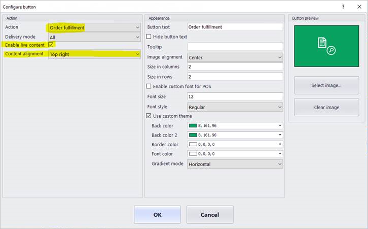
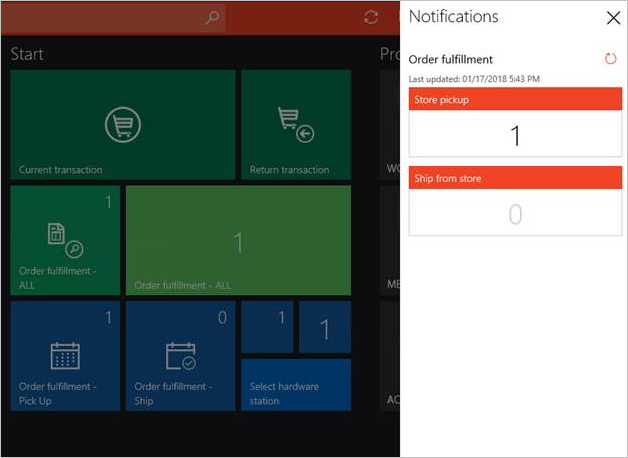

---
# required metadata

title: Show order notifications in the point of sale (POS)
description: This topic describes how to enable order notifications in the point of sale and the notification framework.
author: ShalabhjainMSFT
manager: AnnBe
ms.date: 03/12/2021
ms.topic: article
ms.prod: 
ms.technology: 

# optional metadata

ms.search.form:  RetailOperations, RetailFunctionalityProfile
audience: Application User
# ms.devlang: 
ms.reviewer: josaw
# ms.tgt_pltfrm: 
# ms.custom: 
ms.search.region: Global
ms.search.industry: retail
ms.author: shajain
ms.search.validFrom: 2017-10-30
ms.dyn365.ops.version: 

---

# Show order notifications in the point of sale (POS)

[!include [banner](includes/banner.md)]

Store associates may be assigned various tasks in their store, such as fulfilling orders or performing inventory receiving or stock counts. The point of sale (POS) client provides a single application where associates can be notified of these tasks. The notification framework in the POS helps by letting retailers configure role-based notifications. Starting in Dynamics 365 Retail with application update 5, these notifications can be configured for POS operations.

The system can show notifications for the *order fulfillment* operation, and starting in Commerce version 10.0.18 notifications can also be shown for the *recall order* operation. However, because the framework is designed to be extensible, developers are able to [write a notification handler](dev-itpro/extend-pos-notification.md) for any operation and show the notifications for that operation in the POS.

## Enable notifications for order fulfillment or recall order operations

To enable notifications for the order fulfillment or recall order operations, follow these steps.

1. Go to **Retail and Commerce \> Channel setup \> POS setup \> POS \> Operations**.
1. Search for either the **Order fulfillment** operation or the **Recall order** operation, and then select **Enable notifications** for the operation to specify that the notification framework should listen to the handler for this operation. If the handler is implemented, notifications for this operation will then be shown in the POS.
1. Go to **Retail and Commerce \> Employees \> Workers**.
1. Select the **Commerce** tab, select a worker row, and then select **POS permissions**. Select the **Notifications** FastTab to expand it, and then add the operations you have enabled notifications for. If configuring a single notification for a worker, ensure that the **Display order** value is set to **1**. If configuring more than one operation, set the **Display order** values to indicate the order in which the notifications should be displayed. 

      Notifications are shown only for operations that are added on the **Notifications** FastTab. You can add operations there only if the **Enable notifications** check boxes for those operations have been selected on the **POS operations** page. Additionally, notifications for an operation are only shown to workers if the operation is added to the POS permissions for those workers.

    > [!NOTE]
    > Notifications can be overridden at the user level. To do this, open the worker's record, select **POS permissions**, and then edit the user's notification subscription.

1. Go to **Retail and Commerce \> Channel setup \> POS setup \> POS profiles \> Functionality profiles**. In the **Notification interval** field, specify how often notifications should be pulled. For some notifications, the POS must make real-time calls to the back-office application. These calls consume the compute capacity of your back-office application. Therefore, when you set the notification interval, you should consider both your business requirements and the impact of real-time calls to the back-office application. A value of **0** (zero) turns off notifications.
1. Go to **Retail and Commerce \> Retail and Commerce IT \> Distribution schedule**. Select the **1060** (**Staff**) schedule to synchronize notification subscription settings, and then select **Run now**. Next, select the **1070** (**Channel configuration**) schedule to synchronize the permission interval, and then select **Run now**.

## View notifications in the POS

After you complete the preceding steps, the workers will be able to view the notifications in the POS. To view notifications, select the notification icon in the upper-right corner of the POS. A notification panel appears and shows notifications for the operations configured for the worker. 

For the **order fulfillment** operation, the notification panel will show the following groups:

- **Store pickup** – This group shows the count of individual order lines that are scheduled for pickup from the current store. You can select the number on the group to open the **Order fulfillment** operation with a filter so that it shows only the active order lines that are set up for pickup from the current store.
- **Ship from store** – This group shows the count of individual order lines that have been configured to ship from the user's current store. You can select the number on the group to open the **Order fulfillment** operation with a filtered view that only shows the active order lines that are set up for shipment from the current store.

For the **recall order** operation, the notification panel will show the following groups:

- **Orders to fulfill** – This group shows the count of orders that are configured either for pickup or shipping fulfillment for the user's current store. You can select the number on the group to open the **Recall order** operation with a filtered view that only shows the open orders that need to be fulfilled by the user's current store for either pick up in store or ship from store scenarios.
- **Orders to pick up** – This group shows the count of orders that are scheduled for pickup from the current store. You can select the number on the group to open the **Recall order** operation with a filtered view that only shows open orders that need to be fulfilled for customer pickup from the user's current store.
- **Orders to ship** – This group shows the count of orders to be shipped from the user's current store. You can select the number on the group to open the **Recall order** operation with a filtered view that only shows open orders that need to be fulfilled for shipment from the user's current store.

For both the order fulfillment and recall order notifications, as new orders are picked up by the process the notification icon changes to indicate that there are new notifications, and the count for the appropriate groups is updated. Even though the groups are refreshed at regular intervals, POS users can manually refresh the groups at any time by selecting **Refresh** next to the group. Lastly, if a group has a new item that the current worker hasn't viewed, then the group shows a burst symbol to indicate new content.

## Enable live content on POS buttons

POS buttons can now show a count to help workers easily determine which tasks require their immediate attention. To show this number on a POS button, you must complete the notification setup that is described earlier in this topic (that is, you must enable notifications for an operation, set up a notification interval, and update the POS permission group for the worker). Additionally, you must open the button grid designer, view the button's properties, and select the **Enable live content** check box. In the **Content alignment** field, you can select whether the count appears in the upper-right corner of the button (**Top right**) or in the center (**Center**).

> [!NOTE]
> The live content can be enabled for operations only if the **Enable notifications** check box has been selected for them on the **POS operations** page, as described earlier in this topic.

The following illustration shows the live content settings in the button grid designer.

To show the notification count on a button, you need to ensure that the correct screen layout is being updated. To determine the screen layout that is being used by the POS, select the **Settings** icon in upper-right corner and note the **Screen layout ID** and **Layout resolution**. Now using Edge browser, go to the **Screen layout** page, find the **Screen layout ID** and **Layout resolution** identified above and select the **Enable live content** check box. Go to **Retail and Commerce \> Retail and Commerce IT \> Distribution schedule** and run the 1090 (Registers) job to synchronize layout changes.

The following illustration shows the effect of selecting **Top right** versus **Center** in the **Content alignment** field for buttons of various sizes.

[!INCLUDE[footer-include](../includes/footer-banner.md)]
