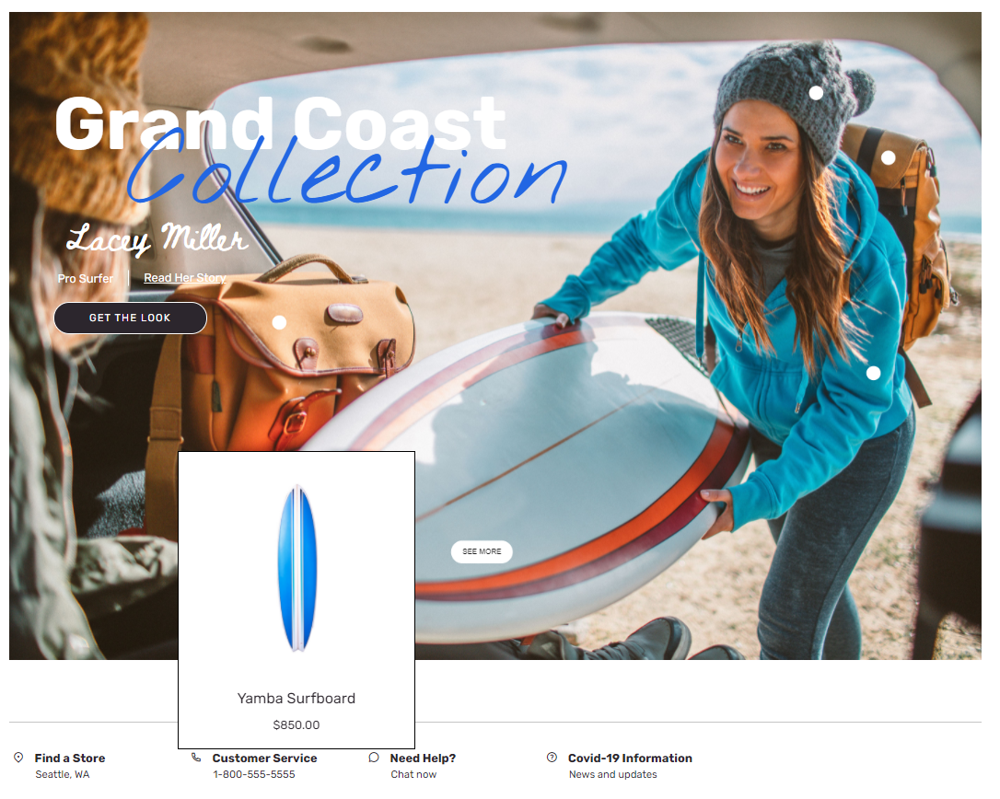

---
# required metadata

title: Active image module
description: This topic covers Active image modules and describes how to add them to site pages in Microsoft Dynamics 365 Commerce.
author: anupamar-ms
ms.date: 05/11/2021
ms.topic: article
ms.prod: 
ms.technology: 

# optional metadata

ms.search.form: 
audience: Application User
# ms.devlang: 
ms.reviewer: v-chgri
# ms.tgt_pltfrm: 
# ms.custom: 
ms.search.region: Global
ms.search.industry: 
ms.author: anupamar
ms.search.validFrom: 2019-10-31
ms.dyn365.ops.version: Release 10.0.8

---
#Active image 
[!include [banner](includes/banner.md)]
This topic covers Active image module and describes how to add them to site pages in Microsoft Dynamics 365 Commerce.
An Active image module is a module that can be used to showcase an image where the image can be tagged with products. A user can hover over the tags and preview each product. In addition, the user can directly navigate to the product details page of the respective products from its tag. 
The tags are defined using X,Y coordinates on the image. Each tagged point should be configured with the product id of the respective product that is shown on the image.

Below is an example of an Active Image on Adventure works home page

>[!IMPORTANT]
> Active Image module is available in Dynamics 365 Commerce 10.0.20 release.
>[!IMPORTANT]
> Active Image module is showcased in Adventure works theme.

## Active image module properties
| Property name  | Values | Description |
|----------------|--------|-------------|
| Image          | Image file | An image can be used to showcase a user using one or more products. An image can be uploaded to the image gallery, or an existing image can be used. |
|Width| in pixels| This property defines the width of the image. The active coordinates are calculated based on the width of the image|
|Active coordinates| Array of X, Y coordinates and product number| This property takes an array of values. Each is a X, Y coordinates and the respective product number.|
| Heading        | Heading text and heading tag (**H1**, **H2**, **H3**, **H4**, **H5**, or **H6**) | By default, the **H2** heading tag is used for the heading. However, the tag can be changed to meet accessibility requirements. |
| Paragraph      | Paragraph text | The module supports paragraph text in rich text format. Some basic rich text capabilities are supported, such as bold, underlined, and italic text, and hyperlinks. Some of these capabilities can be overridden by the page theme that is applied to the module. |
| Link           | Link text, link URL, Accessible Rich Internet Applications (ARIA) label, and **Open link in new tab** | Modules support one or more "call to action" links. If a link is added, link text, a URL, and an ARIA label are required. ARIA labels should be descriptive to meet accessibility requirements. Links can be configured so that they are opened on a new tab. |
| Sub Text|  Heading, Text, Links| It’s a collection of additional context for the image E.g. Surfer/Author/Designer name, links to personal blog etc.|
|Text theme| Light or Dark| This property is available as a theme extension in Adventure works theme. It allows a user to set the text to Light or Dark based on the background image|

## Add Active image module to a new page
To add Active image module to a new page and set the required properties, follow these steps.
1. Go to **Templates**, and open **Marketing template** which is used for the home page (or create a new one)
1. In the **Main** slot of the default page, add Active image module.
1. Select **Save**, select **Finish editing** to check in the template, and then select **Publish** to publish it.
1. Open the site Home page or create a new one using Marketing template.
1. In the **Main** slot of the default page, select the ellipsis button (**...**), and then select **Add Module**.
1. In the **Add Module** dialog box, under **Select Modules**, select the Active Image, and then select **OK**.
1. In the property panel for Active Image module, add an Image and set the canvas width to the size of the image
1.In the property panel, set the Active coordinates – set the X, Y coordinate and associate with the respective product number
1. Repeat with more Active coordinates as needed.
1. Select **Save**, and then select **Preview** to preview the page.
1. Select **Finish editing** to check in the template, and then select **Publish** to publish it. 

## Additional resources
[Module library overview](starter-kit-overview.md)

[Adventure works]()

[!INCLUDE[footer-include](../includes/footer-banner.md)]

