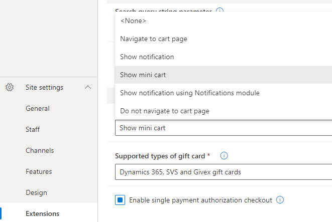
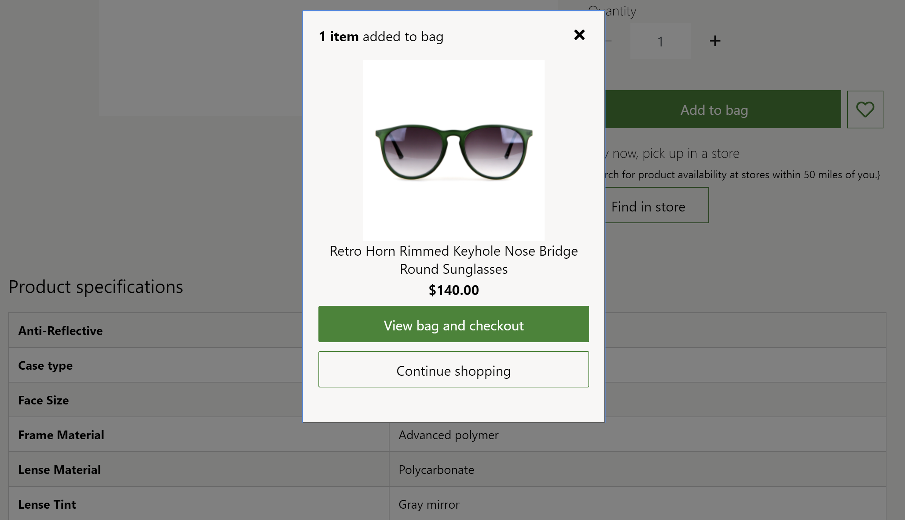

---
# required metadata

title: Add product to cart settings
description: This topic covers "add product to cart" settings and describes how to apply them in Microsoft Dynamics 365 Commerce.
author: anupamar-ms
ms.date: 06/23/2021
ms.topic: article
ms.prod: 
ms.technology: 

# optional metadata

# ms.search.form: 
audience: Application User
# ms.devlang: 
ms.reviewer: v-chgri
# ms.tgt_pltfrm: 
ms.custom: 
ms.assetid: 
ms.search.region: Global
# ms.search.industry: 
ms.author: anupamar
ms.search.validFrom: 2019-10-31
ms.dyn365.ops.version: Release 10.0.5

---

[!include [banner](includes/banner.md)]
[!include [banner](includes/preview-banner.md)]

# Add product to cart settings

This topic covers "add product to cart" settings and describes how to apply them in Microsoft Dynamics 365 Commerce.

When a product is added to cart on a Dynamics 365 Commerce site, there are different workflows that are supported. A site user may be navigated to cart page, or a notification may be shown confirming the add to cart action while keeping the user on the current page. To support these different workflows, there is an **Add product to cart** setting in Commerce site builder under **Settings /> Extensions**. 

The following workflows can be implemented using the **Add product to cart** setting:

 - **Navigate to cart page** - When this setting is selected, after adding an item to the cart users will be navigated to the cart page.
 - **Show notification** - When this setting is selected, users are shown a confirmation notification and can continue to browse on the product details page (PDP).
 - **Show mini cart** - When this setting is selected, users are shown the mini cart contents when an item is added to cart. This way a user can browse all the items in the cart and potentially proceed to checkout.
 - **Show notification using Notifications module** - When this setting is selected, users are shown a confirmation notification using the notifications module. The notifications module must be added to the page header for this setting to work.
 - **Do not navigate to cart page** - When this setting is selected, after adding an item to the cart users will remain on the current page.
 
The following example image shows the **Add product to cart** setting options in site builder.

> [!IMPORTANT]
> - The **Add product to cart** site settings are available as of the Dynamics 365 Commerce version 10.0.11 release. If you are updating from an older version of Dynamics 365 Commerce, you must manually update the appsettings.json file. For information on updating the appsettings.json file, see [SDK and module library updates](e-commerce-extensibility/sdk-updates.md#update-the-appsettingsjson-file). 
> - The **Show mini cart** option is available as of the Dynamics 365 Commerce version 10.0.20 release. If you are updating from an older version of Dynamics 365 Commerce, you must manually update the appsettings.json file. For information on updating the appsettings.json file, see [SDK and module library updates](e-commerce-extensibility/sdk-updates.md#update-the-appsettingsjson-file). 

The following example image shows an "added to cart" confirmation notification on the Fabrikam site.

The following example image shows an "added to cart" confirmation notification on the Adventure Works site.

## Additional Resources

[Module library overview](starter-kit-overview.md)

[Buy box module](add-buy-box.md)

[Store selector module](store-selector.md)

