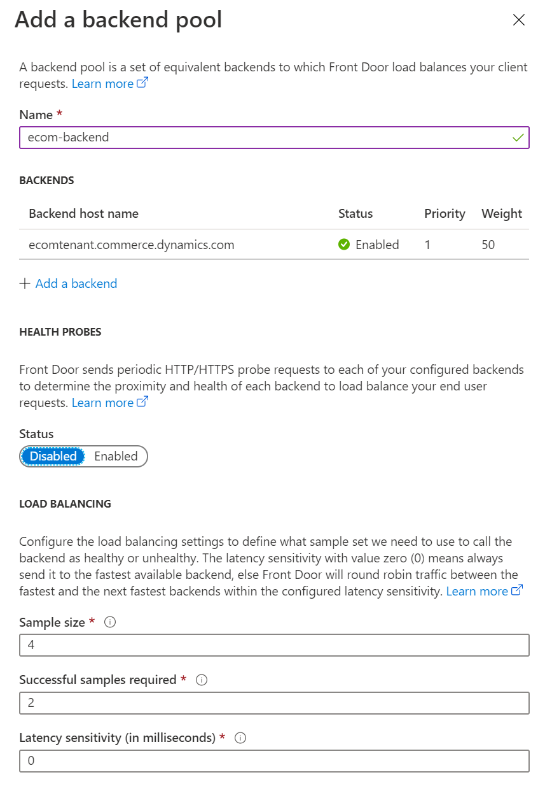

---
# required metadata

title: Add support for a content delivery network (CDN)
description: This topic describes how to add a content delivery network (CDN) to your Microsoft Dynamics 365 Commerce environment.
author: brianshook
manager: annbe
ms.date: 03/17/2021
ms.topic: article
ms.prod: 
ms.service: dynamics-365-commerce
ms.technology: 

# optional metadata

# ms.search.form: 
audience: Application user
# ms.devlang: 
ms.reviewer: v-chgri
# ms.tgt_pltfrm: 
ms.custom: 
ms.assetid: 
ms.search.region: Global
# ms.search.industry: 
ms.author: brshoo
ms.search.validFrom: 2019-10-31
ms.dyn365.ops.version: Release 10.0.5

---

# Add support for a content delivery network (CDN)

[!include [banner](includes/banner.md)]

This topic describes how to add a content delivery network (CDN) to your Microsoft Dynamics 365 Commerce environment.

When you set up an e-commerce environment in Dynamics 365 Commerce, you can configure it to work with your CDN service. 

Your custom domain can be enabled during the provisioning process for your e-commerce environment. Alternatively, you can use a service request to set it up after the provisioning process is completed. The provisioning process for the e-commerce environment generates a host name that is associated with the environment. This host name has the following format, where \<*e-commerce-tenant-name*\> is the name of your environment:

&lt;e-commerce-tenant-name&gt;.commerce.dynamics.com

The host name or endpoint that is generated during the provisioning process supports a Secure Sockets Layer (SSL) certificate only for \*.commerce.dynamics.com. It doesn't support SSL for custom domains. Therefore, you must terminate SSL for custom domains in your CDN and forward traffic from the CDN to the host name or endpoint that Commerce generated. 

Additionally, the *statics* (JavaScript or Cascading Style Sheets \[CSS\] files) from Commerce are served from the endpoint that Commerce generated (\*.commerce.dynamics.com). The statics can be cached only if the host name or endpoint that Commerce generated is put behind the CDN.

## Set up SSL

After you provision your Commerce environment with the custom domain that is provided, or after you provide the custom domain for your environment by using a service request, you need to work with the Commerce onboarding team to plan the DNS changes.

As was previously mentioned, the generated host name or endpoint supports an SSL certificate only for \*.commerce.dynamics.com. It doesn't support SSL for custom domains.

## CDN services

Any CDN service can be used with a Commerce environment. Here are two examples:

- **Microsoft Azure Front Door Service** – The Azure CDN solution. For more information about Azure Front Door Service, see [Azure Front Door Service Documentation](https://docs.microsoft.com/azure/frontdoor/).
- **Akamai Dynamic Site Accelerator** – For more information, see [Dynamic Site Accelerator](https://www.akamai.com/us/en/products/performance/dynamic-site-accelerator.jsp).

## CDN setup

The CDN setup process consists of these general steps:

1. Add a front-end host.
1. Configure a backend pool.
1. Set up rules for routing.

### Add a front-end host

Any CDN service can be used, but for the example in this topic, Azure Front Door Service is used. 

For information about how to set up Azure Front Door Service, see [Quickstart: Create a Front Door for a highly available global web application](https://docs.microsoft.com/azure/frontdoor/quickstart-create-front-door).

### Configure a backend pool in Azure Front Door Service

To configure a backend pool in Azure Front Door Service, follow these steps.

1. Add **&lt;ecom-tenant-name&gt;.commerce.dynamics.com** to a backend pool as a custom host that has a backend host header that is the same as **&lt;ecom-tenant-name&gt;.commerce.dynamics.com**.
1. Under **Load balancing**, leave the default values.
1. Disable health checks for the backend pool.

The following illustration shows the **Add a backend** dialog box in Azure Front Door Service with the backend host name entered.

The following illustration shows the **Add a backend pool** dialog box in Azure Front Door Service with the default load balancing values.

### Set up rules in Azure Front Door Service

To set up a routing rule in Azure Front Door Service, follow these steps.

1. Add a routing rule.
1. In the **Name** field, enter **default**.
1. In the **Accepted protocol** field, select **HTTP and HTTPS**.
1. In the **Frontend hosts** field, enter **dynamics-ecom-tenant-name.azurefd.net**.
1. Under **Patterns to match**, in the upper field, enter **/\***.
1. Under **Route Details**, set the **Route type** option to **Forward**.
1. In the **Backend pool** field, select **ecom-backend**.
1. In the **Forwarding protocol** field group, select the **Match request** option. 
1. Set the **URL rewrite** option to **Disabled**.
1. Set the **Caching** option to **Disabled**.

> [!WARNING]
> If the domain that you will use is already active and live, create a support ticket from the **Support** tile in [Microsoft Dynamics Lifecycle Services](https://lcs.dynamics.com/) to get assistance for your next steps. For more information, see [Get support for Finance and Operations apps or Lifecycle Services (LCS)](../fin-ops-core/dev-itpro/lifecycle-services/lcs-support.md).

If your domain is new and is not a pre-existing live domain, you can add your custom domain to the configuration for Azure Front Door Service. This will enable web traffic to direct to your site via the Azure Front Door instance. To add the custom domain (for example, `www.fabrikam.com`), you must configure a Canonical Name (CNAME) for the domain.

The following illustration shows the **CNAME configuration** dialog box in Azure Front Door Service.

You can use Azure Front Door Service to manage the certificate, or you can use your own certificate for the custom domain.

The following illustration shows the **Custom Domain HTTPS** dialog box in Azure Front Door Service.

For detailed instructions on adding a custom domain to your Azure Front Door, see [Add a custom domain to your Front Door](https://docs.microsoft.com/azure/frontdoor/front-door-custom-domain).

Your CDN should now be correctly configured so that it can be used with your Commerce site.

## Additional resources

[Configure your domain name](configure-your-domain-name.md)

[Deploy a new e-commerce tenant](deploy-ecommerce-site.md)

[Create an e-commerce site](create-ecommerce-site.md)

[Associate a Dynamics 365 Commerce site with an online channel](associate-site-online-store.md)

[Manage robots.txt files](manage-robots-txt-files.md)

[Upload URL redirects in bulk](upload-bulk-redirects.md)

[Set up a B2C tenant in Commerce](set-up-B2C-tenant.md)

[Set up custom pages for user logins](custom-pages-user-logins.md)

[Configure multiple B2C tenants in a Commerce environment](configure-multi-B2C-tenants.md)

[Enable location-based store detection](enable-store-detection.md)
