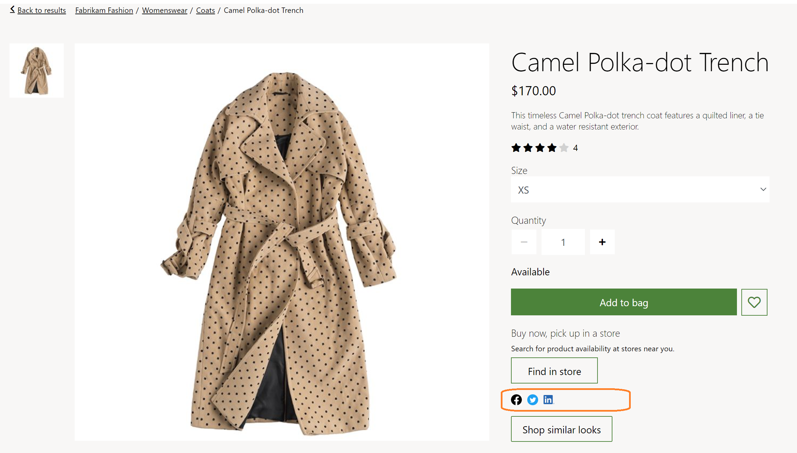

---
# required metadata

title: Social share module 
description: This topic covers social share module and describes how to add them to site pages in Microsoft Dynamics 365 Commerce.
author:  anupamar-ms
manager: annbe
ms.date: 05/28/2020
ms.topic: article
ms.prod: 
ms.service: dynamics-365-commerce
ms.technology: 

# optional metadata

# ms.search.form: 
# ROBOTS: 
audience: Application User
# ms.devlang: 
ms.reviewer: v-chgri
ms.search.scope: Retail, Core, Operations
# ms.tgt_pltfrm: 
ms.custom: 
ms.assetid: 
ms.search.region: Global
ms.search.industry: 
ms.author: anupamar
ms.search.validFrom: 2019-10-31
ms.dyn365.ops.version: 
---

# Social share module

[!include [banner](includes/banner.md)]

This topic covers social share module and describes how to add them to site pages in Microsoft Dynamics 365 Commerce.

## Overview

Social share module allows the user to share the page Url in social media such as Facebook, Linkedin etc. Its commonly used on the product details page to share the product information. This module was enabled in 10.0.13.

**Social share module** is a container of **Social share item** modules. Each Social share item module can be configured to point to a specific social media. We support integration with the following social media's out of box - Facebook, Twitter, Pinterest, Linkedin and Mail. When a site user interacts with the social media icon, an iframe is launched for the respective social media. Within the iframe, the user can login and post the page content that they were viewing. Each social media platform expects certain data to be availble TBD.

Each social media platforms may track some cookies, therefore this module requires the user to accept the cookie consent message. When cookie consent is not accepted, the module will be hidden on the page. For more details, refer to [Cookie compliance](cookie-compliance.md)

The following image shows an example of a Social share module that is used on product details page.

## Social share module properties

| Property name             | Value                 | Description |
|---------------------------|-----------------------|-------------|
| Caption                  | Caption text | The module can be provided with a caption for this module|
| Orientation |Horizontal or Vertical    | This defines the layout for the social media items, it can be Horizontal or Vertical |

## Social share item module properties
| Property name             | Value                 | Description |
|---------------------------|-----------------------|-------------|
| Social media              | Facebook, Twitter, Pinterest, Linkedin, Mail | A dropdown with a list of social media platforms to chose from|
| Icon |Image    | This will be the icon that will be shown for the respective social media. As a best practice, refer to the social media platform's SDK for the recommended icon for each platform |

## Add a social share module to a buy box module

The Social share module can be added to the buy box module within the **Social share slot**.  

1. In Fabrikam, open the the **DefaultPDP** page which is the product details page 
1. To the Buy box module, **Social share slot** add the **Social share module**. Set caption if needed. Set Orientation=Horizontal
1. To the **Social share** add a **Social share item** module.
1. On the **Social share item** module, select Social Media = Facebook. Set Icon to the Facebook icon.
1. Conitnue adding more **Social share item**s.
1. Select **Save**, and then select **Preview** to preview the page. The page will show the social share module.
1. Select **Finish editing** to check in the page, and then select **Publish** to publish it.

## Additional resources

[Starter kit overview](starter-kit-overview.md)

[Buy Box](add-buy-box.md)

[Cookie compliance](cookie-compliance.md)
