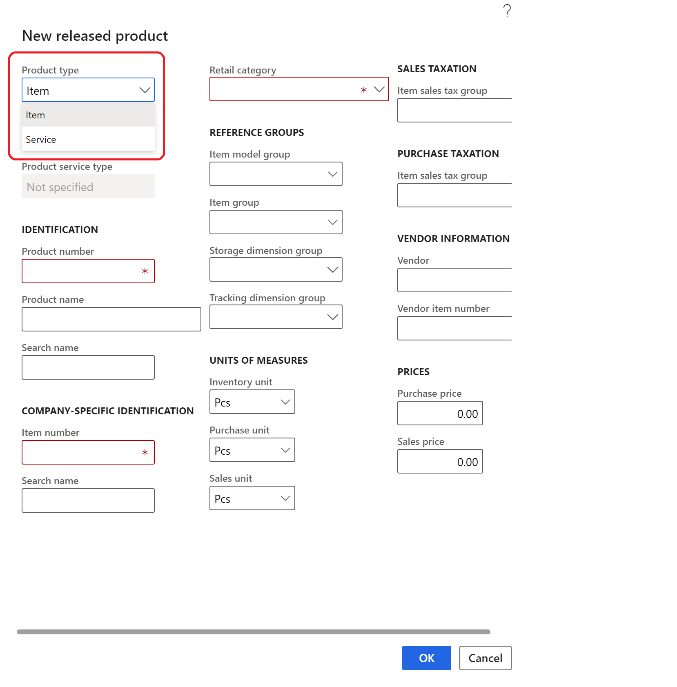

---
# required metadata

title: Configure digital gift cards
description: This topic describes how to configure digital gift cards in Dynamics 365 Commerce.
author: anupamar-ms
manager: annbe
ms.date: 11/16/2020
ms.topic: article
ms.prod: 
ms.service: dynamics-365-commerce
ms.technology: 

# optional metadata

ms.search.form:  
audience: Application User
# ms.devlang: 
ms.reviewer: v-chgri
ms.search.scope: Retail, Core, Operations
# ms.tgt_pltfrm: 
# ms.custom: 
ms.search.region: Global
ms.search.industry: 
ms.author: anupamar
ms.search.validFrom: 2019-10-31
ms.dyn365.ops.version: Release 10.0.15

---

# Configure digital gift cards

[!include [banner](includes/banner.md)]
[!include [banner](includes/preview-banner.md)]

This topic describes how to configure digital gift cards in Dynamics 365 Commerce.

The purchase of digital gift cards is supported as of the Dynamics 365 Commerce 10.0.16 release. 

## Digital gift cards in Dynamics 365 Commerce

In Dynamics 365 Commerce, the digital gift card purchase flow follows the same flow as other products in the system and does not require any additional modules to be configured.

When multiple gift cards are added to the cart, gift card items will not be aggregated in a single sales line. This is required because each sales line will be invoiced with a separate gift card number. 

## Enable the digital gift card feature in Commerce headquarters

The **Purchasing gift card on e-commerce feature** feature flag must be enabled in Commerce headquarters for gift card purchase flow to work in Dymamics 365 Commerce. The feature flag can be found in **Feature Management** in Head quarters. Below is an image of the Feature Management page that shows the new feature flag.

## Configure a digital gift card in Commerce headquarters

Digital gift card products should be configured in Commerce headquarters similar to other products. For more information on creating and configuring products, see [Create a new product in Commerce](create-new-product-commerce.md).

Here are important steps specific to configuring a gift card for purchase in Commerce headquarters.

- When configuring digital gift card products, set the **Product type** property to **Service item**. If a product is of type **Service item**, it will not be checked for available inventory before placing an order. For more information, see [Create a new product](create-new-product-commerce.md#create-a-new-product). See image below for details.

- The product needs to be configured as a Gift card. For more information on how to configure a product as gift card, see [Support for external gift cards](./dev-itpro/gift-card.md).
- If a gift card needs to support multiple predefined values (for example, $25, $50, $100), the predefined values should be set up using the **Size** dimension. Each predetermined amount will be a variant. For more information, see [Product dimensions](https://docs.microsoft.com/dynamics365/supply-chain/pim/product-dimensions?toc=/dynamics365/retail/toc.json).
- If a gift card needs to allow customers to specify a custom amount, first set up a variant that allows a custom amount. Then open the product from the **Released Products in Category** page, navigate down to **Commerce** section, and set the **Key in Price** property to **Must key in price**. This ensures that a price can be entered by the customer when browsing the product on a product details page (PDP).

- Set the delivery mode for gift cards to be of type **Electronic**. Navigate to Retail Commerce->Channel Setup->Modes of delivery and assign **Electronic** to gift card product. For more information, see [Set up modes of delivery](https://docs.microsoft.com/dynamicsax-2012/appuser-itpro/set-up-modes-of-delivery).

- Ensure that you have an online functionality profile created and associated with your online store in Commerce headquarters. In the functionality profile, set the **Aggregate products** property to **Yes**. This will ensure that all items except gift cards are aggregated. For more information, see [Create an online functionality profile](online-functionality-profile.md).
- To ensure that customers receive an email once a gift card is invoiced, go to **Email notification profiles**, create a new email notification type, and set the **Email notification type** property to **Issue gift card**. For more information, see [Set up an email notification profile](email-notification-profiles.md).

## Add product images to the Commerce site builder Media library

You must add product images for digital gift card products to the Commerce site builder **Media library**. Ensure that he gift card image file names follow naming conventions for product images. For more information, see [Upload images](dam-upload-images.md).

## Configure a custom amount for a digital gift card in Commerce site builder

If a digital gift card is configured to allow a custom amount, this must also enabled in the [Buy box module](add-buy-box.md) used on your site's PDPs. The buy box module supports module configuration to allow custom prices. In addition, you can define the **Minimum** and **Maximum** amounts allowed for the custom price.

To configure a custom amount for a digital gift card in Commerce site builder, follow these steps.

1. Navigate to the buy box module used on your site's PDPs. This might be implemented in a fragment, template, or page.
1. Select **Edit**. 
1. In the properties pane on the right, select the **Allow custom price** check box.
1. To optionally define minimum and maximum amounts for custom prices, enter prices under **Minimum price** and **Maximum price**.
1. Select **Finish editing**, and then select **Publish**.

## Additional resources

[Buy box module](add-buy-box.md)

[Checkout module](add-checkout-module.md)

[Cart module](add-cart-module.md)

[Create a new product in Commerce](create-new-product-commerce.md)

[Set up modes of delivery](https://docs.microsoft.com/dynamicsax-2012/appuser-itpro/set-up-modes-of-delivery)

[Product dimensions](https://docs.microsoft.com/dynamics365/supply-chain/pim/product-dimensions?toc=/dynamics365/retail/toc.json)

[Set up an email notification profile](email-notification-profiles.md)

[Create an online functionality profile](online-functionality-profile.md)

[Support for external gift cards](./dev-itpro/gift-card.md)
