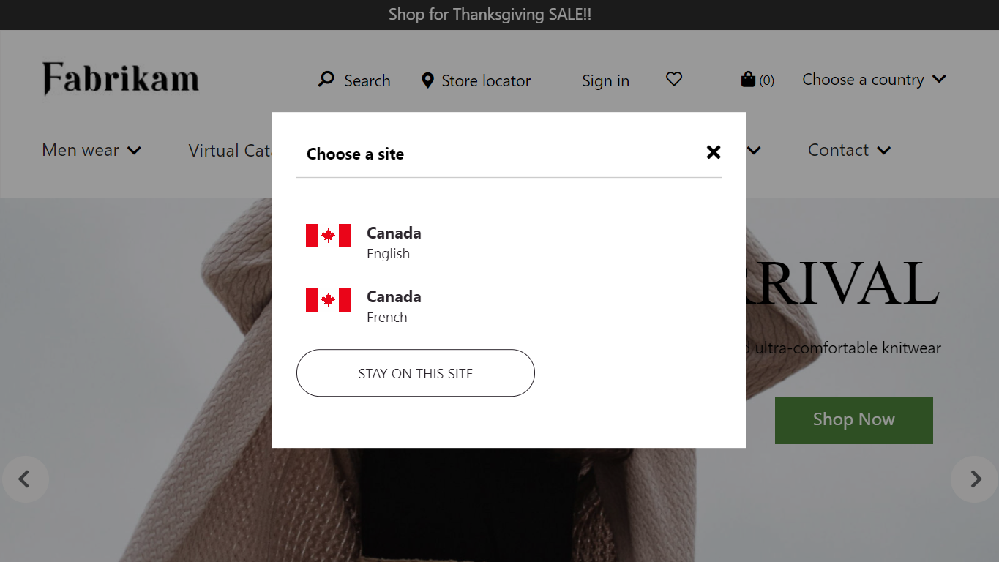

---
# required metadata

title: Country/region picker module
description: This topic covers the country/region picker module and describes how to add it to site pages in Microsoft Dynamics 365 Commerce. 
author: stuharg
ms.date: 09/03/2021
ms.topic: article
ms.prod:
ms.technology:

# optional metadata
# ms.search.form:
# ROBOTS:
audience: Application User
# ms.devlang:
ms.reviewer: v-chgri
# ms.tgt\_pltfrm:
ms.custom:
ms.assetid:
ms.search.region: Global
ms.search.industry:
ms.author: anupamar
ms.search.validFrom: 2021-08-12
ms.dyn365.ops.version: Release 10.0.22

---

# Country and region picker module

[!include [banner](includes/banner.md)]
[!include [banner](includes/preview-banner.md)]

This topic covers the country/region picker module and describes how to add it to site pages in Microsoft Dynamics 365 Commerce.

The country/region picker module uses the Commerce [geo detection and redirection](geo-detection-redirection.md) feature to display recommended URLs to customers who request an e-commerce site URL that is not associated with their country/region. 

For example, if a customer in Canada requests a site URL that is not associated with Canada, the country/region picker module displays a dialog box that recommends site URLs that are associated with Canada, as shown in the following example illustration.

## Country/region picker module properties

| Property name              | Value       | Description                                                  |
| -------------------------- | ----------- | ------------------------------------------------------------ |
| Heading                    | Text        | The heading that displays at the top of the module.          |
| Sub heading                | Text        | Smaller text that displays below the heading.                |
| Country: display string    | Text        | Display name for a URL option in the country/region picker (for example, "Canada"). |
| Country: display substring | Text        | Optional display substring for a URL option (for example, "English" and "French"). |
| Country: Country image     | Media asset | Optional image associated with the URL option (for example, a Canadian flag image). |
| Country: Country URL       | Text        | The URL that corresponds to the channel and locale configured for the country on the **Channels** page in site builder (**Site settings \> Channels**). This URL must exactly match the URL configured on the **Channels** page. |
| Action link                | Action link | Optional link that displays at the bottom of the country/region picker dialog box. This link can point to an internal page that provides a list of all countries supported by this site. |

## Add a country/region picker module to a page

The country/region picker module can be added to the header module either directly or via a shared fragment, where you can configure the module heading and properties. For more information, see [Header module](author-header-module.md).

## Configure the country/region picker module in Commerce site builder 

The URLs that you'll recommend to your customers must be configured as country objects in the country/region picker module. 

For each URL that you want to display and recommend to customers, follow these steps in site builder.

1. Under **Country list**, select **+ Add country**  
1. Select the newly-created box that says "Country".
1. Enter a **Display string** (for example, "Canada").
1. Enter an optional **Display substring** (for example, "French", or "fr-ca"). 
1. Specify an optional image from the media library.
1. Enter the **Country URL**. This URL must exactly match the URL shown on the **Channels** page that is mapped to the channel, including the locale associated with the country. 
1. Select **OK**.
1. Repeat the steps above for any additional country URLs you want the country/region picker module to display. 

## Additional resources

[Set up geo detection and redirection](geo-detection-redirection.md)

[Module library overview](starter-kit-overview.md)

[Header module](author-header-module.md)

[!INCLUDE[footer-include](../includes/footer-banner.md)]
