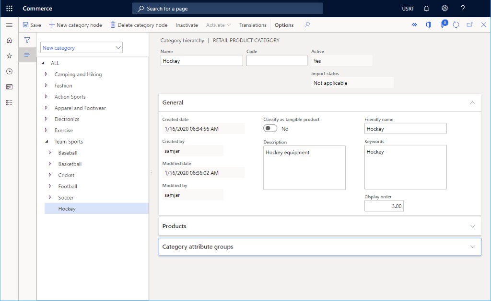

---
# required metadata

title: Create a new product hierarchy
description: This topic describes how to create a new product hierarchy in Microsoft Dynamics 365 Commerce.
author: samjarawan
manager: annbe
ms.date: 01/27/2020
ms.topic: article
ms.prod: 
ms.service: dynamics-365-commerce
ms.technology: 

# optional metadata

# ms.search.form: 
audience: Application User
# ms.devlang: 
ms.reviewer: v-chgri
#ms.search.scope: Retail, Core, Operations
# ms.tgt_pltfrm: 
ms.custom: 
ms.assetid: 
ms.search.region: Global
# ms.search.industry: 
ms.author: samjar
ms.search.validFrom: 2020-01-20
ms.dyn365.ops.version: Release 10.0.8

---
# Create a new product hierarchy

[!include [banner](includes/banner.md)]

This topic describes how to create a new product hierarchy in Microsoft Dynamics 365 Commerce.

## Overview

Dynamics 365 Commerce supports multiple retail channels. These retail channels include online stores, call centers, and retail stores (also known as brick-and-mortar stores). Each retail store channel can have its own payment methods, price groups, point of sale (POS) registers, income accounts and expense accounts, and staff. You must set up all of these elements before you can create a retail store channel. 

A Commerce product hierarchy is used to define the overall product hierarchy for your organization. You can use a Commerce product hierarchy for merchandising, pricing and promotions, reporting, and assortment planning. Only one Commerce product hierarchy can be assigned per organization.

## Create and configure a product hierarchy

To create and configure a Commerce product hierarchy, follow these steps.

1. In the navigation pane, go to **Modules \> Retail and commerce \> Products and categories \> Commerce product hierarchy**.
1. If no hierachy exists yet, on the **Action pane**, select **New** to create the root of the hierarchy.
1. Under **General**:
    1. In the **Name** box, enter a name.
    1. In the **Description** box, enter a description.
    1. In the **Friendly name** box, enter a friendly name.
    1. Set **Active** to **Yes**.

## Add hierarchy nodes

To add hierarchy nodes, follow these steps.

1. On the action pane, select **Edit category hierarchy**.
1. Select the parent node you want to add a new node to, and then select **New category node**.
1. In the **General** section provide a **Name**, **Description**, **Friendly name** and **Keywords**.
1. Under **General**:
    1. In the **Name** box, enter a name.
    1. In the **Description** box, enter a description.
    1. In the **Friendly name** box, enter a friendly name.
    1. In the **Keywords** box, enter relevant keywords.
    1. In the **Display order**box, enter a number for the display order (optional).
1. On the action pane, select **Save**.
1. Repeat the steps above to add additional nodes.

The following image shows the creation of a new product hierarchy node.

## Other settings

Category attribute groups can also be assigned to each group as required.  

## Additional resources

[commerce hierarchies](retail-hierarchies.md)

[Manage product categories and products ](category-management-product-creation.md)

[Change the sort order for merchandizing entities](custom-order-categories-nav-retail-prod-hierarchy.md)
