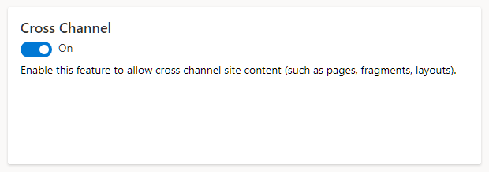
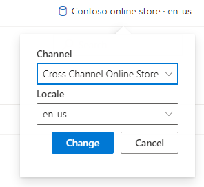

---
# required metadata

title: Cross-channel sharing
description: This topic describes the cross-channel sharing feature of Dynamics 365 Commerce site builder that allows content to be shared between multiple channels of an e-Commerce site.
author: psimolin
manager: annbe
ms.date: 07/31/2020
ms.topic: article
ms.prod: 
ms.service: dynamics-365-commerce
ms.technology: 

# optional metadata

ms.search.form:  
audience: Application User
# ms.devlang: 
ms.reviewer: v-chgri
ms.search.scope: Retail, Core, Operations
# ms.tgt_pltfrm: 
# ms.custom: 
ms.search.region: Global
ms.search.industry: 
ms.author: psimolin
ms.search.validFrom: 2019-10-31
ms.dyn365.ops.version: Release 10.0.5

---
# Cross-channel sharing

[!include [banner](includes/banner.md)]
[!include [banner](includes/preview-banner.md)]

This topic describes the cross-channel sharing feature of Dynamics 365 Commerce site builder that allows content to be shared between multiple channels of an e-Commerce site.

## Overview

Cross-channel sharing allows the retailer to reuse and share content between multiple channels of a site. This is particularly useful when the channels of a site have a compatible base language or they have a lot of common content items that can be shared as such between the channels.

Cross-channel sharing works by enabling a default channel which will be searched for available content in case channel specific version of the requested content is not found. Content meant to be shared between channels is created in this channel and can be localized to any of the locales used on any channels of the site.

## When to use the cross-channel sharing feature

Cross channel sharing is useful when there are multiple channels on a single site that can share some of the content between them.

One example would be a retailer with multiple brands and storefronts that are grouped under a single site. In this case some of the content can be shared with all or some of the storefronts, for example terms and conditions, payment terms, shipment methods and FAQ. Cross channel sharing supports fragments as well, which means that terms and conditions page can be created as cross channel content, with channel specific fragments used in it. This means that while most of the content is shared between the channels, with cross channel sharing it is possible to have storefront (channel) specific fragments on a cross channel page, which are rendered only when requested from that specific storefront.

Sites with a single channel only or multiple channels which cannot share content do not benefit from cross channel sharing.

## Enable cross-channel sharing

Cross-channel sharing is enabled at the site level and is a one-way operation. Once enabled, it cannot be disabled.

To enable cross-channel sharing in site builder, follow these steps.

1. Go to **Site settings \> Features**.
1. Under **Cross Channel**, set the feature to **On**. 

The following image show the **Cross Channel** setting in site builder under **Site settings \> Features**.

After enabling cross-channel sharing, cross-channel information will be visible in the **Channels** section under **Site settings \> Features**, as shown in the following example image.

After enabling cross-channel sharing, the **Channel** drop down menu options in site builder will also include a **Cross Channel Online Store** entry to manage cross-channel content, as show in the following image.

## Create cross-channel content

Log in to the Site builder and navigate to the site you wish to create cross channel content to. Select the Cross channel entry from the drop down list and ensure that the source locale is selected.

In this example we do the following
* Create a cross channel fragment
* Create a cross channel page where we use the cross channel and channel specific fragments
* Override cross channel fragment with a channel specific version

### Create a cross-channel fragment

To create a cross-channel fragment in site builder, follow these steps.

1. Go to **Fragments**, and select **New** to create a new fragment.
1. In the **New page fragment** dialog box, select the **Promo banner** module, and then under **Page fragment name** enter a name (for example, **Cross-channel banner**), and then select **OK**.
1. In the **Promo banner** module property pane, select **+ Add Message**, and then select **Message**.
1. In the **Message** dialog box, enter "Cross channel" under **Text**, and the select **OK**. 
1. Select **Save**, select **Finish editing** to check in the page, and then select **Publish** to publish it.

The fragment you just created is a cross-channel fragment. It can be used on a cross-channel page or channel-specific page created on any of the channels of this site.

### Create a cross-channel page that uses cross-channel content

Cross channel pages are available for use on any channel of your site. This allows you to create a shared content page once and then make any updates later in a single place. For example, a cross-channel "Terms and conditions" page with URL "/toc" could be shared for all the channels of a site. If the base URLs for the site channels were www.fabrikam.com/brand1 and www.fabrikam.com/brand2, the same cross-channel shared "Terms and conditions" page would be available from both URLs (www.fabrikam.com/brand1/toc and www.fabrikam.com/brand2/toc). If the "Terms and conditions" page needed to be updated later, you would only have to update the shared page. 

To create a cross-channel page in site builder that uses cross-channel content, follow these steps.

1. Go to **Pages**, and select **New** to create a new page.
1. In the **Choose a template** dialog box, select a template such as **Marketing**. 
1. Under **Page name**, enter a name for the page (for example, "Cross-channel page").
1. Under **Page URL**, enter a page URL (for example, "examplepage"), and then select **OK**.
1. In the **Main** slot of the new page, select the ellipsis (**...**), and then select **Add Fragment**.
1. In the **Add Fragment** dialog box, select the cross-channel fragment with a promo banner that you just created, and then select **OK**.
1. Select **Save**, and then select **Preview** to preview the page. You should be able to see the promo banner that says "Cross channel."
1. Select **Finish editing** to check in the page, and then select **Publish** to publish it.

### Create a channel-specific page that uses cross-channel content

Using cross-channel content on channel-specific pages allows you to create your shared content fragment once and then use it on channel-specific pages. This is very useful for shared content such as terms and conditions, payment terms, or contact information.

To create a channel-specific page in site builder that uses cross-channel content, follow these steps.

1. From within a specific channel such as "Fabrikam extended online store", go to **Pages**, and select **New** to create a new page. 
1. In the **Choose a template** dialog box, select a template such as **Marketing**. 
1. Under **Page name**, enter a name for the page (for example, "Channel-specific page").
1. Under **Page URL**, enter a page URL (for example, "channelspecificpage"), and then select **OK**.
1. In the **Main** slot of the new page, select the ellipsis (**...**), and then select **Add Fragment**.
1. In the **Add Fragment** dialog box, under **Channel** select **Cross Channel Online Store**. You should see the cross-channel fragment you created earlier. Select it, and then select **OK**.
1. Select **Save**, and then select **Preview** to preview the page. You should be able to see the promo banner that says "Cross channel."
1. Select **Finish editing** to check in the page, and then select **Publish** to publish it.

### Create a channel-specific version of a cross-channel page

Cross-channel sharing supports the overriding of cross-channel content. For example, all of your channels share the exact same piece of content except one, which needs different content. To achieve this for the exceptional channel, you would override the cross-channel content with a channel-specific content.

To create a channel-specific version of a cross-channel page in site builder, follow these steps.

1. From the channels drop down menu at the top right, ensure that the **Cross Channel Online Store** option is selected. 
1. Open the cross-channel page you created earlier. 
1. From the channels drop down menu at the top right, select the channel that you want to have specific content. The page editor will become empty with a message prompting you to create new page variant. 
1. Select **Create page variant**.
1. In the **Main** slot of the page variant, select the ellipsis (**...**), and then select **Add Module**.
1. In the **Add Module** dialog box, select the **Promo banner** module, and then select **OK**.
1. In the **Promo banner** module property pane, select **+ Add Message**, and then select **Message**.
1. In the **Message** dialog box, enter "Channel-specific" under **Text**, and the select **OK**. 
1. Select **Save**, and then select **Preview** to preview the page. You should be able to see the promo banner that says "Channel-specific."
1. Select **Finish editing** to check in the page, and then select **Publish** to publish it.
Select Main slot and Add a module - choose a **Promo banner** module. Add a message with a text "Channel specific". Then Finish editing and Publish.

Now if you use the base URL of the channel and navigate to the URL of the cross channel page on that site, you will see that you get the "Channel specific" content instead of the cross channel content.

#### Recap

* Enabling Cross Channel sharing is a one-way operation - make sure your site structure benefits from Cross channel sharing before enabling it
* Cross channel sharing allows creating content (pages and fragments) which will be available on all the channels of the site using the same URL
* Cross channel pages can use also channel specific fragments, which will be rendered only when the page is requested from that specific storefront (channel)
* Channel specific pages can use cross channel fragments
 
## Additional resources

[Authoring page overview](authoring-home-overview.md)

[Document states and lifecycle](document-states-overview.md)
