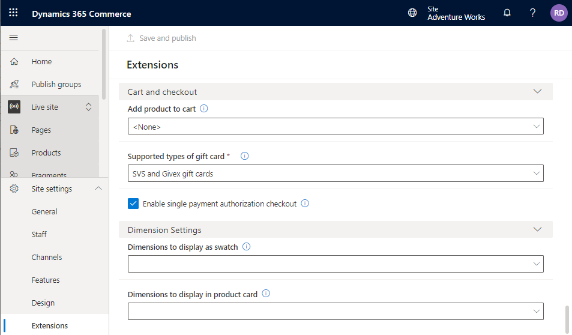

---
# required metadata

title: Enhanced payments in storefront checkout
description: This topic provides an overview of enhanced strong customer authentication (SCA) support for storefront checkout in Microsoft Dynamics 365 Commerce.
author: rubendel
ms.date: 6/02/2021
ms.topic: article
ms.prod: 
ms.service: dynamics-365-retail
ms.technology: 

# optional metadata

# ms.search.form: 
# ROBOTS: 
audience: IT Pro
# ms.devlang: 
ms.reviewer: v-chgri
# ms.tgt_pltfrm: 
ms.custom: 141393
ms.assetid: e23e944c-15de-459d-bcc5-ea03615ebf4c
ms.search.region: Global
ms.search.industry: Retail
ms.author: rubendel
ms.search.validFrom: 
ms.dyn365.ops.version: AX 7.0.1

---

# Enhanced payments in storefront checkout

[!include [banner](../includes/banner.md)]

This topic provides an overview of enhanced strong customer authentication (SCA) support for storefront checkout in Microsoft Dynamics 365 Commerce.

## Key terms

| Term | Description |
|---|---|
| SCA | Strong Customer Authentication refers to a capability that allows a purchaser's identity to be verified by their bank when an online purchase is attempted. This is typically perfomred via a redirect from the checkout to a page hosted by the cardholder's bank where their identity is verified. Once validated, the purchaser is directed back to the storefront where the order proceeds through checkout. |
| Redirect | A web page used to verify that the person making the purchase is the cardholder associated with the card being used to make the purchase.
| Card token | An alias that is used to refer to a real card number. Card tokens allow a reference to an actual card to be saved while avoiding the security issues associated with saving real card numbers. | 

Traditionally, the storefront checkout process made two distinct calls to the payment processor. The first call was used to tokenize the card number entered in the payment processor's embedded HTML iframe element during checkout. During this first call, SCA was also enabled so that the cardholder could be authenticated with the card's issuing bank if needed. The second call used the card token obtained from the first call to request the actual authorization response. 

This two-step method of acquiring payment authorizations was not ideal for all cases, for the following reasons: 

- Not all payment processors support a zero amount authorization request, which was used in the first call to request the payment token. 
- Since SCA was performed during the first call, the liability shift granted by SCA was only evident in the tokenization request, not on the actual authorization request. 

Aside from technical issues, the traditional storefront checkout process also caused confusion for merchants when they were reviewing payment processing activity and seeing many zero amount requests. 

To address the issues noted above, payments in Commerce storefront checkout have been refactored to only require a single request. This single request performs all necessary functions related to payment processing, including:

- Obtaining a card token where supported in case the authorization expires and a new authorization is required for fulfillment. 
- Providing support for SCA during the actual authorization request so that the liability shift is evident on the authorization for the amount due.

## Key changes from the traditional storefront checkout flow

### No "Review order" step

Once the payments flow is initiated, there is no step to review and submit the order. When payment details are entered, customers will only have the option to "Place order." If the payment method provided requires SCA, customers will be redirected to the bank's authentication page. Once authentication is completed, customers will be redirected back to the checkout page and the order will be processed. 

The flow described above is also applicable to payment methods that redirect by default, such as PayPal. Once payment details have been provided to PayPal, the redirect back to the checkout page will initiate placement of the order. 

With the traditional flow, after the payment details had been entered in the embedded iframe element there was a "Save and continue" button available that would add the tokenized payment to the checkout. In demonstration environments there may have also been a step to collect the customer's email, or have the customer agree to terms of use. With the new flow, the validation that was previously perfomed by the final "Save and continue" button is now performed by the "Place order" button, saving a click for the customer and eliminating a page load from the checkout flow. 

## Payment connector support

The out-of-the-box payment connectors for Adyen and PayPal support the enhanced payment flows in checkout by default. 

> [!IMPORTANT]
> - Only Adyen connector version **V002** will truly support enhanced SCA. Version **V001** will still work when the checkout is configured for enhanced SCA, but behind the scenes that version of the connector will still make two calls. 
> - Version **V001** of the Adyen connector should no longer be used due to SCA requirements that went into effect in the EU on January 1, 2021. For information about configuring the Adyen connector to use version **V002**, see the [Set up a processor for new credit cards](adyen-connector.md?tabs=8-1-3#set-up-a-processor-for-new-credit-cards).

## Enable enhanced payments in storefront checkout in Commerce site builder

To enable the enhanced payments feature in Commerce site builder, follow these steps.

1. In the site you want to edit, expand **Site settings**.
2. Select **Extensions**. 
3. Scroll down to **Cart and checkout**, select the **Enable single payment authorization checkout** check box.
4. Select **Save and publish**. 

## Additional resources

[Payments FAQ](payments-retail.md)

[Dynamics 365 Payment Connector for PayPal](../paypal.md)

[Dynamics 365 Payment Connector for Adyen](adyen-connector.md)

[Adyen redirect](../adyen_redirect.md)

[!INCLUDE[footer-include](../../includes/footer-banner.md)]
