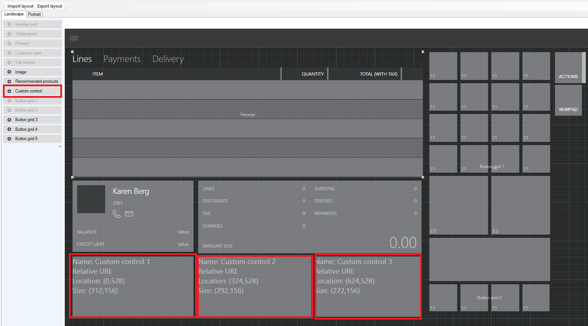
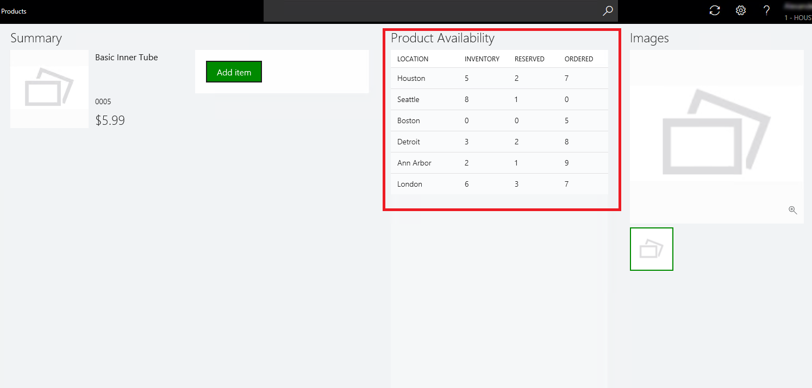

---
# required metadata

title: Add custom controls to POS views
description: This topic explains how you can enhance the information that appears in the Dynamics 365 Commerce POS views by adding custom controls. 
author: mugunthanm
manager: AnnBe
ms.date: 09/15/2017
ms.topic: article
ms.prod: 
ms.technology: 

# optional metadata

# ms.search.form: 
# ROBOTS: 
audience: Developer
# ms.devlang: 
ms.reviewer: rhaertle
# ms.tgt_pltfrm: 
ms.custom: 83892
ms.search.region: Global
# ms.search.industry: 
ms.author: mumani
ms.search.validFrom: 2017-09-15
ms.dyn365.ops.version: AX 7.0.0, Retail September 2017 update

---


# Add custom controls to POS views

[!include [banner](../../includes/banner.md)]

To enhance the information that appears in the views in Microsoft Dynamics 365 Commerce POS, you can add custom controls. A custom control lets you add your own custom information to the existing POS views. Custom controls can be implemented by using the POS extension framework.

In Cart view, you can add custom controls by using the POS screen layout designer. In this case, you can drag a custom control to a location of your choice, and you can also set the height and width of the control. You then write the extension logic in the extension project.

For example, in the following illustration, three custom controls were added by using the screen layout designer.



Currently, only Cart view lets you use the screen layout designer to add custom controls. For all other screens, you should do the layout in the extension project. One advantage of using the screen layout designer is that you can drag the custom control wherever you want on the screen. On other screens, the position is fixed, but you can modify the position by specifying the height and width.

## Custom control matrix

The following table shows the views that support custom controls in POS.

| POS view                   | Supports custom controls | Supports screen layout designer |
|----------------------------|--------------------------|---------------------------------|
| Cart view/Transaction page | Yes                      | Yes                             |
| Customer details view      | Yes                      | No                              |
| Product details view       | Yes                      | No                              |
| Customer Add/Edit view     | Yes    | No                              |
| Address Add/Edit view      | Yes    | No                              |

> [!NOTE]
> Custom controls are supported only in the following product versions:
> - **For views that aren't based on the screen layout designer:** Microsoft Dynamics 365 for Finance and Operations App update 3 and Microsoft Dynamics 365 Retail App update 3
> - **For views that are based on the screen layout designer:** Microsoft Dynamics 365 for Finance and Operations App update 4 and Microsoft Dynamics 365 Retail App update 4

## Create a custom control

The following example shows how you can use extension to add custom controls to one of the existing POS views. For this example, we want information about product availability to appear in the product details view. To show this information, we will add a custom data list that has four columns: **Location**, **Inventory**, **Reserved**, and **Ordered**. You can use the same procedure to show other custom information in the POS views.

1. On the developer virtual machine (VM), start Microsoft Visual Studio 2015.
2. Open the **ModernPos.sln** file from RetailSDK\\POS.
3. In the **POS.Extensions** project, add a new folder, and name it **SampleExtensions**.
4. In the new **SampleExtensions** folder, add another folder, and name it **ViewExtensions**.
5. In the **ViewExtensions** folder, add another folder, and name it **SimpleProductDetails**.

    > [!NOTE]
    > If you're extending a view, you should give the folder the same name as the view, to make navigation and code maintenance easier.

6. In the **SimpleProductDetails** folder, add a new .html file, and name it **ProductAvailabilityPanel.html**. Also add a new .ts file, and name it **ProductAvailabilityPanel.ts**. In the .html file, you can add whatever information you want the custom control to show. In the .ts file, you add the corresponding logic.

    A custom control is a simple HTML page that has your custom information.

7. Open the **ProductAvailabilityPanel.html** file, and paste the following code into it.

    ```html
    <!DOCTYPE html>
    <html lang="en" xmlns="http://www.w3.org/1999/xhtml">
        <head>
            <meta charset="utf-8" />
            <title></title>
        </head>
        <body>
            <!-- Note: The element ID differs from the ID that is generated by the POS extensibility framework. This 'template' ID isn't used by the POS extensibility framework. -->
            <script id="Microsot\_Pos\_Extensibility\_Samples\_ProductAvailabilityPanel" type="text/html">
                <h2 class="marginTop8 marginBottom8" data-bind="text: title"></h2>
                <div class="width400 grow col">
                    <div id="Microsot\_Pos\_Extensibility\_Samples\_ProductAvailabilityPanel\_DataList" data-bind="msPosDataList: dataList"></div>
                </div>
            </script>
        </body>
    </html>
    ```

    In the file, you add the POS data list control to show the product availability information. You also specify the width of the control.

    You can copy the full code from RetailSDK\\Code\\POS\\Extensions\\SampleExtensions\\ViewExtensions\\SimpleProductDetails\\ProductAvailabilityPanel.html.

8. Open the **ProductAvailabilityPanel.ts** file, and paste the following code into it.

    ```typescript
    import {
        SimpleProductDetailsCustomControlBase,
        ISimpleProductDetailsCustomControlState,
        ISimpleProductDetailsCustomControlContext
    } from "PosApi/Extend/Views/SimpleProductDetailsView";
    import { ProxyEntities } from "PosApi/Entities";
    import { ArrayExtensions } from "PosApi/TypeExtensions";
    import { DataList, SelectionMode } from "PosUISdk/Controls/DataList";
    ```

    To write our custom logic, we imported the list of controls and other data objects from the POS application programming interface (API).

## Add constructor and initialize data list

Next, you must add the constructor and initialize the data list with the product availability information. In this way, when you navigate to the page, the product availability information is loaded.

> [!NOTE]
> We didn't copy the source code here, but you can copy the full code from RetailSDK\\Code\\POS\\Extensions\\SampleExtensions\\ViewExtensions\\SimpleProductDetails\\ProductAvailabilityPanel.ts.

1. In your **SampleExtensions** folder, add a new .json file, name it **manifest.json**, and paste the following code into it.

    ```json
    {
        "$schema": "../manifestSchema.json",
        "name": "Pos_Extensibility_Samples",
        "publisher": "Microsoft",
        "version": "7.2.0",
        "minimumPosVersion": "7.2.0.0",
        "components": {
            "resources": {
                "supportedUICultures": [ "en-US" ],
                "fallbackUICulture": "en-US",
                "culturesDirectoryPath": "Resources/Strings",
                "stringResourcesFileName": "resources.resjson",
                "cultureInfoOverridesFilePath": "Resources/cultureInfoOverrides.json"
            },
            "extend": {
                "views": {
                    "SimpleProductDetailsView": {
                        "controlsConfig": {
                            "customControls": [
                                {
                                    "controlName": "productAvailabilityPanel",
                                    "htmlPath": "ViewExtensions/SimpleProductDetails/ProductAvailabilityPanel.html",
                                    "modulePath": "ViewExtensions/SimpleProductDetails/ProductAvailabilityPanel"
                                }
                            ]
                        }
                    }
                }
            }
        }
    }
    ```

    During runtime, the manifest informs the POS that a custom control has been added in **SimpleProductDetailsView**. In the preceding code example, we included all the required metadata that the POS requires in order to load the control.

    - **Extend** – Inform the POS that there is an extension for an existing POS feature.
    - **Views** – Specify that an existing POS view is being extended.
    - **View Name** – Specify the view that is being extended.
    - **Controls config** – Specify the control that you are adding, such as **Custom control**.
    - **Control metadata** – Specify the name, the path of the .html file path, and the path of the typescript module (that is, the .ts file).

3. Open the **extensions.json** file, and paste the following code into it.

    ```json
    {
        "extensionPackages": [
            {
                "baseUrl": "SampleExtensions"
            }
        ]
    }
    ```

    In the extensions.json file, you specify the various extensions that you have. In this case, we added a new extension folder. Therefore, we must specify that folder.
    
    > [!NOTE]
    > Each extension folder or package that you specify here should have a manifest.

4. Open the **tsconfig.json** file, and include your extension. Paste the following code into the file.

    ```json
    "extends": "../tsconfigs/tsmodulesconfig",
    "exclude": [
        // "SampleExtensions"
    ],
    ```

## Test the extension

1. Press F5, and deploy the POS to test your customization.
2. After the POS is started, sign in. Then search for any product, and open to product details view. You should now see the custom control that you added. Here is an example.

    

You can copy the full code for this sample from RetailSDK\\Code\\POS\\Extensions\\SampleExtensions\\ViewExtensions\\SimpleProductDetails.


[!INCLUDE[footer-include](../../includes/footer-banner.md)]