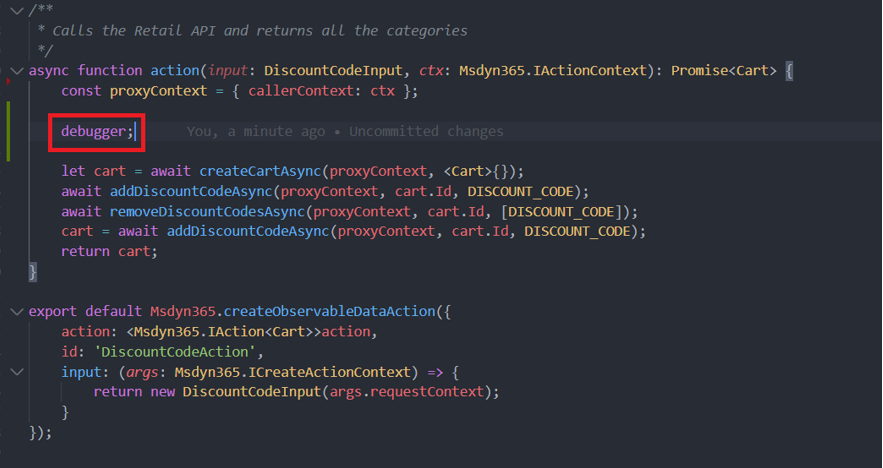

---
# required metadata

title: Debugging best practices for Dynamics 365 Commerce development 
description: This topic describes some best practices to follow when debugging Dynamics 365 Commerce customizations.  
author: samjarawan
manager: annbe
ms.date: 02/11/2021
ms.topic: article
ms.prod: 
ms.technology: 

# optional metadata

# ms.search.form: 
audience: Developer
# ms.devlang: 
ms.reviewer: v-chgri
# ms.tgt_pltfrm: 
ms.custom: 
ms.assetid: 
ms.search.region: Global
# ms.search.industry: 
ms.author: samjar
ms.search.validFrom: 2019-10-31
ms.dyn365.ops.version: Release 10.0.5

---
# Debugging best practices for Dynamics 365 Commerce development 

[!include [banner](../includes/banner.md)]

This topic describes some best practices to follow when debugging Dynamics 365 Commerce customizations. 

## Stepping through code in a modern browser on localhost
An easy way to debug code is to use a modern browsers debugger and stepping through code such as a module or data action that is normally run on the server side.  This can be done if you have set up a local development environment as found in the [Set up a development environment](setup-dev-environment.md) article.
T
First, you will want to identify the breakpoints in your code or where you would like to start stepping through the code. To create a breakpoint in your code, add the **debugger** statement. 

For example, if we want to debug a data action that is running server side and we want to insert a breakpoint right before we make an API call that creates the Cart. To do this we would insert the debugger statement before making this API call as shown in the following image:

## Additional resources

[Dynamics 365 Commerce architecture overview](../commerce-architecture.md)

[Online channel extensibility overview](overview.md)

[System requirements](system-requirements.md)

[Set up a development environment](setup-dev-environment.md)

[best-practices-dev](best-practices-dev.md)

[!INCLUDE[footer-include](../../includes/footer-banner.md)]
