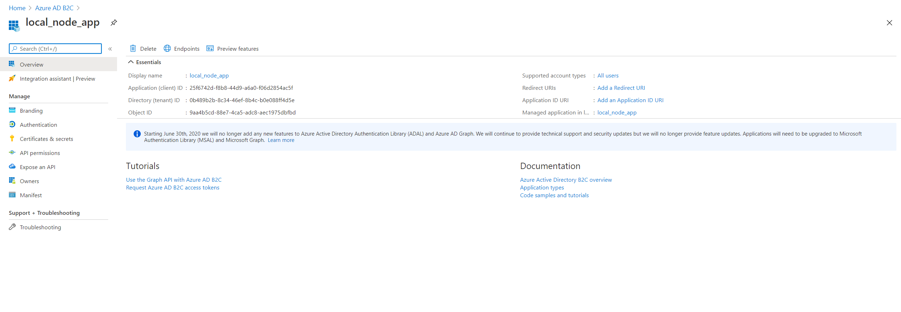
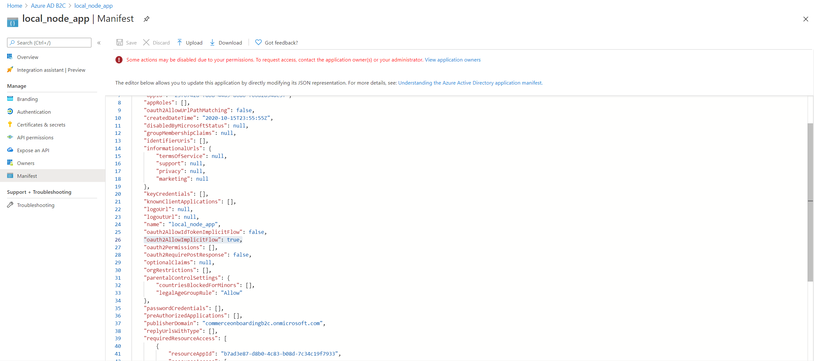
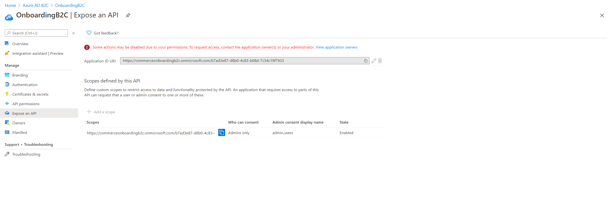
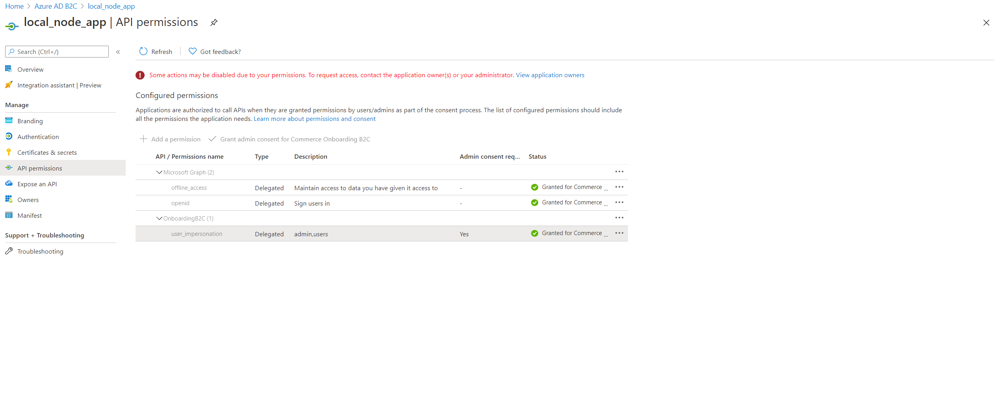
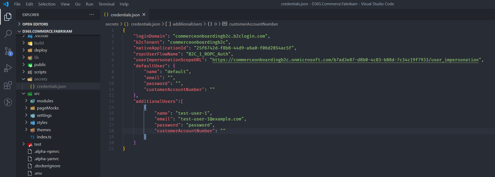

---
# required metadata

title: Mock the signed-in state during local development
description: This topic describes how to mock a signed-in user in a Dynamics 365 Commerce online local development environment.
author: samjarawan
manager: annbe
ms.date: 09/29/2020
ms.topic: article
ms.prod: 
ms.service: dynamics-365-commerce
ms.technology: 

# optional metadata

# ms.search.form: 
audience: Developer
# ms.devlang: 
ms.reviewer: v-chgri
ms.search.scope: Retail, Core, Operations
# ms.tgt_pltfrm: 
ms.custom: 
ms.assetid: 
ms.search.region: Global
# ms.search.industry: 
ms.author: samjar
ms.search.validFrom: 2019-10-31
ms.dyn365.ops.version: Release 10.0.5

---
# Mock the signed-in state during local development

[!include [banner](../includes/banner.md)]

This topic describes how to mock a signed-in user in a Dynamics 365 Commerce online local development environment.

## Overview

Over the course of developing your e-Commerce online site, it may become necessary to develop and test scenarios for signed-in users. Rather then publishing these pages and testing against live pages, you can instead mock the signed-in state when running in developer mode.
 
## Configure your Azure AD B2C tenant

To take advantage of this feature, you must perform a one-time setup in your Azure Active Directory (Azure AD) business-to-consumer (B2C) tenant to allow you to mock the signed-in user status. To proceed with the following steps, you will need to be signed in as a user with global administrator privileges.

### Create a new resource owner password credentials (ROPC) flow
 
The first step is to create a new resource owner password credentials (ROPC) flow in your Azure AD B2C tenant. 

To create a new ROPC flow, follow these steps.

1.	Sign in to the [Azure portal](https://ms.portal.azure.com/) as the global administrator of your Azure AD B2C tenant, and then select the **Azure AD B2C** service.
1.	Select **User flows** and **New user flow**.
1.	Select **Sign in using resource owner password credentials (ROPC)**, and then select **Create**.
1.	Enter a name for the user flow, for example "ROPC_Auth". Copy and save the full name, as it will later be used as the `ropcUserFlowName` value in your credentials.json file.
1.	Under **Application claims**, select **Show more**.
1.	Select the application **"Display Name"**, **"Email Addresses"**,**"Given Name"**, **"Identity provider"**, **"SurName"**, and **"User’s object ID"** claims.
1.	Select **OK**, and then select **Create**.
1.	Select the new user flow, and then select **Run user flow**. 

You have now created a new ROPC policy to enable local sign-in. Under **Run user flow** you should see an endpoint URL similar to ```https://**<B2C_TENANT>**.b2clogin.com **<LOGIN_DOMAIN>**/v2.0/.well-known/openid-configuration?p=B2C_1_ROPC_Auth```. Make note of the **<B2C_TENANT>** and **<LOGIN_DOMAIN>** values from the URL, since this information will later be used in your credentials.json file.

In the following example image, the endpoint URL listed under **Run user flow** is ```https://rushmoreb2c.b2clogin.com/login.fabrikam.com/v2.0/.well-known/openid-configuration?p=B2C_1_ROPC_Auth```.


From the example above, we can obtain values for the `ropcUserFlowName`, `loginDomain`, and `b2cTenant` properties as follows:

| Property name | Example value |
| ----------- | ----------- |
| ropcFlowUserName | B2C_1_ROPC_Auth |
| loginDomain | login.fabrikam.com |
| b2cTenant | rushmoreb2c |

### Create a native application

Next, you will create a native application meant to represent the Node application you will run during local development.
 
1.	In the **Azure AD B2C** settings, select **App Registrations**, and then select **New registration**.
1.	Enter a name for the application, for example "Local_Node_App".
1.	For **Supported account types**, select **"Accounts in any identity provider or organizational directory (for authenticating users with user flows)**.
1.	For **Redirect URIs**, select **Public client/native (mobile & desktop)** from the drop-down list, and leave the URI as is.
1.	Leave all other default values as is, and select **Register**.
1.	Select the new application, and then copy and save the **Application (client) ID** value, as this ID will later be used as the `nativeApplicationId` property value in your credentials.json file.

    

1.	In the left navigation pane under **Manage**, select **Authentication**.
1.	Select **Try out the new experience** (if shown).
1.	Under **Default client type**, select **Yes** for **Treat the application as a public client**. This setting is required for the ROPC flow.
1.	Select **Save**.
1.	In the left navigation pane under **Manage**, select **Manifest** to open the manifest editor.
1.	Set the **oauth2AllowImplicitFlow** attribute to **true**, and then select **Save**.

    

You have now created a new native application that will be used to represent your local Node application. 

From the examples above, we have now obtained the following information:

| Property name | Example value |
| ----------- | ----------- |
| ropcFlowUserName | B2C_1_ROPC_Auth |
| loginDomain | login.fabrikam.com |
| b2cTenant | rushmoreb2c |
| nativeApplicationId | 0fb41a53-fcae-45df-b4cb-ab78471ad919 |

### Configure scope and register the native application

1.	In the Azure AD B2C settings, go to **App registrations**.
1.	Open the application created above which is currently being used by the e-Commerce rendering application.
1.	In the left navigation pane under **Manage**, select **Expose an API** and verify that a **user_impersonation** scope exists. If one does not exist, select **Add a scope** to create one. Enter "user_impersonation" for the **Scope name** and then enter friendly values for **Admin consent display name** and **Admin consent description**.

    

1.	Copy and save the full scope value, as this information will later be used as the `userImpersonationScopeURL` property value in your credentials.json file.
1.	Return to the native application you just created, and in the left navigation pane under **Manage**, select **API permissions**.
1.	Select **Add a permission**, and then select the **APIs my organization uses** tab.
1.	Search for your e-Commerce rendering application that was created above, and then select it and add **user_impersonation** as a permission.

    

1.	Select **Add permissions**.
1.	Select **Grant admin consent for ...** (this name will contain your domain), and then select **Yes** to apply the consent. You should now see a green checkmark under **Status** for **user_impersonation**.
 
The Azure AD setup portion is now complete and you should now have your versions of all of the following example values.

| Property name | Example value |
| ----------- | ----------- |
| ropcFlowUserName | B2C_1_ROPC_Auth |
| loginDomain | login.fabrikam.com |
| b2cTenant | rushmoreb2c |
| nativeApplicationId | 0fb41a53-fcae-45df-b4cb-ab78471ad919 |
| userImpersonationScopeURL | `https://login.fabrikam.com/B2CAPI/user_impersonation` |

## Configure your Node application

Once you have completed the steps to configure you Azure AD B2C tenant, you will need to create a credentials file in your online software development kit (SDK) Node application.
 
The credentials will live under the `secrets/` directory in your Node application. Create a `secrets/` directory in your application if you haven't already, and then create a new file named `credentials.json` that is similar to the following example that uses the data gathered above.

```json
{
    "loginDomain" : "login.fabrikam.com",
    "b2cTenant" : "rushmoreb2c",
    "nativeApplicationId": "0fb41a53-fcae-45df-b4cb-ab78471ad919",
    "ropcUserFlowName": "B2C_1_ROPC_Auth",
    "userImpersonationScopeURL": "https://login.fabrikam.com/B2CAPI/user_impersonation",
    "defaultUser": {
        "name": "default",
        "email": "",
        "password": ""
    },
    "additionalUsers": [
        {
            "name": "test-user-1",
            "email": "",
            "password": ""
        }
    ]   
}
```



> [!NOTE]
> Everything under the `secrets/` directory should be added to your .gitignore file to help prevent credentials from being leaked online.

After using the information collected in the Azure setup steps to populate your credentials.json file, you need to add test accounts that you want to use during local development. The accounts defined here should be valid accounts that have already been created in Dynamics 365 Commerce headquarters.

- **defaultUser**: The default user that will be used when the **mockUser** query parameter is set to **true**. The name value should be **default**.
- **additionalUsers**: An array of user objects that allows you to configure additional users to test with. Each entry in this array should be an object with a name, email address, and password. To sign in as one of these users, use the query parameter **mockUser=\<name>**.

## Mock sign-in status

Once all of the above configuration steps are complete, start up your e-Commerce Node application in local dev mode using the **yarn start** command. Sign-in status is controlled using the **mockUser** query parameter and works to mock the signed-in state on mock pages as well as on published pages (for example, ```https://localhost:4000?mock=homepage&mockUser=true``` or ```https://localhost:4000?mockUser=true```).
 
Use **mockUser=\<true|false|name>** to control the signed-in behavior. The behavior of each of the query parameter values is described in the table below.

| mockUser value	| Example	| Sign in/Sign out	| Description |
| ---------------| ------- | ---------------- | ----------- |
| true	| mockUser=true |	Sign in	| Signs in as the default user. |
| name	| mockUser=test-user-1 |	Sign in	| Signs in as the user specified in the query parameter. |
| false |	mockUser=false	|Sign out	| Signs out the currently signed-in user. |

You can use the **mockUser** query parameter to test pages as different users without signing out and signing back in again for each different user. For example, hitting ```https://localhost:4000?mock=homepage&mockUser=true``` and then ```https://localhost:4000?mock=homepage&mockUser=test-user-1``` would allow you to test the homepage mock as different signed-in users.
 
Once you hit a page with **mockUser** turned on and successfully sign in, the signed-in state will persist across pages until you either sign in with a different user or sign out.
 
You can also make use of the sign-in and sign-out buttons on the webpage itself to mock signed-in user behavior. The sign-in button will sign you in as the default user while the sign-out button will sign out the currently signed-in user.

## Additional resources

[Request properties object](request-properties-object.md)

[App settings](app-settings.md)

[Extend a module definition file](extend-module-definition.md)

[Cookie API overview](cookie-api-overview.md)

[Interactive components overview](interactive-components.md)

[Globalize modules by using the CultureInfoFormatter class](globalize-modules.md)
