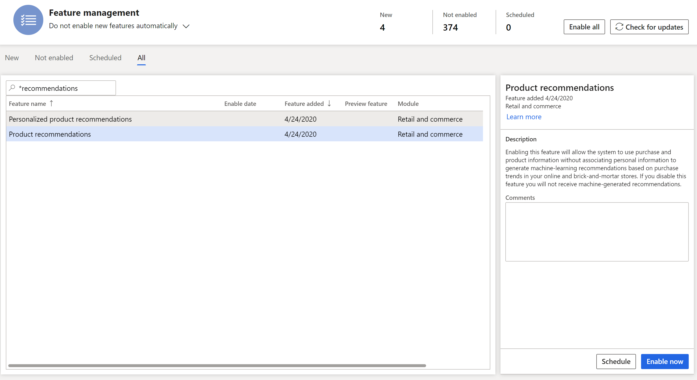

---
# required metadata

title: Enable product recommendations
description: This topic explains how to make product recommendations that are based on artificial intelligence-machine learning (AI-ML) available for Microsoft Dynamics 365 Commerce customers. 
author: bebeale
manager: AnnBe
ms.date: 08/18/2020
ms.topic: article
ms.prod: 
ms.service: dynamics-365-commerce
ms.technology: 

# optional metadata

ms.search.form: 
# ROBOTS: 
audience: Application User
# ms.devlang: 
ms.reviewer: josaw
#ms.search.scope: 
# ms.tgt_pltfrm: 
ms.custom: 
ms.assetid: 
ms.search.region: global
ms.search.industry: Retail, eCommerce
ms.author: bebeale
ms.search.validFrom: 2019-10-31
ms.dyn365.ops.version: 10.0.5

---

# Enable product recommendations

[!include [banner](includes/banner.md)]

This topic explains how to make product recommendations that are based on artificial intelligence-machine learning (AI-ML) available for Microsoft Dynamics 365 Commerce customers. For more information about product recommendation lists, see [Product recommendations overview](product-recommendations.md).

## Recommendations pre-check

Before enabling, note that product recommendations are only supported for Commerce customers who have migrated their storage to using Azure Data Lake Storage. 

The following configurations must be enabled in the back office before enabling recommendations:

1. Ensure that Azure Data Lake Storage has been purchased and successfully verified in the environment. For more information, see [Ensure that Azure Data Lake Storage has been purchased and successfully verified in the environment](enable-ADLS-environment.md).
2. Ensure that the entity store refresh has been automated. For more information, see [Ensure that the Entity store refresh has been automated](../fin-ops-core/dev-itpro/data-entities/entity-store-data-lake.md).
3. Confirm that Azure AD Identity configuration contains an entry for Recommendations. More information on how to do this action is below.

Additionally, ensure that RetailSale measurements have been enabled. To learn more about this set up process, see [Work with measures](https://docs.microsoft.com/dynamics365/ai/customer-insights/pm-measures).

## Azure AD Identity configuration

This step is required for all customers running an infra-structure as a service (IaaS) configuration. For customers running on service fabric (SF), this step should be automatic and we recommend verifying the setting is configured as expected.

### Setup

1. From the back office, search for the **Azure Active Directory applications** page.
2. Verify if an entry exists for "RecommendationSystemApplication-1".

If the entry does not exist, add a new entry with the following information:

- **Client Id** - d37b07e8-dd1c-4514-835d-8b918e6f9727
- **Name** - RecommendationSystemApplication-1
- **User Id** - RetailServiceAccount

Save and close the page. 

## Turn on recommendations

To turn on product recommendations, follow these steps.

1. In Commerce headquarters, search for **Feature Management**.
1. Select **All** to see a list of available features. 
1. In the search box, enter **Recommendations**.
1. Select the **Product recommendations** feature.
1. In the **Product recommendations** properties pane, select **Enable now**.

> [!NOTE]
> This procedure starts the process of generating product recommendation lists. It may take several hours before the lists are available and can be viewed at the point of sale (POS) or in Dynamics 365 Commerce.

## Configure recommendation list parameters

By default, the AI-ML-based product recommendation list provides suggested values. You can change the default suggested values to suit the flow of your business. To learn more about how to change the default parameters, go to [Manage AI-ML-based product recommendation results](modify-product-recommendation-results.md).

## Show recommendations on POS devices

After enabling recommendations in Commerce back office, the recommendations panel must be added to the control POS screen using the layout tool. To learn about this process, see [Add a recommendations control to the transaction screen on POS devices](add-recommendations-control-pos-screen.md). 

## Enable personalized recommendations

In Dynamics 365 Commerce, retailers can make personalized product recommendations (also known as personalization) available. In this way, personalized recommendations can be incorporated into the online customer experience and at the point of sale. When the personalization functionality is turned on, the system can associate a user's purchase and product information to generate individualized product recommendations.

To learn more about personalized recommendations, see [Enable personalized recommendations](personalized-recommendations.md).

## Additional resources

[Product recommendations overview](product-recommendations.md)

[Enable Azure Data Lake Storage in a Dynamics 365 Commerce environment](enable-adls-environment.md)

[Enable personalized recommendations](personalized-recommendations.md)

[Enable "shop similar looks" recommendations](shop-similar-looks.md)

[Opt out of personalized recommendations](personalization-gdpr.md)

[Add product recommendations on POS](product.md)

[Add recommendations to the transaction screen](add-recommendations-control-pos-screen.md)

[Adjust AI-ML recommendations results](modify-product-recommendation-results.md)

[Manually create curated recommendations](create-editorial-recommendation-lists.md)

[Create recommendations with demo data](product-recommendations-demo-data.md)

[Product recommendations FAQ](faq-recommendations.md)

