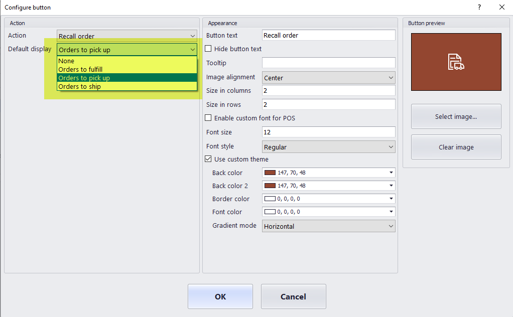
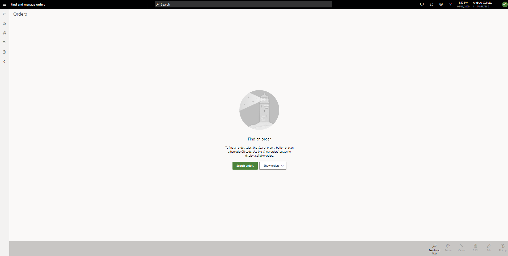
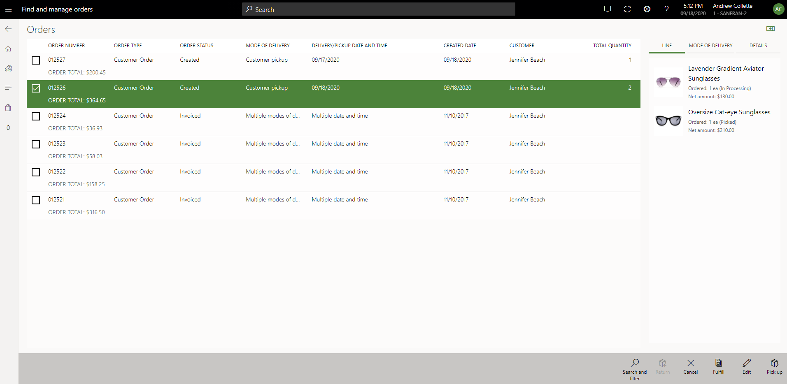

---
# required metadata

title: Recall order operation in POS
description: This topic explains feature capabilities available for improved order recall pages in POS.
author: hhainesms
manager: annbe
ms.date: 10/09/2020
ms.topic: article
ms.prod:
ms.service: dynamics-365-commerce
ms.technology: 

# optional metadata

# ms.search.form:
audience: Application User
# ms.devlang: 
ms.reviewer: josaw
#ms.search.scope: Core, Operations, Retail
# ms.tgt_pltfrm: 
# ms.custom:
ms.search.region: global
# ms.search.industry:
ms.author: hhaines
ms.search.validFrom:
ms.dyn365.ops.version: 10.0.15
---

# Recall order operation in POS

[!include [banner](includes/banner.md)]

The **Recall order** operation in the Commerce point of sale (POS) provides updated order search and filtering features and order-specific information. This feature is available in Commerce versions 10.0.15 and later.

To enable this functionality, turn the **Improved Recall order operation in POS** feature on in **Feature management** workspace in Commerce headquarters. After you enable the feature, consider updating your [screen layouts](pos-screen-layouts.md) in POS to take advantage of some of the changed  capabilities.

The configuration of the **Recall order** operation button allows organizations to deploy the operation with a pre-defined display.

The display options are as follows.
- **None** – This option deploys the operation with no specific display. When a user opens the operation with this configuration, they will be prompted to search and find orders or choose from a pre-defined order filter.
- **Orders to fulfill** – When a user launches the operation, a query will run automatically to search and display a list of orders that are to be fulfilled by the store. These orders are configured for in-store pickup or store shipment and the lines of these orders have not yet been picked or packed.
- **Orders to pick up** – When a user launches the operation, a query will run automatically to search and display a list of orders that are configured for in-store pickup at the user's current store.
- **Orders to ship** - When a user launches the operation, a query will run automatically to search and display a list of orders that are configured for shipment from the user's current store.

When launching the **Recall order** operation from POS, if the display is configured to **None**, a user will be able to search and retrieve orders in one of the following ways.
- Scan order barcodes. This will search order number, channel reference, and receipt ID fields for matches.
- Select **Search orders** or **Search and filter** icon on the AppBar to use the filtering mechanism to locate orders that meet the filter criteria.
- Choose from a pre-defined filter from the **Show Orders** drop-down menu (orders to fulfill, orders to pick up, or orders to ship).

After search criteria are applied, the application will display a list of matching sales orders.

A user can select an order on the list to view additional details. The information panel on the right side of the screen displays specifics on the selected order, including order line details, delivery details, and fulfillment details.

From the AppBar, a user can select an operation. Depending on the status of the order, certain operations may not be enabled.

- **Return** – Executes a return for one or more invoices related to the selected customer order.

- **Cancel** – Issue a full cancellation of the selected sales order.

- **Fulfill** – Transfers the user to the order fulfillment page, which will be pre-filtered for the selected order. Only order lines that are open for fulfillment by the user's store for the selected order will be displayed.

- **Edit** – Allows users to make changes to the selected customer order.

- **Pick up** – Launches the pickup flow, which allows the user to choose the products to be picked up and creates the pickup sales transaction.
