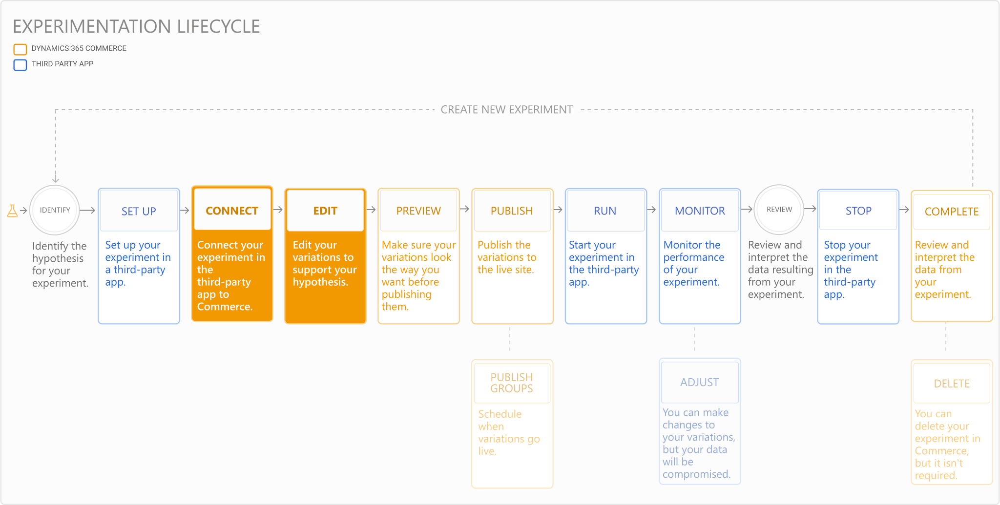

---
# required metadata

title: Connect an experiment and edit variations
description: This topic describes how to connect an experiment in a third-party service to Dynamics 365 Commmerce, and how to edit variations for the experiment.
author:  sushma-rao 
manager: AnnBe
ms.date: 10/01/2020
ms.topic: article
ms.prod: 
ms.service: dynamics-365-retail
ms.technology: 

# optional metadata

# ms.search.form: 
# ROBOTS: 
audience: Application User
# ms.devlang: 
ms.reviewer: josaw
ms.search.scope: Core, Operations, Retail
# ms.tgt_pltfrm: 
ms.custom: 
ms.assetid: 
ms.search.region: global
ms.search.industry: Retail
ms.author: sushmar
ms.search.validFrom: 2020-09-30
ms.dyn365.ops.version: AX 10.0.13
---

# Connect an experiment and edit variations

This topic describes how to connect your experiment in Commerce and make changes to your variations so they align with your hypothesis. The following diagram shows all of the steps involved in setting up and running an experiment on an e-Commerce website in Dynamics 365 Commerce. Other steps are covered in separate topics.

After you've [set up your experiment](experimentation-setup.md) in a third-party service, you'll connect the experiment in Dynamics 365 Commerce and edit the experiment variations.

## Planning considerations

Before you connect your experiment in Commerce, you'll need to make some decisions that impact the way Commerce manages your content.

### Determine the scope of your experiment
When you connect an experiment in Commerce, you are prompted to define the scope of the experiment. Experiments in Commerce are defined as **partial** scope or **entire** scope.
- Choose **partial** if you want to target a specific portion of a page for the experiment. Changes that are made to parts of the default page or fragment that aren't related to the experiment are automatically synchronized across variations. 
- Choose **entire** if you want to target an entire page or fragment. Separate copies of the default page or fragment are created in this scenario. In other words, if you make any changes to the default page or fragment that the experiment is associated with, you'll have to manually synchronize those changes across all variations.

<!-- not to editors, we're adding an image here to illustrate the difference. it will help.) -->

> [!NOTE]
> If you associate your experiment with a page that uses a layout, you can only scope the experiment as **entire**.

### Decide if you want to schedule when your experiment is published
If you want to schedule when your experiment is published to your live site, make sure the content you want to associate with the experiment is available in a publish group *before* you connect the experiment. 

For more information about publish groups, refer to [Work with publish groups](publish-groups.md).

## Connect your experiment
To connect your experiment in Commerce, you'll launch the **Connect experiment** wizard. The wizard walks you through the steps required to connect your experiment. When you complete the wizard, your experiment is connected and variations are created and ready to be edited.

1. To launch the wizard, select the **Experiments** tab in site builder and then select **Connect**. Alternatively, the wizard can be accessed from a page or fragment editor. In edit mode, select **Connect experiment** in the command bar.

> [!NOTE]
> A page can only be connected to one experiment at a time. To connect a page to a different experiment, first delete the experiment the page is currently connected to.

1. Choose the page or fragment you want to run your experiment on.
1. Set the experimentation scope to **entire** or **partial**, based on the choice you made in the [Determine the scope of your experiment](#determine-the-scope-of-your-experiment) section above.
    > [!NOTE]
    > The **Experiment on pages or fragments** feature flag must be enabled if you want to experiment on a full page or fragment. Refer to the [Experimentation in Dynamics 365 Commerce](experimentation-overview.md) topic for more information.
    
1. In the final step of the wizard, select **Generate variations and exit wizard**. Variations are created for the experiment. 

## Edit your variations
When you exit the wizard, variations are created for you. 

Next, you'll edit the variations so they reflect the choices that you need to verify in the experiment hypothesis. Choose the procedure below that corresponds to the scope you chose for your experiment in the [Determine the scope of your experiment](#determine-the-scope-of-your-experiment) section above.

### Edit variations for experiments with partial scope
Follow these steps if you defined the scope of your experiment as **partial** in the **Connect experiment** wizard.

1. In editor view, use the variations drop-down menu below the command bar to edit each variation based on your original hypothesis. You may want to also establish a control or base variation by leaving one of the variations unchanged.
1. Select the module to be experimented on, select the ellipsis, and then select **Add to experiment**.

### Edit variations for experiments with entire scope
If you defined the scope of your experiment as **entire** in the **Connect experiment** wizard, while in editor view, use the variations drop-down menu below the command bar to edit each variation based on your original hypothesis. 

> [!NOTE]
> In either case, you may want to also establish a control or base variation by leaving one of the variations unchanged.

## Previous topic
[Set up an experiment](experimentation-setup.md) 

## Next topic
[Preview and publish an experiment](experimentation-preview-publish.md)
