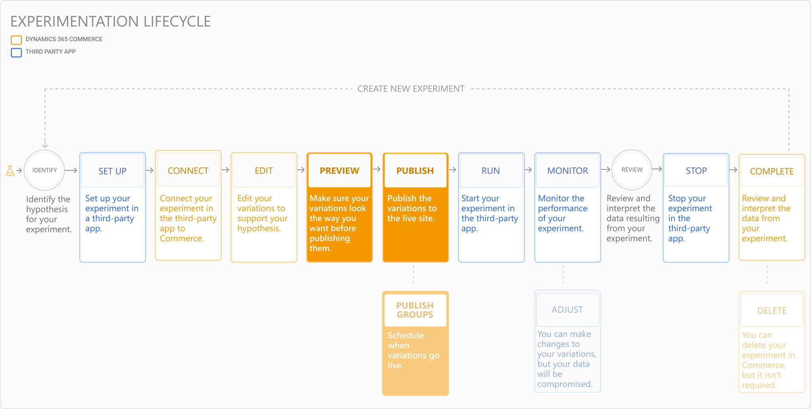

---
# required metadata

title: Preview and publish an experiment
description: This topic describes how to preview and publish an experiment from Dynamics 365 Commerce.
author:  sushma-rao 
manager: AnnBe
ms.date: 10/21/2020
ms.topic: article
ms.prod: 
ms.service: dynamics-365-retail
ms.technology: 

# optional metadata

# ms.search.form: 
# ROBOTS: 
audience: Application User
# ms.devlang: 
ms.reviewer: josaw
#ms.search.scope: Core, Operations, Retail
# ms.tgt_pltfrm: 
ms.custom: 
ms.assetid: 
ms.search.region: global
ms.search.industry: Retail
ms.author: sushmar
ms.search.validFrom: 2020-09-30
ms.dyn365.ops.version: AX 10.0.13
---

# Preview and publish an experiment

This topic describes how to preview and publish your experiment in Dynamics 365 Commerce after you've [connected your experiment and edited your variations](experimentation-connect-edit.md). The following diagram shows all of the steps involved in setting up and running an experiment on an e-Commerce website in Dynamics 365 Commerce. Additional steps are covered in separate topics.

## Preview your experiment variations
You can preview your variations and continue editing them until they look the way you want them to.

To preview your experiment variations in Commerce site builder, follow these steps.

1. From the variations drop-down menu below the command bar, select the content you want to preview. 
1. On the command bar, select **Preview**. A preview of what the content will look like when it's published is displayed.
1. To preview a different variation, select it from the variation drop-down menu and select **Preview** again.

## Publish your experiment
If you aren't using a publish group to schedule when your experiment goes live and you want to publish immediately, select **Publish** in the command bar. All variations that belong to the experiment will be published.
    
> [!IMPORTANT]
> If the page has an unpublished URL, you must first publish the URL or it won't be visible to your website users. For details, see [Save, preview, and publish a page](save-preview-publish-page.md).
    
### Use publish groups to schedule when your experiment goes live
Variations created in site builder can be scheduled for publishing by using a publish group. Within a publish group, you can connect a page or fragment to your experiment by selecting **Experiments** in the left navigation pane. You can also do this by selecting **Pages** or **Fragments** and following the instructions in [Connect an experiment and edit variations](experimentation-connect-edit.md). For information about publish groups, see [Work with publish groups](publish-groups.md).

When using publish groups with experiments, there are some important considerations to be aware of.
- When you add a page or fragment that has an experiment running on it to a publish group, the experiment will be removed from the page or fragment in the publish group.
- Experiments that are connected to pages in a live site aren't available to pages within publish groups and vice-versa. Similarly, pages that have experiments running on them in a live site aren't available to other experiments in publish groups and vice versa.
- When you publish or schedule a publish group, all content in the publish group is published, regardless of whether there's an experiment associated with the publish group.
- Because a publish group continues to persist after it's been published to a live site, experiments in the publish group will also persist. Therefore, you won't be able to associate other experiments with the same page or fragment. To avoid this limitation, delete any publish groups with persisting experiments. Similarly, if you want to delete an experiment in a live site that also exists in a publish group, delete it from the publish group first.

## Previous step
[Connect and edit an experiment](experimentation-connect-edit.md)

## Next step
[Run and monitor an experiment](experimentation-run-monitor.md)
