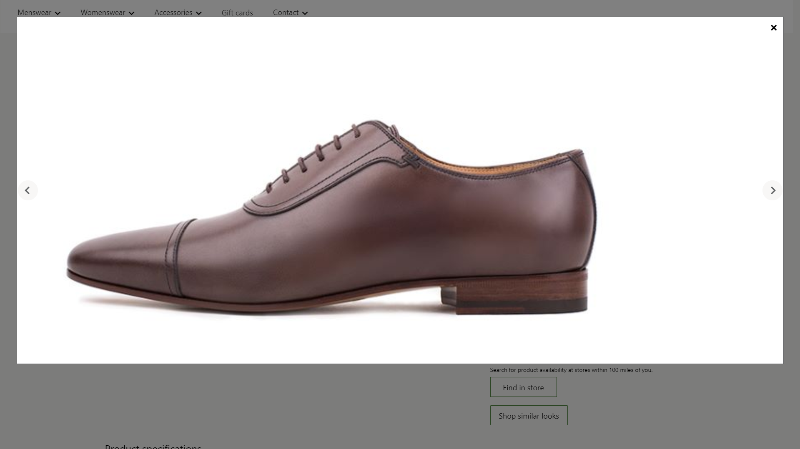
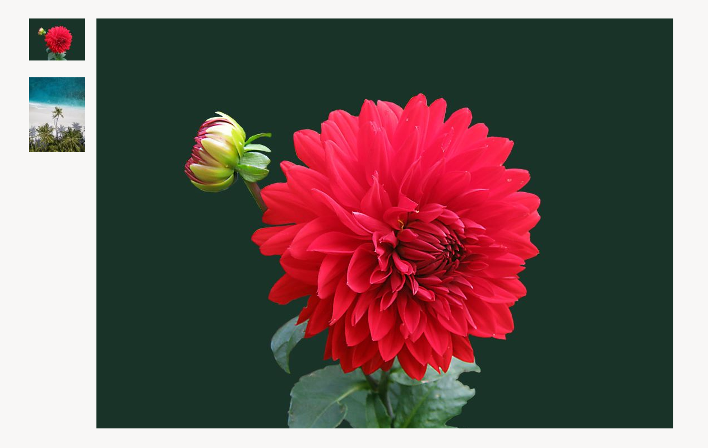

---
# required metadata

title: Media gallery module
description: This topic covers media gallery modules and describes how to add them to site pages in Microsoft Dynamics 365 Commerce.
author: anupamar-ms
manager: annbe
ms.date: 09/15/2020
ms.topic: article
ms.prod: 
ms.service: dynamics-365-commerce
ms.technology: 

# optional metadata

# ms.search.form: 
audience: Application User
# ms.devlang: 
ms.reviewer: v-chgri
# ms.tgt_pltfrm: 
ms.custom: 
ms.assetid: 
ms.search.region: Global
# ms.search.industry: 
ms.author: anupamar
ms.search.validFrom: 2019-10-31
ms.dyn365.ops.version: Release 10.0.13

---

# Media gallery module

[!include [banner](includes/banner.md)]

This topic covers media gallery modules and describes how to add them to site pages in Microsoft Dynamics 365 Commerce.

Media gallery modules show one or more images in a gallery view. Media gallery modules support thumbnail images, which can be arranged either horizontally (as a row below the image) or vertically (as a column next to the image). Media gallery modules also provide capabilities that enable images to be zoomed (magnified) or viewed in full-screen mode. To be rendered in a media gallery module, an image must be available in the Commerce site builder Media Library. Currently, media gallery modules support only images.

In the default mode, a media gallery module uses the product ID that is available from the page context of a product details page (PDP) to render the corresponding product images. In Commerce headquarters, a media file path must be defined for all products. Images should then be uploaded to the site builder Media Library according to the file path that was defined for the products in Commerce headquarters. These images include images for products and any product variants. For more information about how to upload images to site builder Media Library, see [Upload images](dam-upload-images.md).

Alternatively, a media gallery module can host a fully curated set of images on an image gallery page, where there are no dependencies on the product ID or page context. In this case, images must be uploaded to site builder Media Library and specified in site builder.

Here are some usage examples for media gallery modules:

- Rendering product images on a PDP
- Rendering product images on a product marketing page
- Showcasing a curated set of images on a marketing page, such as a gallery page

In the example in the following illustration, a buy box on a PDP hosts product images by using a media gallery module.

## Media gallery properties

| Property name | Values | Description |
|---------------|--------|-------------|
| Image source | **Page context** or **Product ID** | The default value is **Page context**. If **Page context** is selected, the module expects the page to provide the product ID information. If **Product ID** is selected, the product ID for an image must be provided as the value of the **Product ID** property. This capability is available in Commerce version 10.0.12. |
| Product ID | A product ID | This property is applicable only if the value of the **Image source** property is **Product ID**. |
| Image zoom | **Inline** or **Container** | This property lets the user zoom images in the media gallery module. An image can be zoomed either inline or in a separate container next to the image. This capability is available in 10.0.12 |
| Zoom scale | A decimal number | This property specifies the scale factor for zooming images. For example, if the value is set to **2.5**, images are magnified 2.5 times.|
| Full screen | **True** or **False** | This property specifies whether images can be viewed in full-screen mode. In full-screen mode, images can be also be further magnified if the zoom capability is turned on. This capability is available in Commerce version 10.0.13. |
| Images | Images that are selected from site builder Media Library | In addition to being rendered from a product, images can be curated for a media gallery module. These images will be appended to any product images that are available. This capability is available in Commerce version 10.0.12. |
| Thumbnail orientation | **Vertical** or **Horizontal** | This property specifies whether thumbnail images should be shown in a vertical strip or a horizontal strip. |

The following illustration shows an example of a media gallery module where the full-screen and zoom options are available.

The following illustration shows an example of a media gallery module that has curated images (that is, the specified images aren't dependent on the product ID or page context).

## Commerce Scale Unit interaction

When the image source is derived from the page context, the product ID from the PDP is used to retrieve the images. The media gallery module retrieves the image file path for products by using Commerce Scale Unit application programming interfaces (APIs). The images are then pulled from the Media Library so that they can be rendered in the module.

## Add a media gallery module to a page

To add a media gallery module to a marketing page, follow these steps.

1. Go to **Templates**, and select **New** to create a new template.
1. In the **New Template** dialog box, under **Template name**, enter **Marketing template**, and then select **OK**.
1. In the **Body** slot, select the ellipsis (**...**), and then select **Add Module**.
1. In the **Add Module** dialog box, select the **Default Page** module, and then select **OK**.
1. In the **Main** slot of the default page, select the ellipsis (**...**), and then select **Add Module**.
1. In the **Add Module** dialog box, select the **Container** module, and then select **OK**.
1. Select **Save**, select **Finish editing** to check in the template, and then select **Publish** to publish it.
1. Go to **Pages**, and select **New** to create a new page.
1. In the **Choose a template** dialog box, select the **Marketing template** template. Under **Page name**, enter **Media gallery page**, and then select **OK**.
1. In the **Main** slot of the new page, select the ellipsis (**...**), and then select **Add Module**.
1. In the **Add Module** dialog box, select the **Container** module, and then select **OK**.
1. In the **Container** slot, select the ellipsis (**...**), and then select **Add Module**.
1. In the **Add Module** dialog box, select the **Media gallery** module, and then select **OK**.
1. In the property pane for the media gallery module, under **Image source**, select **Productid**. Then, in the **Product id** field, enter a product ID.
1. Select **Save**, and then select **Preview** to preview the page. You should be able to see the images for the product in a gallery view.
1. To use only curated images, in the property pane, under **Image source**, select **Productid**. Then, under **Images**, select **Add an image** as many times as required to add images from the Media Library.
1. Set any additional properties that you want to set, such as **Image zoom**, **Zoom factor**, and **Thumbnails orientation**.
1. When you've finished, select **Save**, select **Finish editing** to check in the page, and then select **Publish** to publish it.

## Additional resources

[Module library overview](starter-kit-overview.md)

[Buy box module](add-buy-box.md)

[Container module](add-container-module.md)

[Upload images](dam-upload-images.md)
