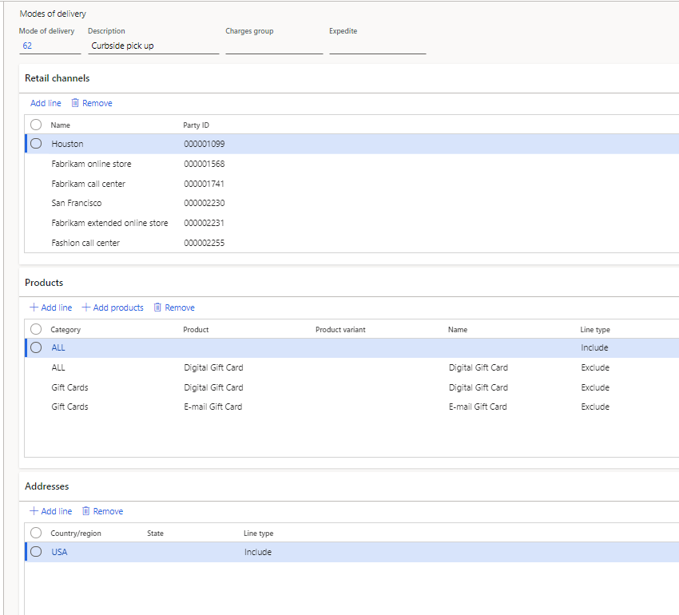
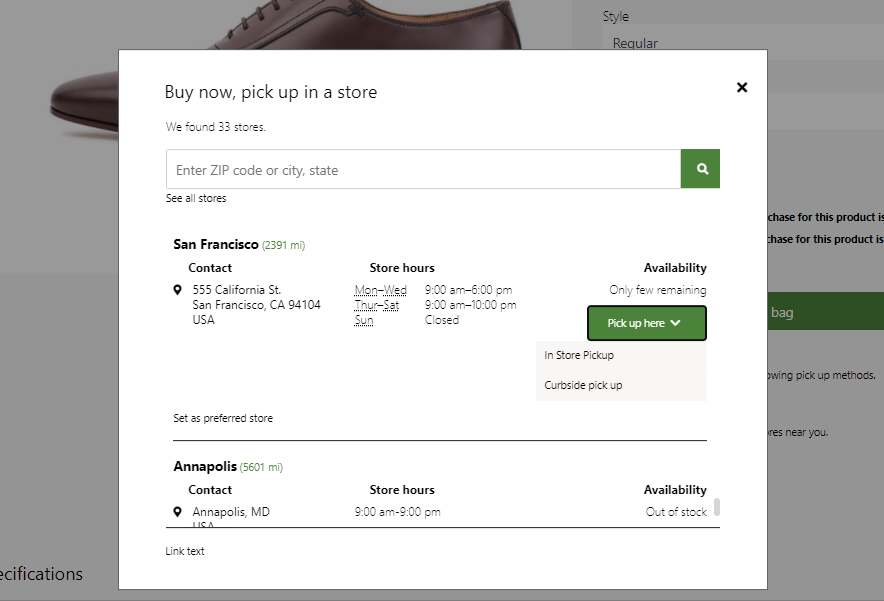

---
# required metadata

title: Enabling multiple pick up delivery modes for Commerce customer orders
description: This topic explains feature capabilities available for creating customer orders for pick up in a store
author: hhainesms
manager: annbe
ms.date: 10/29/2020
ms.topic: article
ms.prod:
ms.service: dynamics-365-commerce
ms.technology: 

# optional metadata

# ms.search.form:
audience: Application User
# ms.devlang: 
ms.reviewer: josaw
ms.search.scope: Core, Operations, Retail
# ms.tgt_pltfrm: 
# ms.custom:
ms.search.region: global
# ms.search.industry:
ms.author: hhaines
ms.search.validFrom:
ms.dyn365.ops.version: 10.0.16
---

# Enabling multiple pick up delivery modes for Commerce customer orders

[!include [banner](includes/banner.md)]

In version 10.0.16 and later, organizations will now have the ability to define multiple modes of delivery that shoppers or sales associates may choose from when creating a pick up in store order.  This new capability will allow organizations to enable additional pick up options for their shoppers to choose from. As an example, many retailers are now offering shoppers the choice of in-store or curbside pick up for their orders.  Dynamics 365 Commerce now has the capabilities to support the configuration of these different pick up types if needed.  Users may leverage these added pick up delivery mode options when creating a customer order in any supported Commerce channel (e-Commerce, Call Center, Store).

To use this feature, start by enabling the **Support for multiple pickup delivery modes** feature from the **Feature management** workspace in Commerce Headquarters.  After you enable the feature, additional configurations are required.

## Additional configurations

In earlier versions of the application, organizations were only able to define a single mode of delivery as the designated pick up delivery mode through **Commerce parameters**. After enabling the **Support for multiple pickup delivery modes** feature, an organization will now be able to define multiple pick up modes of delivery.  It's important to note that whatever mode of delivery was defined as the pick up mode of delivery in **Commerce parameters** before enabling this feature will be automatically copied into the new pick up delivery modes configuration when the **Support for multiple pickup delivery modes** feature is enabled.

When the **Support for multiple pickup delivery modes** feature is enabled, a new **Modes of delivery** fasttab is enabled in **Commerce parameters** under the **Customer orders** tab.  This new fasttab provides the setup for **Pickup mode of delivery** which allows the user to define multiple pick up modes of delivery. The existing parameters for **Carry Out mode of delivery** and **Electronic mode of delivery** have also been moved to this new **Modes of delivery** section, along with the existing **Show only carrier mode options for ship orders** parameter.

Before configuring additional pick up modes of delivery, the delivery modes must be defined.  Navigate to the **Modes of delivery** form in Commerce Headquarters and add additional delivery modes that should be considered as pick up delivery mode options.   Ensure that all configurations are complete such as linking the mode of delivery to appropriate channels and items.  After defining the new pick up modes of delivery, the **Process delivery modes job** must be execute to properly create the delivery mode/channel/item relationships.  Once the processing job completes, navigate to the **Distribution schedule** in Commerce Headquarters and run the **1120** distribution job to ensure the relevant Commerce channel databases are updated with these new delivery mode configurations.

After defining additional pick up modes of delivery, add these new modes to the **Pickup mode of delivery** parameter on the **Commerce parameters** form. Then run the appropriate distribution jobs to update the relevant Commerce channel databases with this configuration change.

> [!NOTE]
> Outside of the existing pick up mode of delivery that will be copied to the pick up delivery modes parameter when this feature is enabled, it is recommended to configure new modes of delivery when creating additional pick up delivery mode configurations. When delivery modes are added to the pick up delivery modes parameter, the application will verify if there are active open sales lines in the application already using the delivery mode being added, if any open sales lines are detected, the application will error and these modes of delivery cannot be considered pick up delivery modes until all open sales lines using that mode of delivery have been closed (invoiced or canceled).

> [!IMPORTANT]
> Once you have defined more than one pick up mode of delivery in **Commerce parameters**, the **Support for multiple pickup delivery modes** feature becomes a **Mandatory** feature and can no longer be disabled.  If you need to disable this feature, you must first remove all but one pick up delivery mode from the **Pickup mode of delivery** parameter.  When only one pick up mode is defined, the feature will no longer be considered mandatory and can be disabled if needed.

### e-Commerce site configurations
Once the **Support for multiple pickup delivery modes** feature is enabled, the following modules will show the new pick up modes delivery modes as configured
- BuyBox
- Store selector
- Cart
- Pickup information
- Order confirmation 
- Order details 

There are no additional steps needed on e-Commerce pages to enable the new pick up modes of delivery.

## Working with multiple pick up modes of delivery

When multiple pickup modes are available for the channel, users will see an enhanced experience when shopping for products to be picked up.   

- In e-Commerce channels, the shopper will be able to choose from any of the valid pick up modes of delivery available.  For example, if  the retailer has defined two different pick up modes of delivery (in-store and curbside) and both of these modes of delivery are configured in the **Pickup mode of delivery** parameter, and both of these modes of delivery are valid for the order fulfillment channel and the product the shopper is purchasing, the shopper will get to choose their preferred pick up mode of delivery.The mode of delivery selected by the shopper will become the mode of delivery linked to the salesline for the order when the order is created in HQ.

- In Store channels, if creating a customer order for pick up through the Point of Sale (POS) application, the sales associate will now be prompted after choosing the pick up store location to choose from available pick up modes of delivery if they have been configured.  Please note if only one valid pick up mode of delivery is available for the channel/item combination, the user will not be prompted to choose and that pick up mode of delivery will be automatically applied to those order lines.

- In Call Center channels, users can manually choose from any of the defined pick up modes of delivery linked to that call center channel when creating a pick up order in Call Center.   Validation will be done to ensure the item being linked to the pick up mode of delivery can be ordered with that pick up mode.  Please note that when choosing a pick up delivery mode in call center, the sales order lines must be linked to a valid store warehouse.  If a non-store warehouse is defined on the call center salesline, a pick up mode of delivery setting on the sales line will not be allowed.
  
- When using the **Order recall** or **Order fulfillment** operations in POS to retrieve a list of orders or order lines for pick up, when the user uses a pre-defined search filter to show all orders to pick up for their current store, these queries have been modified to ensure that all eligible orders that use any of the pick up modes of delivery are included in the search results.  POS users can also use existing filters to narrow down the list of orders to a specific pickup mode if desired (e.g. show only curbside pickup orders).

## Considerations for Distributed Order Management (DOM)

The [Distributed Order Management](https://docs.microsoft.com/en-us/dynamics365/commerce/dom)(DOM) features of Dynamics 365 Commerce will ignore any sales lines that have been marked for store pick up.  Please note that this logic has been updated to ensure that sales lines linked to any of the configured pick up delivery modes will bypass DOM logic and will not be potentially re-allocated to a new fulfillment warehouse.
