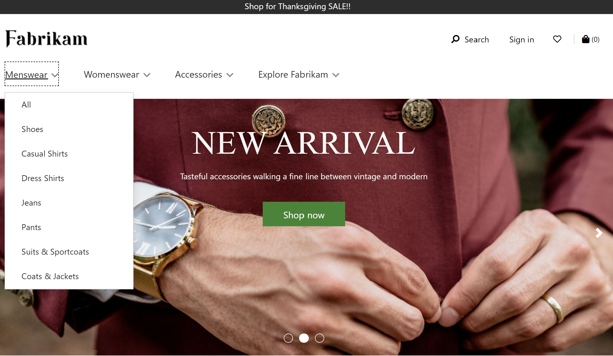

---
# required metadata

title: Navigation menu module 
description: This topic covers Navigation menu module and describes how to add them to site pages in Microsoft Dynamics 365 Commerce.
author:  anupamar-ms
manager: annbe
ms.date: 05/28/2020
ms.topic: article
ms.prod: 
ms.service: dynamics-365-commerce
ms.technology: 

# optional metadata

# ms.search.form: 
# ROBOTS: 
audience: Application User
# ms.devlang: 
ms.reviewer: v-chgri
ms.search.scope: Retail, Core, Operations
# ms.tgt_pltfrm: 
ms.custom: 
ms.assetid: 
ms.search.region: Global
ms.search.industry: 
ms.author: anupamar
ms.search.validFrom: 2019-10-31
ms.dyn365.ops.version: 
---

# Navigation menu module

[!include [banner](includes/banner.md)]

This topic covers Navigation menu module and describes how to add them to site pages in Microsoft Dynamics 365 Commerce.

## Overview

Navigation menu module allows the users to browse the channel navigation heirarchy as defined in Dynamics 365 Commerce HQ.  Configured items then appear as header navigation. In addition, it also supports static menu items which showcase relative links to other pages on the site.  The primary purpose of the module is to help the user browse the products and the site pages.

The module can be added to the [Header](author-header-module.md) of the page. In Fabrikam theme, the navigation menu shows 2-levels by default. In Starter theme, the navigation menu shows 3-levels by default. For changes to the nubmer of levels, a view extension is required on the theme.

The following is an example of Navigation Menu in Fabrikam with 2-levels of category heirarchy and some static menu items.

## Navigation menu module properties
| Property name             | Value                 | Description |
|---------------------------|-----------------------|-------------|
| Source                  | Retail, Manual authoring, Retail and manual authoring |Retail source allows the channel navigaiton heirarchy from HQ to be displayed on the navigation menu. Manaul authoring allows static menu items to be curated|
| Show category images |True or False    | This property was added in 10.0.14 and displays category images defined in HQ for a category on the navigation menu|
| Static menu item| Array of values| Static menu items take a menu item name and link to a static page. Recursively, you can create menu items below each other. By default, static menu appear on the root level and will be appended to channel navigation heirarchy if it exists |

The following is an example of Navigation Menu in Fabrikam with category images showing up on the menu

## Add a navigation menu module to a Header module

See Header module for details on how to author navigation menu

## Additional resources

[Starter kit overview](starter-kit-overview.md)

[Buy Box](add-buy-box.md)

[Cookie compliance](cookie-compliance.md)

[Header](author-header-module.md)
