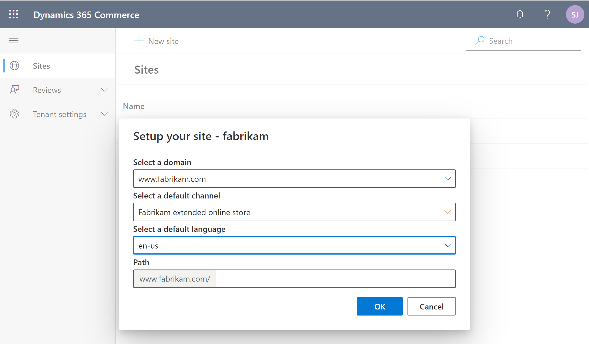
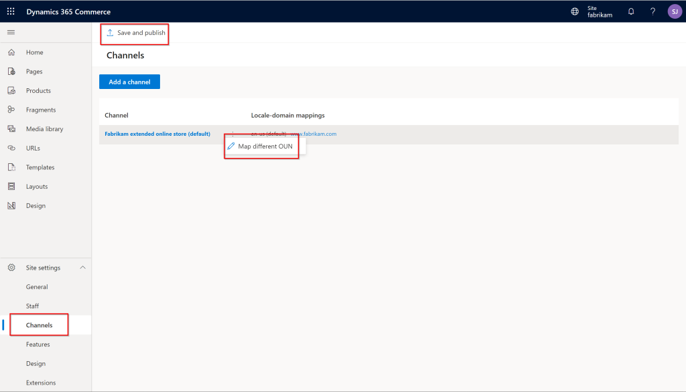

---
# required metadata

title: E-commerce site overview
description: This topic provides an overview of Microsoft Dynamics 365 Commerce e-commerce site support.
author: bicyclingfool
manager: AnnBe
ms.date: 11/05/2020
ms.topic: article
ms.prod: 
ms.service: dynamics-365-commerce
ms.technology: 

# optional metadata

ms.search.form: 
# ROBOTS: 
audience: Application user
# ms.devlang: 
ms.reviewer: josaw
ms.search.scope: Core, Operations, Retail
# ms.tgt_pltfrm: 
ms.custom: 
ms.assetid: 
ms.search.region: global
ms.search.industry: Retail
ms.author: stuharg
ms.search.validFrom: 2019-09-30
ms.dyn365.ops.version: 10.0.5

---

# E-commerce site overview

[!include [banner](includes/banner.md)]

This topic provides an overview of Microsoft Dynamics 365 Commerce e-commerce site support, including how e-commerce online stores are initialized and managed in Dynamics 365 Commerce. It also provides links to more information about online stores and how to set up and configure an e-commerce site. While this topic covers many of the basics, it does not cover everything needed to set up a production e-commerce site. More advanced topics can be found within the Commerce documentation.

## Online store channel

Before you can build your site in Dynamics 365 Commerce, at least one online store channel must be set up. For more information, see [Set up an online channel](channel-setup-online). 

In Dynamics 365 Commerce, you use an online store channel to establish the products, pricing, languages, payment methods, delivery modes, fulfillment centers, and other aspects of the online experience that should be available to your customers.

Only one online store channel has to be set up before you can get started with Dynamics 365 Commerce. However, a single e-commerce site can provide the online experience for multiple online stores. For example, if multiple online stores are set up to support different geographical regions, a single set of e-commerce pages can be used to provide the unique experiences that are defined by each store. For more information about how to configure a site to support multiple online stores, see [Associate an online site with a channel](associate-site-online-store.md).

After an online store is set up, it can be associated with the Dynamics 365 Commerce site that will serve as your online storefront. For more information about online stores and how to set them up, see [Set up online stores](https://docs.microsoft.com/dynamics365/unified-operations/retail/online-stores).

## Deploy a new e-commerce tenant

During initialization of an e-commerce site, you will be prompted for a domain name. For more information on domains in Commerce, see [configure your domain name](configure-your-domain-name.md) and [domains in Dynamics 365 Commerce](domains-commerce.md). To deploy a new e-commerce tenant using [Microsoft Dynamics Lifecycle Services (LCS)](https://docs.microsoft.com/en-us/dynamics365/unified-operations/dev-itpro/lifecycle-services/lcs-user-guide), follow the steps in [Deploy a new e-commerce tenant](deploy-ecommerce-site). Once your e-commerce tenant is setup in LCS, a link will be provided to Commerce site builder wjere you can initialize and configure your e-commerce site(s).

## Initialize your e-commerce site

Launching Commerce site builder from LCS will take you to the **Sites** page with two preconfigured sites named "default" and "fabrikam", as shown in the following example image.

Selecting one of the sites will prompt you to select a domain name, a default online store channel, a supported language for the selected channel, and a path. If only one channel is used, the path can be left empty. More online store channels or languages can be configured later within site builder, and each additional channel or language will require a unique path. For example, if you have two online channels associated with a single site and the site domain name is `www.fabrikam.com`, the path for one channel can be the default with no path (`https://www.fabrikam.com`) and the second channel could be set to a new path such as "site2" which would have the URL `https://www.fabrikam.com/site2`. The following example image shows a site initialization dialog box.

The **Sites** page also has a **New site** button that will bring up a similar dialog box to create a new site, however new sites will be blank and not include the same default templates, fragments, pages, and images provided with the "default" and "fabrikam" sites. If required, a support ticket can be opened to have a copy of default content added to a new blank site. For more information, see [Create an e-commerce site](create-ecommerce-site.md).

Once the new site is initialized, the Commerce site builder **Home** page will load with links with to common actions and guidance content as shown in the following image.

## Modify or add additional online store channels to an e-commerce site

Once an e-commerce site is created, the channel it is associated with can be changed by following the information in [Associate an e-commerce site with an online channel](associate-site-online-store.md). The following example image shows how a new channel operating unit number (OUN) can be changed from the **Site settings \> Channels** page.  Once a change is made, be sure to select **Save and publish** to ensure that the changes to go live.  

New channels can be added with by selecting **Add a channel**, and new languages can be added to a channel by selecting the channel and then selecting **Add a locale** in the channel dialog box on the right. Locales must be preconfigured for the online store channel in the Commerce headquarters before they will appear in the dialog box.

## Set up Azure B2C tenant

Dynamics 365 Commerce uses Azure Active Directory (Azure AD) business-to-consumer (B2C) to support user credential and authentication flows. For information on setting up your Azure B2C tenant, see [Set up a B2C tenant in Commerce](set-up-b2c-tenant.md), [set up custom pages for user sign-ins](custom-pages-user-logins.md), and [Configure multiple B2C tenants in a Commerce environment](configure-multi-b2c-tenants.md).

## Overview of default site pages

The Commerce "default" and "fabrikam" sites come with preconfigured templates, fragments, and pages to get you started. For more information, see the following topics.

- [Home page overview](quick-tour-home-page.md)
- [Product details page overview](quick-tour-pdp.md)
- [Cart and checkout pages overview](quick-tour-cart-checkout.md)
- [Account management pages overview](quick-tour-account-management.md)

## Manage site settings

For information on managing your site settings, see the following topics.

- [Manage e-commerce users and roles](manage-ecommerce-users-roles.md)
- [Search engine optimization (SEO) considerations for your site](/search-engine-optimization-considerations.md)
- [Manage Content Security Policy (CSP)](manage-csp.md)
- [Select a site theme](select-site-theme.md)

## Manage site content

For information on managing site content, see the following topics.

- [Page model glossary](page-elements-overview.md)
- [Document states and lifecycle](document-states-overview.md)
- [Templates and layout](templates-layouts-overview.md)
- [Work with fragments](work-with-fragments.md)
- [Work with modules](work-with-modules.md)
- [Digital asset management overview](dam-overview.md)
- [Module library overview](starter-kit-overview.md)

## Additional resources

[Create an e-commerce site](create-ecommerce-site.md)

[Deploy a new e-commerce site](deploy-ecommerce-site.md)

[Associate an online site with a channel](associate-site-online-store.md)

[Configure your domain name](configure-your-domain-name.md)

[Add support for a content delivery network (CDN)](add-cdn-support.md)

[Enable location-based store detection](enable-store-detection.md)

[Set up custom pages for user logins](custom-pages-user-logins.md)
