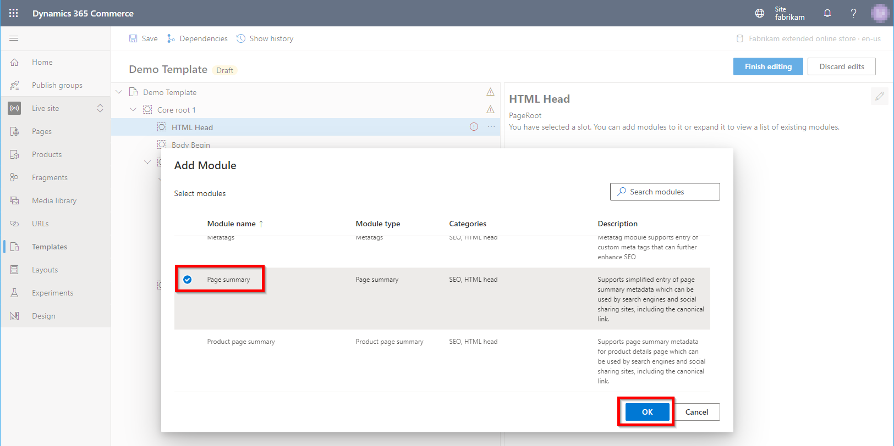
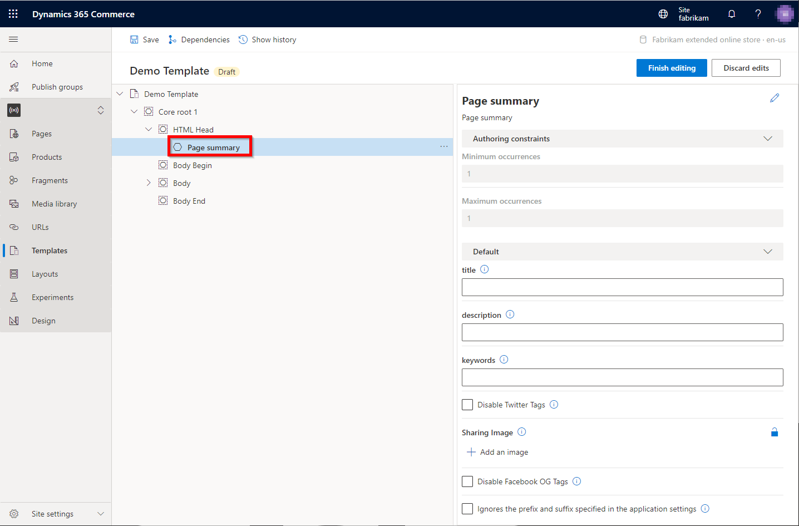

---
# required metadata

title: Page summary modules
description: This topic covers page summary modules and describes how to add them to templates in Microsoft Dynamics 365 Commerce.
author: samjarawan
manager: annbe
ms.date: 04/09/2021
ms.topic: article
ms.prod: 
ms.service: dynamics-365-commerce
ms.technology: 

# optional metadata

# ms.search.form: 
audience: Developer
# ms.devlang: 
ms.reviewer: v-chgri
# ms.tgt_pltfrm: 
ms.custom: 
ms.assetid: 
ms.search.region: Global
# ms.search.industry: 
ms.author: samjar
ms.search.validFrom: 2019-10-31
ms.dyn365.ops.version: Release 10.0.5

---

# Page summary modules

[!include [banner](includes/banner.md)]

This topic covers page summary modules and describes how to add them to templates in Microsoft Dynamics 365 Commerce.

Page summary modules help simplify the entry of page summary metadata that can be used by search engines and social sharing sites. This metadata includes canonical links.

The Dynamics 365 Commerce module library contains several page summary modules, such as page summary, category page summary, list page summary, and product page summary modules. Each page summary module has search engine optimization (SEO) metadata that is tuned for the specific page types that the module will be used for. All summary page modules share the same set of properties, which are described in the next section.

> [!NOTE]
> The product page summary module, included with Commerce module library version 9.27 and higher, uses the [Schema.org product schema](https://schema.org/Product) to insert basic JSON product metadata into a product page's header section. This metadata is automatically generated using the same Commerce Runtime (CRT) API data actions used by the buy box module and other product page metadata. Schema.org structured product metadata is often used by major search engines to render rich search results. By default, the product page summary module includes the product name, product description, offer (currency and pricing) information, and default image location per the Schema.org product schema specification. If necessary, this module and the data actions used by it can be extended using the Commerce online SDK to augment or modify metadata requirements.

## Summary page module properties

| Property name | Values | Description |
|---------------|--------|-------------|
| Title | Text | The title of the site page. |
| Description | Text | A brief description of the site page's contents. |
| Keywords | Text | A series of comma-separated keywords that are relevant to the site page. |
| Disable Twitter Tags | **True** or **False** | If this property is set to **True**, Twitter tags won't be rendered in the HTML. |
| Sharing image | An image that is selected in a list of available images | The image to use when the site page is shared. |
| Disable Facebook OG tags | **True** or **False** | If this property is set to **True**, Facebook Open Graph (OG) tags won't be rendered in the HTML. |
| Ignore the prefix and suffix specified in the application settings | **True** or **False** | If this property is set to **True**, the site-level prefix and suffix settings will be ignored. |

## Add a page summary module to a template

To add a page summary module to a template, follow these steps.

1. In Commerce site builder for your site, select **Templates**.
1. Select a template, and then select **Edit**.
1. In the **HTML Head** slot, select the ellipsis (**...**), and then select **Add module**.
1. In the **Add Module** dialog box, select the **Page summary** module (or another page summary module, such as **List page summary**), and then select **OK**. Make sure that you add the appropriate page summary module for the page types that the template will be used for.

    

After the summary module is added, it should resemble the example in the following illustration. The module can now be configured, and the template can be saved and published.

> [!NOTE]
> Although you can set default values in the template, those values can be overridden on pages that use the template.

## Additional resources

[Module library overview](starter-kit-overview.md)

[Default page module](default-page-module.md)

[External and inline script modules](script-module.md)

[Metatags module](metatags-module.md)

[!INCLUDE[footer-include](../includes/footer-banner.md)]
