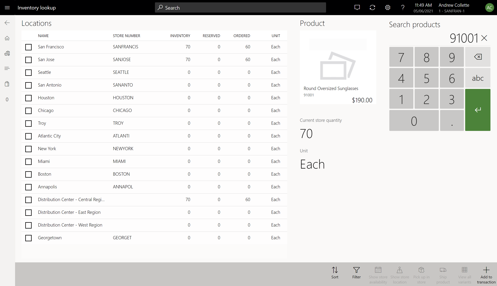
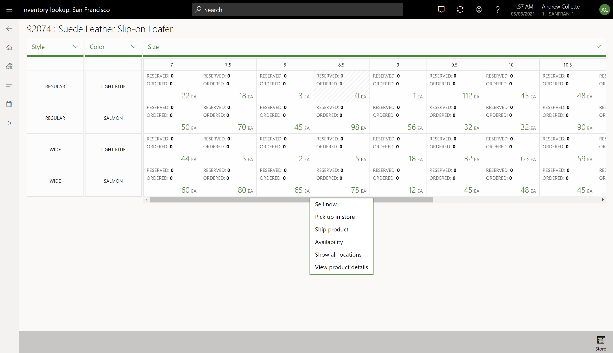

---
# required metadata

title: Inventory lookup operation in POS
description: This topic describes the options that are available for viewing inventory information in the point of sale (POS). 
author: boycezhu
ms.date: 03/12/2018
ms.topic: article
ms.prod: 
ms.technology: 

# optional metadata

# ms.search.form: 
audience: Application User
# ms.devlang: 
ms.reviewer: josaw
# ms.tgt_pltfrm: 
ms.custom: 
ms.assetid: 
ms.search.region: global
ms.search.industry: Retail
ms.author: asharchw
ms.search.validFrom: 2018-03-30
ms.dyn365.ops.version: Application update 5, AX 8.0

---

# Inventory lookup operation in POS

[!include [banner](includes/banner.md)]

This topic describes how a company can use the **Inventory lookup** operation in the point of sale (POS) to view the on-hand inventory availability and future available-to-promise (ATP) data for a product across stores and warehouses.

## Overview

**Inventory lookup** operation in POS helps retailers achieve operational excellence and gain insights by connecting stores, the POS, and the back office. This functionality provides inventory availability view of product across stores and warehouses. It also helps retailers drive additional efficiencies and cost savings by improving inventory planning in real-time.

An accurate view of inventory across organization helps store associates provide timely, superior customer service. The moment that matters most is the moment when the customer is ready to make a purchase decision. It's important that cashiers in the store have real-time or near-real-time inventory information at their fingertips, so that they can accurately promise product delivery and pickup.

When the **Inventory lookup** operation is started from the POS operation, the user needs to use the numeric keyboard to enter a product number to query its inventory information. If the entered product has variants, the user has option to further select dimension values to check inventory information of a specific product variant.

## Inventory lookup list view for individual product

For an individual product, the operation provides an inventory lookup list view showing the following product information at a list of locations:

- **Inventory** - This refers to the **available physical** quantity.
- **Reserved** - This refers to the **physical reserved** quantity retrieved from back office.
- **Ordered** - This refers to the **ordered in total** quantity retrieved from back office.
- **Unit** - This refers to the inventory unit of measure configured in back office.

The locations displayed in the list view include all stores and warehouses that are configured in the fulfillment groups that the current store is linked to.

The following actions are available on the app bar:

- **Sort** - This action sorts the data in the list view based on various criteria: **Geo location** (from the closest location to the farthest location, compared with the current store), **Name** (in ascending or descending order), **Store number** (in ascending or descending order), **Inventory** (in descending order), **Reserved** (in descending order), and **Ordered** (in descending order). The geo location based sorting is the default sort option.
- **Filter** - This action lets the user to view the data for a specified location name or store number.
- **Show store availability** - This action lets the user to view the ATP quantities for the product in the selected store.
- **Show store location** - This action opens a separate page to show the map view, address and store hours for the selected store.
- **Pick up in store** - This action creates a customer order for the product that will be picked up from the selected store, and redirects the user to the transaction screen.
- **Ship product** - This action creates a customer order for the product that will be shipped from the selected store, and redirects the user to the transaction screen.
- **View all variants** - For a product with variants, this action switches to the matrix view showing the inventory information for all variants of the product.
- **Add to transaction** - This action adds the product to the cart, and redirects the user to the transaction screen.

> [!NOTE]
> For **Geo location** based sorting, the distance between a location and current store is determined by the coordinates (latitude and longitude) configured in Commerce headquarters. For store, the location information is configured in the primary address of the operating unit associated with the store, for non-store warehouse, the location information is configured in the warehouse address. If current store doesn't have coordinates properly configured, the geo location based sorting will display current store at the top of the list and other locations sorted by name.

> [!NOTE]
> The **Show store availability**, **Show store location**, **Pick up in store**, and **Ship product** actions are not available for non-store locations.

## Inventory lookup matrix view for variants

For a master product with variants, the operation also provides a **dimension based matrix view** showing the inventory availability information for all variants of that product at a selected location. By default, the matrix view shows data for the current store, and you can use the Store action on the app bar to look up the inventory information at other stores configured in the fulfillment groups that the current store is linked to.

In the matrix view, each cell represents an individual variant. It displays an on-hand **inventory** (available physical) value in the lower-right corner, as well as **reserved** (physical reserved) and **ordered** (ordered in total) value in the upper-left corner. The table below explains the meaning of the various on-hand values.

| On-hand value                            | Description |
|------------------------------------------|-------------|
| Numeric value that is more than 0 (zero) | A variant has been released to the selected location, and you can perform additional actions in the cell. |
| **0** (zero)                             | A variant has been released to the selected location, but the item isn't available in selected location. However, you can perform additional actions in the cell. |
| **n/a** or an inactive cell              | A variant hasn't been released to the selected location, and you can't perform additional actions in the cell. |

The display order of the dimension values in the matrix view is based on the dimension display order configuration in the back office. You can also change the pivot for dimensions by selecting the new dimension to use. 

The following actions are available in the matrix view cell:

- **Sell now** - This action adds the selected variant to the cart, and redirects the user to the transaction screen.
- **Pick up in store** - This action creates a customer order for the selected variant that will be picked up from the selected store, and redirects the user to the transaction screen.
- **Ship product** - This action creates a customer order for the selected variant that will be shipped from the selected store, and redirects the user to the transaction screen.
- **Availability** - This action takes the user to a separate page showing the ATP quantities for the selected variant in the selected store.
- **Show all locations** - This action switches to the standard inventory availability list view showing the inventory information for the selected variant.
- **View product details** - This action redirects the user to the product details page of the selected variant.

## Launch inventory lookup from other pages in POS

The user can access on-hand inventory information or launch the **Inventory lookup** operation from other pages in POS.

On the product details page of a master product, you can use the **View all variants** action on the app bar to launch the **Inventory lookup** matrix view that shows the inventory availability information for all variants of that product for the current store. For an individual product, the product details page shows the on-hand inventory (available physical) value of that product for the current store. Additionally, the user can click the **Other stores inventory** link to launch the **Inventory lookup** operation to check the inventory availability of that product across other stores or warehouses.

> [!NOTE]
> The **View all variants** action on the product details page is available only for master products that have variants. It isn't available for distinct product or kits.

You can configure the **Inventory lookup** operation to the button grids for transaction screen. Once configured, when the user selects a cart line and then clicks the **Inventory lookup** button, the user will be presented the inventory availability list view for the selected product. To learn more about how to configure button grids using POS screen layout designer tool, please check [POS user interface visual configurations](https://docs.microsoft.com/dynamics365/commerce/pos-screen-layouts).

## Inventory lookup with channel-side calculation

In the Commerce release 10.0.9 and earlier, the **available physical** value in the **Inventory lookup** operation is retrieved from Commerce headquarters via real-time service call. In Commerce release 10.0.10 and later, you can configure POS **Inventory lookup** operation to use the channel-side calculation on the Commerce server to determine the available physical value, which can provide a more reliable and more accurate estimate of the on-hand inventory by factoring into the transactional data that is not yet synced to headquarters. To learn more about channel-side inventory calculation and related POS configuration in headquarters, please check [Calculate inventory availability for retail channels](https://docs.microsoft.com/dynamics365/commerce/calculated-inventory-retail-channels).

[!INCLUDE[footer-include](../includes/footer-banner.md)]
