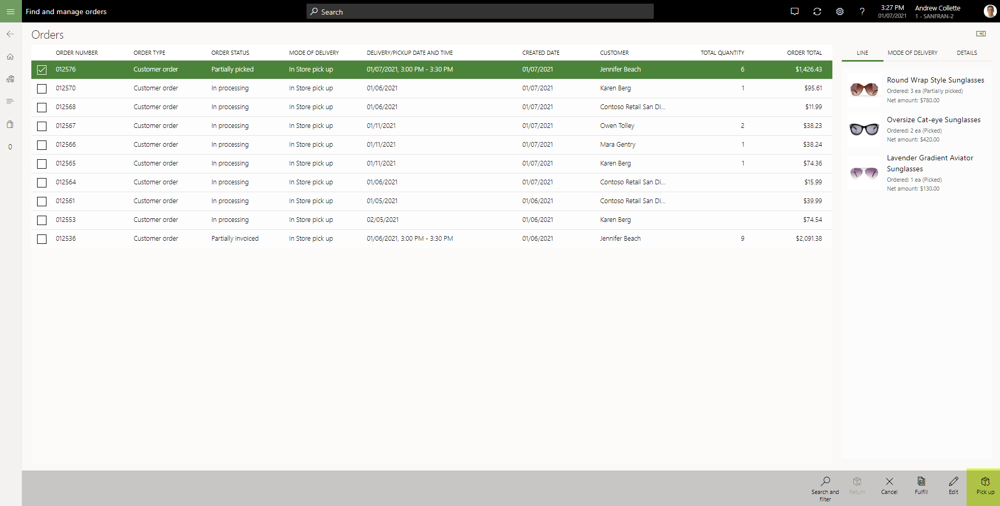
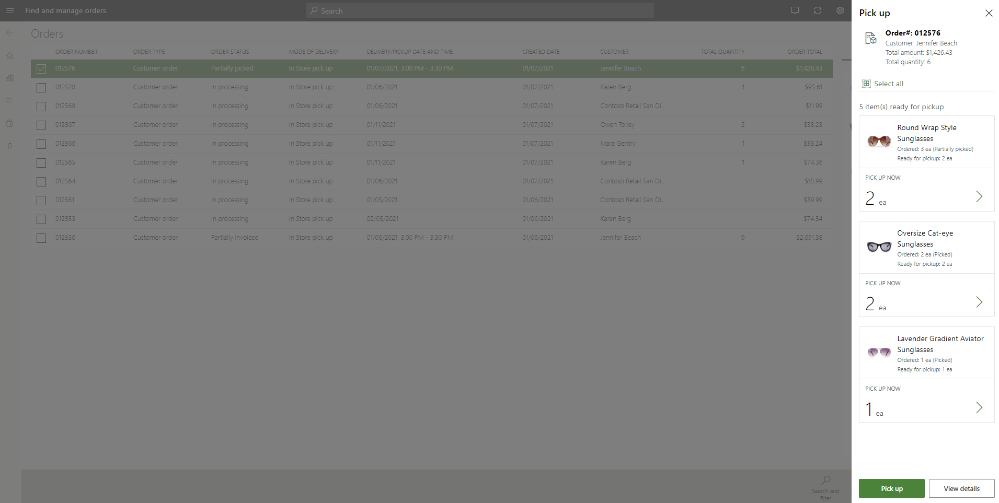

---
# required metadata

title: Process a customer order pickup in POS
description: This topic explains functionality available in the point of sale application for processing a customer order pickup.
manager: annbe
ms.date: 01/06/2021
ms.topic: article
ms.prod:
ms.service: dynamics-365-commerce
ms.technology: 

# optional metadata

# ms.search.form:
audience: Application User
# ms.devlang: 
ms.reviewer: 
ms.search.scope: Core, Operations, Retail
# ms.tgt_pltfrm: 
# ms.custom:
ms.search.region: global
# ms.search.industry:
ms.author: hhaines
ms.search.validFrom:
ms.dyn365.ops.version: 
---

# Process a customer order pickup in POS

When a [customer order](customer-orders-overview.md) is created for a store pickup, the point of sale (POS) application allows store users to initiate the pick up of inventory.  POS will execute the final payment capture if needed, and finalize the inventory and financial posting steps for the product quantities that are picked up.

A user can execute the pickup operation from the **Recall order** operation or the **Order fulfillment** operation in POS. To enable the **Pick up** operation, the user must first search for and locate the order to be picked up and select the order (if using the **Recall order** operation), or search for and select one or more order lines (if using the **Order fulfillment** operation). If the selected order or order lines are not configured for pick up at the specific store, or if the order has already been fully picked up, the **Pick up** operation will be disabled.

In Commerce version 10.0.17 and later, the **Improved user experience for pick up order processing in Point of Sale** feature can be enabled through **Feature management** in Commerce headquarters. If this feature is not enabled, the POS application doesn't allow users to choose pick up quantities and always assumes the full quantity ordered for the line will be picked up. This experience can be problematic because a user may forget to select certain items for pick up when executing the pick up operation through order fulfillment. When the **Improved user experience for pick up order processing in Point of Sale** feature is enabled, users have more control over selecting which products will be picked up and the quantity of these products to be picked up. Users aren't required to select every line of the sales order from the order fulfillment page before selecting pickup. All of the items available for pick up for the order will be displayed, and the user can choose multiple lines for pick up even if only one product line is selected.

When the **Improve user experience for pick up order processing in Point of Sale** feature is enabled and the user selects the **Pick up** operation, a dialog is displayed that allows the user to select the specific items and quantities that will be picked up. By default, any ordered quantity with inventory in a picked or packed state is considered eligible for pick up and the quantity is the default pick up quantity. The quantity can be edited by the user. The quantity entered can be picked up if it doesn't exceed the total open (non-invoiced) quantity for the selected line.  

after the user chooses the pick up quantities and selects **Pick up**, the **Transaction** page is displyed. If the [omni-channel payments](omni-channel-payments.md) feature is enabled and there are pre-authorized credit card payments on file, the user is prompted to apply the payment before being transfered to the transaction page.  

Once on the transaction page, the system calculates the amounts due by calculating the total due for the selected pick up items and subtracting any previously applied deposits or credit card authorized payments. The user must process payment to complete the pick up transaction. If the [transaction screen is configured](pos-screen-layouts.md) with the **Conclude transaction** operation, the user can complete the transaction without having to choose a payment method. This operaction can only be used when there is no amount due. If the **Conclude transaction** operation isn't available, the user can select the **$0.00 amount due** link in the **Totals** panel to conclude the transaction without having to choose a payment method.

## Change pick up lines or quantities

If the user needs to change pick up quantity after they've selected the items to be picked up, they can select **Set quantity** and make the change. The user won't be able to set the pick up quantity to "0" or increase the quantity to a value that's greater than the non-invoiced quantity remaining for the ordered line. If the user wants to remove a pickup line from the transaction cart, they can select **Void transaction**. The current pick up transaction will be stopped and the **Pick up** operation flow will be re-started.

If the **Improve user experience for pick up order processing in Point of Sale** feature is enabled, organizations can add the **Change pickup lines** operation button to their POS transaction screen layout. After a user creates the pick up transaction cart in POS and selects items, the user can select **Change pickup lines** if they need to change the pick up items but don't want to void the entire transaction. The **Change pickup lines** operation allows the user to re-select and change the pick up items and quantities. The transaction cart is then updated with the changes.

