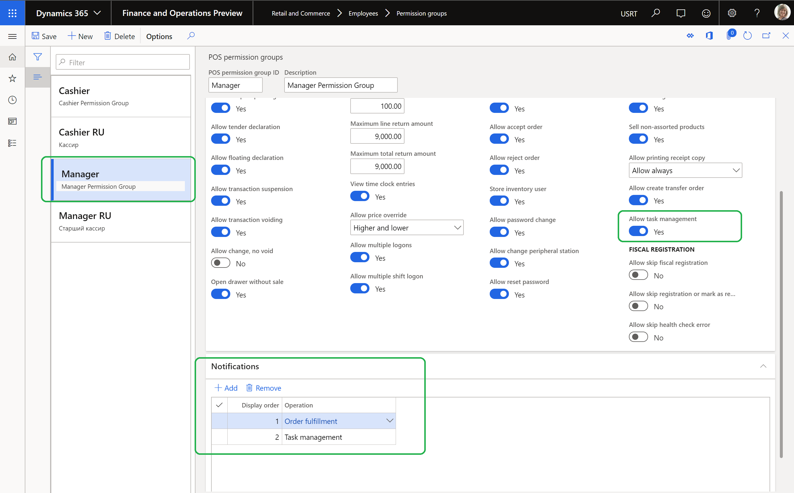
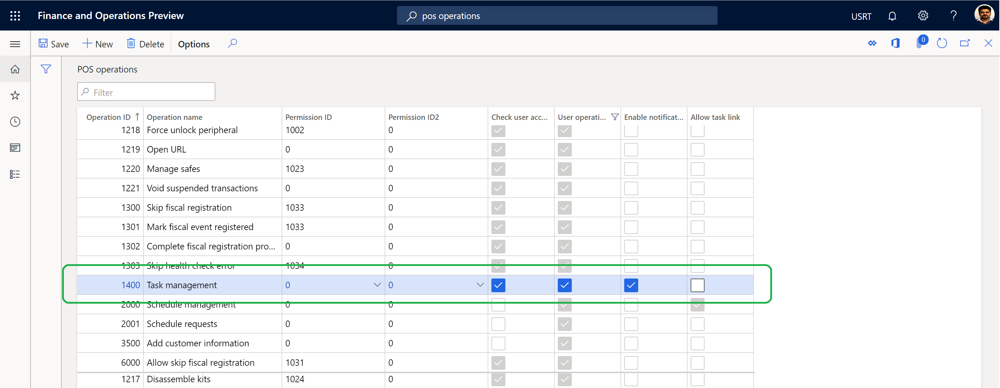
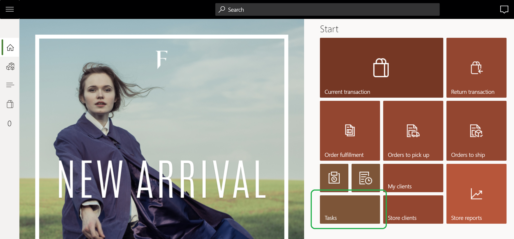

---
# required metadata

title: Configure task management
description: This topic describes how to configure task management features in Microsoft Dynamics 365 Commerce.
author: gvrmohanreddy
manager: annbe
ms.date: 02/10/2020
ms.topic: article
ms.prod: 
ms.service: dynamics-365-commerce
ms.technology: 

# optional metadata

# ms.search.form:  
# ROBOTS: 
audience: Application User
# ms.devlang: 
ms.reviewer: v-chgri
# ms.tgt_pltfrm: 
# ms.custom: 
ms.search.region: Global
ms.search.industry: 
ms.author: gmohanv
ms.search.validFrom: 2020-02-03
ms.dyn365.ops.version: Release 10.0.9
---

# Configure task management

[!include [banner](includes/banner.md)]

This topic describes how to configure task management features in Microsoft Dynamics 365 Commerce.

Before Dynamics 365 Commerce managers and employees can use the task management features in Commerce, task management must be configured. Configuration steps include granting permissions to managers and employees, distributing permissions to point of sale (POS) clients, setting up POS notifications, and configuring the **Tasks** tile on the home page of a POS application.

## Configure permissions for store managers

Every worker in a given store can view all tasks that are assigned to that store. They can also update the status of the tasks that are assigned to them. However, personas such as store managers must have task management permissions to manage tasks that are assigned to the store and to create single-purpose tasks.

To configure task management permissions for store managers, follow these steps.

1. Go to **Retail and Commerce \> Employees \> Permission groups**.
1. Select a specific permission group (for example, **Manager**), and then select **Edit**.
1. On the **Permissions** FastTab, set the **Allow task management** option to **Yes**.
1. On the **Notifications** FastTab, add the **Task management** operation, and enter a value in the **Display order** field. For example, enter **2** if the **Order fulfillment** operation already has a **Display order** value of **1**.
	
> [!NOTE]
> If a non-manager persona must have task management permissions in the POS, you can grant permission to the individual. Alternatively, you can create a new permission group for non-managers and set the **Allow task management** option to **Yes**.

The following illustration shows how to configure task management permissions for store managers.

## Configure permissions for employees

Employees must have permissions to create task lists, manage assignment criteria, and configure the recurrence of any task list. To configure these permissions, you assign employees to the **Retail task manager** role.

To configure permissions for an employee, follow these steps.

1. Go to **Retail and Commerce \> Employees \> Users**.
1. Select an employee.
1. On the **User's roles** FastTab, select **Assign roles**.
1. In the **Assign roles to user** dialog box, select the **Retail task manager** role, and then select **OK**.

## Distribute permissions to POS clients

Before employees can use POS clients, permissions must be distributed and synced to those clients.

To distribute permissions to POS clients, follow these steps.

1. Go to **Retail and Commerce \> Retail and Commerce IT \> Distribution schedule**.
1. Select the **1060** (**Staff**) distribution schedule, and then select **Run now**.
1. Select the **1070** (**Channel configuration**) distribution schedule, and then select **Run now**.

## Configure POS notifications for tasks

Task management must be configured so that notifications are available in the POS application.

To configure POS notifications for tasks, follow these steps.

1. Go to **Retail and Commerce \> Channel setup \> POS setup \> POS \> POS operations**.
1. Find operation **1400** (**Task management**), and select the **Enable notifications** check box for it.

The following illustration shows the **Task management** operation on the **POS operations** page.

For more information about how to configure POS notifications, see [Show order notifications in the point of sale (POS)](notifications-pos.md).

## Configure the Tasks tile on a POS application home page

Before you configure the **Tasks** tile on the home page of a POS application, see [Screen layouts for the point of sale (POS)](pos-screen-layouts.md) for information about how to configure and add new buttons to a POS screen layout.

To configure the **Tasks** tile on a POS application home page, follow these steps.

1. Go to **Retail and Commerce \> Channel setup \> POS setup \> POS \> Screen layouts**.
1. Select a screen layout, select a layout size, and select a button grid.
1. On the **Button grids** FastTab, select **Designer** to edit the selected button grid.
1. Add a **Tasks** tile to the appropriate section of the home page.

The following illustration shows an example of a **Tasks** tile on a POS home page.

## Additional resources

[Task management overview](task-mgmt-overview.md)

[Create task lists and add tasks](task-mgmt-create-lists.md)

[Assign task lists to stores or employees](task-mgmt-assign-lists.md)

[Task management in POS](task-mgmt-POS.md)

[!INCLUDE[footer-include](../includes/footer-banner.md)]
