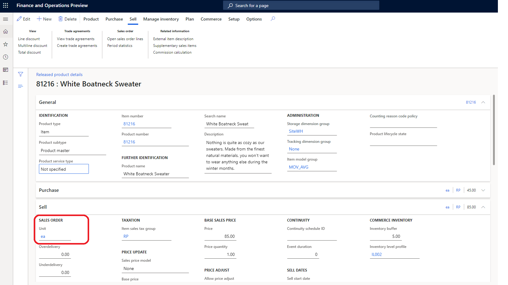
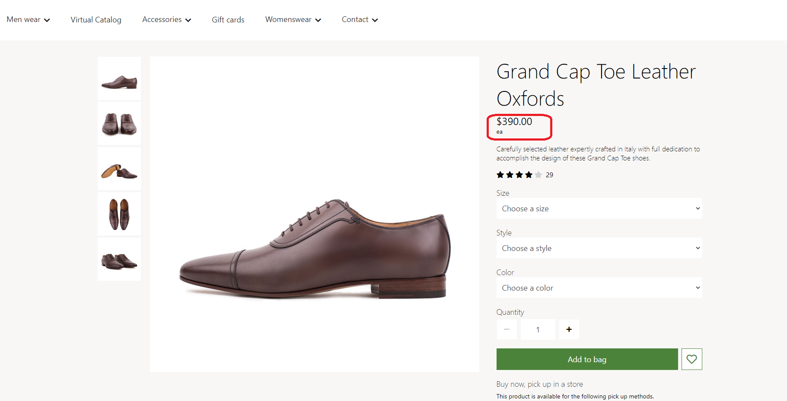
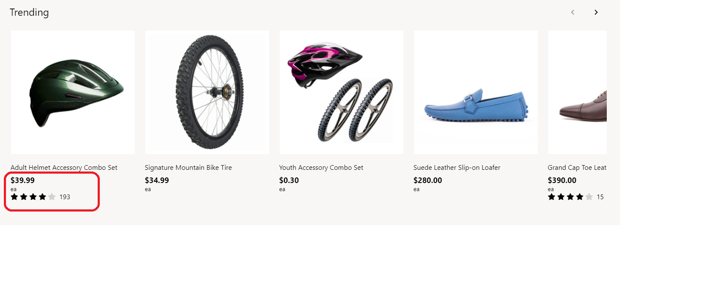

---
# required metadata

title: Apply unit of measure settings
description: This topic covers unit of measure settings and describes how to apply them in Microsoft Dynamics 365 Commerce.
author:  anupamar-ms
manager: annbe
ms.date: 09/15/2020
ms.topic: article
ms.prod: 
ms.technology: 

# optional metadata

# ms.search.form: 
# ROBOTS: 
audience: Application User
# ms.devlang: 
ms.reviewer: v-chgri
# ms.tgt_pltfrm: 
ms.custom: 
ms.assetid: 
ms.search.region: Global
ms.search.industry: 
ms.author: anupamar
ms.search.validFrom: 2019-10-31
ms.dyn365.ops.version: 
---

# Apply unit of measure settings

[!include [banner](includes/banner.md)]
[!include [banner](includes/preview-banner.md)]

This topic covers unit of measure settings and describes how to apply them in Microsoft Dynamics 365 Commerce.

A product can be sold in different units such as "each," "pair," and "dozen." In Commerce headquarters, the sell by unit of measure can be defined for a product and displayed on an e-commerce site using this setting. For example, if a retailer is selling a product both individually and in dozens, the units of measure available can be displayed along with other product information.

The following example image shows a product configured with a sell unit of measure of **ea** (each) in Commerce Headquarters.

> [!NOTE]
> Support for applying and displaying the unit of measure is available as of the Commerce version 10.0.19 release.

## Unit of measure settings

Unit of measure display settings are defined in Commerce site builder at **Site settings \> Extensions \> Display unit of measure for products**. There are three supported settings.

**Do not display**: When this setting is selected, the e-commerce site will not display the unit of measure of the product. This is the default behavior.
**Display in the product buying experience**: When this setting is selected, the unit of measure is displayed on the product details, cart, checkout, order history, and order details pages.
**Display in the product browsing and buying experience**: When this setting is selected, the unit of measure is displayed in the product buying experience as stated above and also during the product browsing experience. This includes displaying units of measure in search results and product collection modules.

> [!IMPORTANT] 
> Unit of measure display settings are available as of the Commerce version 10.0.19 release. If you are updating from an older version of Commerce, you must manually update the appsettings.json file. For instructions on updating the appsettings.json file, see [SDK and module library updates](e-commerce-extensibility/sdk-updates.md#update-the-appsettingsjson-file).

## Modules that use unit of measure settings

Modules that use the unit of measure settings include the buy box, wishlist, cart, cart icon, search results container, product collection, checkout, and order details modules.

The following image shows an example of a product details page (PDP) that is displaying the unit of measure for a product.

The following image shows an example of a product collection that is displaying the unit of measure for a product.

## Additional resources

[Module library overview](starter-kit-overview.md)

[Cart module](add-cart-module.md)

[Buy box module](add-buy-box.md)

[Account management pages and modules](account-management.md)

[SDK and module library updates](e-commerce-extensibility/sdk-updates.md)

[!INCLUDE[footer-include](../includes/footer-banner.md)]
