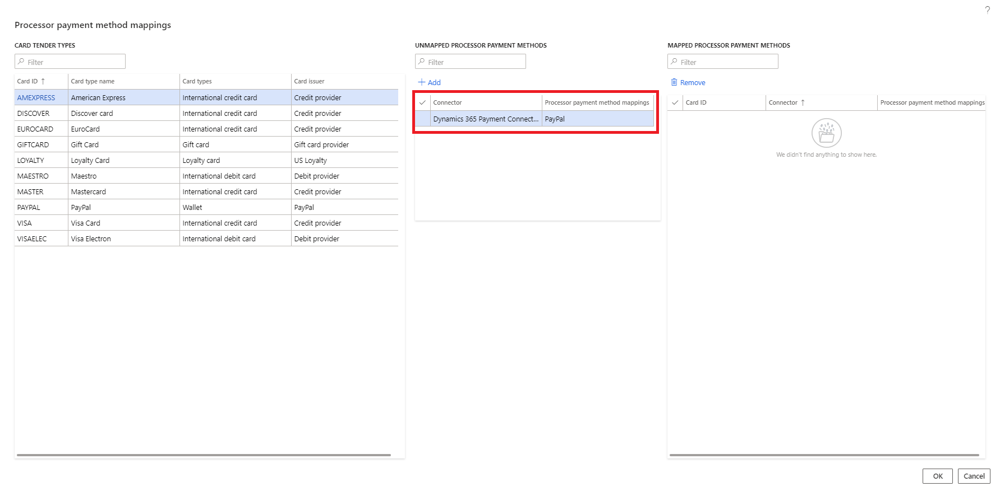
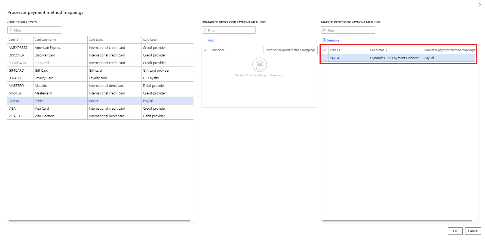

---
# required metadata

title: Wallet payment support
description: This topic provides an overview of wallet payment support for Microsoft Dynamics 365 Commerce.
author: rubendel
manager: annbe
ms.date: 11/18/2020
ms.topic: article
ms.prod: 
ms.service: dynamics-365-retail
ms.technology: 

# optional metadata

# ms.search.form: 
# ROBOTS: 
audience: IT Pro
# ms.devlang: 
ms.reviewer: josaw
ms.search.scope: Operations, Retail
# ms.tgt_pltfrm: 
ms.custom: 141393
ms.assetid: e23e944c-15de-459d-bcc5-ea03615ebf4c
ms.search.region: Global
ms.search.industry: Retail
ms.author: rubendel
ms.search.validFrom: 2020-10-31
ms.dyn365.ops.version: AX 7.0.1

---

# Wallet payment support

[!include [banner](../includes/banner.md)]

This topic provides an overview of wallet payment support for Microsoft Dynamics 365 Commerce.  

## Key terms

| Term | Description |
|---|---|
| Wallet | A payment type that does not include traditional payment characteristics, such as the BIN range that is used to differentiate among credit and debit card types. |
| Processor payment method | A property payment card property in the payments SDK. When this property is added to supported payment methods within a connector, those payment methods can be mapped to cards or wallets configured in Commerce headquarters and avoid the traditional BIN range mapping. 

## Overview

Unlike traditional credit and debit cards, wallet payment authorization responses do not include BIN ranges. Traditionally, BIN ranges have been used to match payment authorization responses to predefined card types with BIN ranges. This feature adds support for **Processor payment methods** and mapping of those variants to card types set up in Commerce headquarters.

**Processor payment method** is a property for the payments SDK that can be applied to payment methods supported for a particular payment connector. When an authorization response is received that includes the processor payment method, a lookup is performed to determine if that processor payment method has been mapped to a card or wallet type. If a mapping is found, that payment is mapped to the matching card or wallet type. If a match can't be found, a BIN lookup is performed following the traditional BIN range settings for Commerce. 

Because wallet payments don't include BIN range, if a payment connector such as PayPal supports wallet payments, the payment connector should be updated to the latest payments SDK and the processor payment method property should be populated at least for all supported wallet payments. 

Processor payment method mappings are also useful for traditional debit and credit card payments. Mapping processor payment methods to cards is more straightforward than BIN range mapping and less prone to errors because it is easy to ensure all possible payment methods supported by a connector are mapped to a card or wallet type. 

## Wallet payment method support and processor payment methods

This feature supports a new payment method and card type called **Wallet**. The primary characteristic of a wallet payment is that it does not have a BIN range, but wallet payment methods may also not return expiration dates and some properties that have traditionally been considered mandatory. Wallet payment methods must be mapped to processor payment methods as an alternative to the traditional BIN range mapping. 

### Adding support of processor payment methods

To support processor payment methods, payment connectors need to populate the PaymentMethodVariant property in PaymentCardProperties. If the payments SDK in use does not include this property, it should be updated. 

### Processor payment method mapping

The **Processor payment method mapping** page can be used to map processor payment methods to configured card or wallet types. To access this page select the **Processor mapping** link on the **Card types** page.

When this page opens, it queries available payment connectors to collect a set or payment methods with the PaymentMethodVariant field populated. It then checks to determine if those payment methods have an existing mapping to a card or wallet. Payment methods that do not have a mapping are listed in the center column of the page. 

To map a processor payment method to a card or wallet, select the card or wallet, then select the processor payment method, and then click **Add**. The processor payment method moves to the **Mapped** column. When a matching payment authorization is received, it will be mapped to the chosen card or wallet.

### When not to use processor payment method mapping

In certain cases, processor payment method mapping may not be granular enough for reporting needs. For example, some retailers differentiate external gift cards from the same provider by their BIN range. In this scenario, the gift cards should not be mapped using the above page. Instead, they should continue to use traditional BIN range mapping. 

## Support for unidentified card types

In some scenarios, a payment connector may return a card that does not have a BIN range or processor payment method mapping. If this occurs, the payment is authorized by the payment terminal, but is then reversed when the point of sale (POS) can't map the authorization response to a specific card type. To address this, a capability is provided to map unknown authorization responses to a default card type. 

This capability ensures that the payment is never authorized by the terminal and then reversed by the POS, and helps avoid confusion for customers and store associates. When this setting is used, the default card for unknown authorizations should be checked periodically to ensure that wanted card types are not accidentally being mapped to the default for unknown card types. If a card type is truly unwanted for processing, it should be disabled at the processor level. 

## Additional resources

- [Payments FAQ](dev-itpro/payments-retail.md)
- [Dynamics 365 Payment Connector for PayPal](paypal.md)
