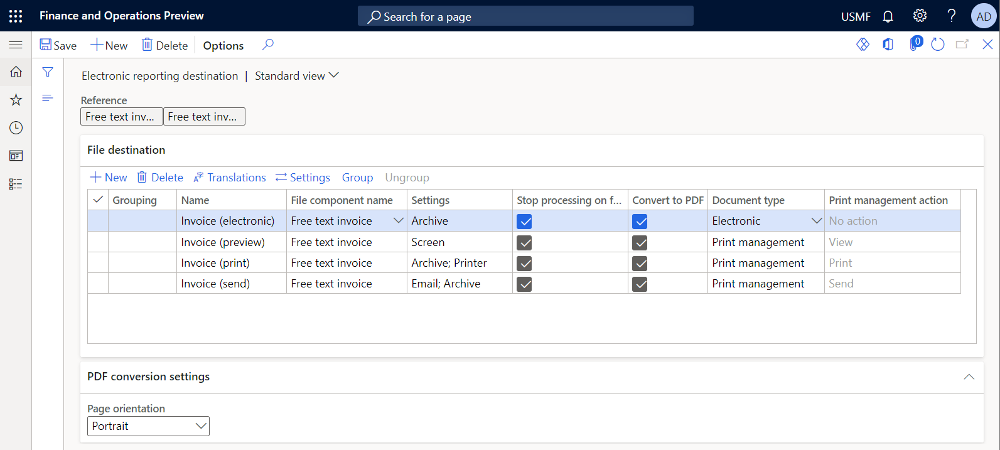
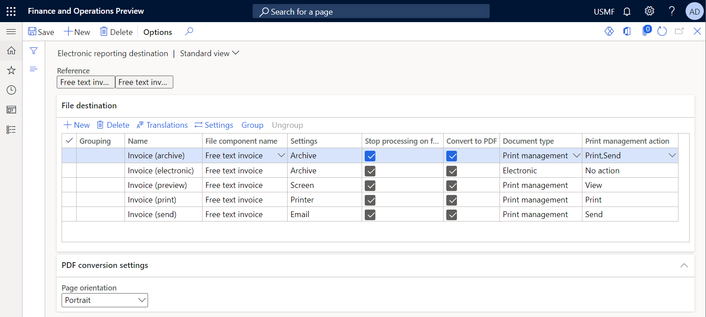
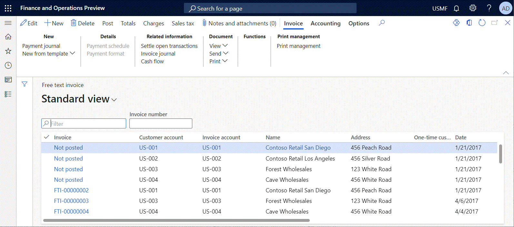

---
# required metadata

title: Configure action-dependent ER destinations
description: This topic provides information about how to configure action-dependent destinations for each FOLDER or FILE component of an Electronic reporting (ER) format that is configured to generate outbound documents.
author: NickSelin
manager: AnnBe
ms.date: 01/22/2021
ms.topic: article
ms.prod: 
ms.service: dynamics-ax-platform
ms.technology: 

# optional metadata

ms.search.form: ERSolutionTable, ERFormatDestinationTable
# ROBOTS: 
audience: Application User
# ms.devlang: 
ms.reviewer: kfend
# ms.tgt_pltfrm: 
ms.custom: 97423
ms.assetid: f3055a27-717a-4c94-a912-f269a1288be6
ms.search.region: Global
# ms.search.industry: 
ms.author: nselin
ms.search.validFrom: 2020-12-01
ms.dyn365.ops.version: 10.0.17

---

# Configure action-dependent ER destinations

[!include [banner](../includes/banner.md)]

You can configure [destinations](electronic-reporting-destinations.md) for each output component (a folder or a file) of an [Electronic reporting (ER)](general-electronic-reporting.md) [format](general-electronic-reporting.md#FormatComponentOutbound) [configuration](general-electronic-reporting.md#Configuration) that is used to generate an outbound document. Users who run an ER format like this and who have appropriate access rights, can also modify the configured destination settings at runtime. Starting in Finance version **10.0.17**, an ER format can be executed by [provisioning](er-apis-app10-0-17.md) an action code that the user performs by running this ER format. For example, in the **Accounts receivable** module you can select an ER format in the Print management (PM) settings to generate a particular business document such as a free text invoice. After that, you can select **View** to preview an invoice or select **Print** to send the invoice to a printer. If a user action is passed at runtime for the running ER format, you can configure different ER destinations for different user actions. This topic explains how ER destinations can be configured for such an ER format.

## Make action-dependent ER destinations available

To configure action dependent ER destinations in the current Finance instance and enable the [new](er-apis-app10-0-17.md) ER API, open the [Feature management](../../fin-ops/get-started/feature-management/feature-management-overview.md#the-feature-management-workspace) workspace, and enable the **Configure specific ER destinations to be used for different PM actions** feature. To use configured ER destinations at runtime for specific reports, enable the **Route output of PM reports based on ER destinations that are user action specific (wave 1)** feature.

## Configure action-dependent ER destinations

When you enable the **Configure specific ER destinations to be used for different PM actions** feature, you can configure action-dependent ER destinations on the **File destination** FastTab of the **Electronic reporting destination** page. For each component, you can add an individual record and enable specific ER destinations. For every record, you must identify the type of a document for which the configured ER destinations must be applied:

- Select **Electronic** to apply the configured destinations when no user action code is provided at runtime.
- Select **Print management** to apply the configured destinations when a user action code is provided at runtime.
- Select **Any** to always apply the configured destinations regardless of whether a user action has been provided at runtime.

When you select the **Print management** document type, identify user actions for which the configured ER destinations must be applied:

- Select **View** to apply the configured destinations when the **View** user action is provided at runtime.
- Select **Print** to apply the configured destinations when the **Print** user action is provided at runtime.
- Select **Send** to apply the configured destinations when the **Send** user action is provided at runtime.

> [!NOTE]
> Several actions can be selected for a single destination record.

When you select the **Any** document type, the **Autodetect** option is automatically selected as a user action which means:

- When no user action code is provided at runtime, all configured destinations are applied.
- When a user action code is provided at runtime, a predefined for a particular action ER destination will be applied **regardless of whether it has been enabled**:
    - When the **View** action is provided at runtime, the **Screen** ER destination is applied.
    - When the **Send** action is provided at runtime, the **Email** ER destination is applied.
    - When the **Print** action is provided at runtime, the **Printer** ER destination is applied.

The following graphic illustrates how ER destinations can be configured for the **Free text invoice (Excel)** ER format to do the following with a generated document:

- Archive when this ER format is executed with no action code provided. For example, when it's sent out electronically.
- Preview in using web browser when a user performs the **View** action.
- Archive and print out when the **Print** action is performed.
- Archive and email as the attachment of an outbound electronic mail when a user performs the **Send** action.

The same can be achieved with the following settings:

> [!NOTE]
> The [default](electronic-reporting-destinations.md#default-behavior) destination behavior is applied when an action code is provided for the running ER format but no destinations have been configured for the provided action code.

## Change action-dependent ER destinations at runtime

When an ER format is executed with user actions provisioned by users who have appropriate [permissions](electronic-reporting-destinations.md#security-considerations) to modify configured destination settings at runtime, a dialog box opens that offers the option to modify configured destination settings is offered. This dialog box is optional, and its appearance depends on how the call of the ER framework to run an ER format has been implemented. If this dialog appears, ER destinations on this dialog will be enabled in accordance with the provided user action. The following illustration shows such a dialog that is offered when the **Free text invoice (Excel)** ER format is executed with the **Printer** action provisioning and when ER destinations for this format were configured as shown above.

> [!NOTE]
> If you configured ER destinations for several components of the running ER format, such option will be offered for every configured component of this ER format separately.

## Verify the provided user action

You can verify what, if any, user action is provided for the running ER format when you perform a particular user action. This verification is important when you need to configure action depended ER destinations but aren't sure whether a user action code is provided and, if so, which one. For example, when you start posting a free text invoice and on the **Post free text invoice** dialog box set the **Print invoice** action to **Yes**, you can set the **Use print management destination** option to **Yes** or **No**. Complete the following steps to verify the provided code of user action.

1.  Go to **Organization administration** \> **Electronic reporting** \> **Configurations**.
2.  On the **Configurations** page, on the Action Pane, on the **Configurations** tab, in the **Advanced settings** group, select **User parameters**.
3.  In the **User parameters** dialog box, [set](er-trace-reports-compare-baseline.md#configure-er-parameters-to-use-the-baseline-feature) the **Run in debug mode** parameter to **Yes**.
4.  Perform a user action by running an ER format taking into account that ER user parameters are company and user specific.
5.  Go to **Organization administration** \> **Electronic reporting** \> **Configuration debug logs**.
6.  On the **Configuration debug logs** page, filter ER run logs to find the log of your ER format run.
7.  Review log entries that must contain the record presenting the provided user action code if any action has been provided for this run.

    

## Additional resources

[Electronic reporting (ER) overview](general-electronic-reporting.md)

[Electronic reporting (ER) destinations](electronic-reporting-destinations.md)

[Electronic reporting framework API changes for Application update 10.0.17](er-apis-app10-0-17.md)
