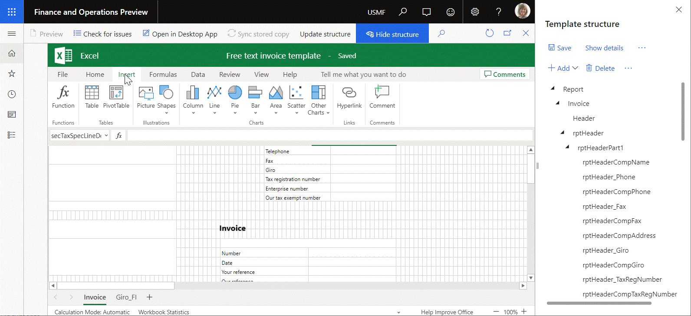

---
# required metadata

title: Update the structure of a business document template 
description: This topic provides information about how to update structure of a business document template by using the Business document management feature.
author: NickSelin
manager: AnnBe
ms.date: 11/06/2020
ms.topic: article
ms.prod: 
ms.service: dynamics-ax-platform
ms.technology: 

# optional metadata

ms.search.form: ERBDWorkspace, ERBDParameters, ERBDTemplateEditor
# ROBOTS: 
audience: Application User, Developer, IT Pro
# ms.devlang: 
ms.reviewer: kfend
ms.search.scope: Core, Operations
# ms.tgt_pltfrm: 
ms.custom: 
ms.assetid: 
ms.search.region: Global
# ms.search.industry: 
ms.author: nselin
ms.search.validFrom: 2019-12-01
ms.dyn365.ops.version: 10.0.9

---

# Update the structure of a business document template 

[!include[banner](../includes/banner.md)]

You can use the **Template structure** panel of the [Business document management](er-business-document-management.md) template editor to modify a business document template by [adding new fields](er-bdm-add-field-to-excel-template.md) to a template in Microsoft Excel. When a template is updated this way, the structure of the template is automatically modified in Dynamics 365 Finance, reflecting all changes on the **Template structure** panel.

You can also modify a template by using Office 365 online functionality. For example, you can add a new named item, such as a picture or shape to the editable worksheet. In this case, the structure of this template isn't automatically modified in Finance and the added item isn't visible on the **Template structure** panel. To force a template structure update, select **Update structure** on the template editor page.

For more information about this feature, complete the following steps of an example.

## Example: Update the structure of a business document template

This example shows how a System administrator can update the structure of a business document template in Finance after the template ss modified in Office online. The following sections provide an overview of the steps that are involved.

### Prepare a business document template for editing

Complete the following steps of the example in the [Business document management overview](er-business-document-management.md) topic:

1.  [Configure ER parameters](er-business-document-management.md#configure-er-parameters)
2.  [Import ER solutions](er-business-document-management.md#import-er-solutions)
3.  [Enable Business document management](er-business-document-management.md#enable-business-document-management)
4.  [Configure parameters](er-business-document-management.md#configure-parameters)

### Edit a business document template

1.  Open the **Business document management** workspace and select **New**.
2.  On the **Create a new template** page, select the **Free text invoice (ER sample)(Excel)** template.
3.  Select **Create document**.
4.  In the **Title** field, enter **FTI sample Litware**.
5.  Select **OK** to confirm a new template creation.
    
    > [!NOTE]
    > If you have not signed in to Office online yet, you will be [directed](er-business-document-management.md#i-selected-edit-document-but-instead-of-opening-the-bdm-template-editor-page-in-finance-and-operations-i-have-been-sent-to-the-microsoft-365-web-page) to the Office 365 sign-in page . Select the **Back** button of your browser to navigate back to your Finance environment.

      When you return to Finance, the template you created is opened for editing in Excel online embedded control of the Business document management template editor page.

      

### Review the current structure of the editable template

1.  In Excel online, on the toolbar, on the **View** tab, in the **Show** group, select **Gridlines**.
2.  In the editable template, select the rectangle that is located above the template title.
    
    > [!NOTE] 
    > In this graphic, this picture in Excel is named, **rptHeaderCompLogo**.
    
3.  Toggle **Show structure** if the **Template structure** panel is hidden.
4.  On the **Template structure** panel, expand tree nodes to access the content of the **Report \> Invoice \> rptHeader \> rptHeaderPart1**.
    
    > [!NOTE]
    > The **rptHeaderCompLogo** item is presented in the template structure of Finance as the child item of **Report \> Invoice \> rptHeader \> rptHeaderPart1**.

     

### Update the structure of a business document template by deleting a picture

1.  In Excel online, select the **rptHeaderCompLogo** picture.
2.  Use one of the following options to delete a selected picture from the editable template:
    - Press the **Delete** button on your keyboard.
    - Right-click the selected picture, and then select **Cut**.
    > [!NOTE]
    > The **rptHeaderCompLogo** item is still presented in the template structure of Finance even though the picture is no longer available in the Excel template.
    
3.  Select **Update structure** to synchronize the structure of the editable template in Excel and Finance.
4.  On the **Template structure** panel, expand tree nodes to access the content of the **Report \> Invoice \> rptHeader \> rptHeaderPart1**.
    
    > [!NOTE]
    > The **rptHeaderCompLogo** item is no longer in the template structure of Finance.

### Update the structure of a business document template by adding a picture

1.  In Excel online, on the toolbar, on the **Insert** tab, select **Picture**.
2.  Select **Choose file**, browse to and select the image you want to add, and then select **OK**.
3.  Select **Insert**.
4.  Move the added picture to properly position it. By default, Excel names the picture. For example, **Picture 2**.
5.  Select **Update structure** to synchronize the structure of the editable template in Excel and Finance.
4.  On the **Template structure** panel, expand tree nodes to access the content of the **Report \> Invoice \> rptHeader \> rptHeaderPart1**. The new picture is now included in the template structure of Finance.

## Related links

[Electronic reporting (ER) overview](general-electronic-reporting.md)

[Business document management overview](er-business-document-management.md)
