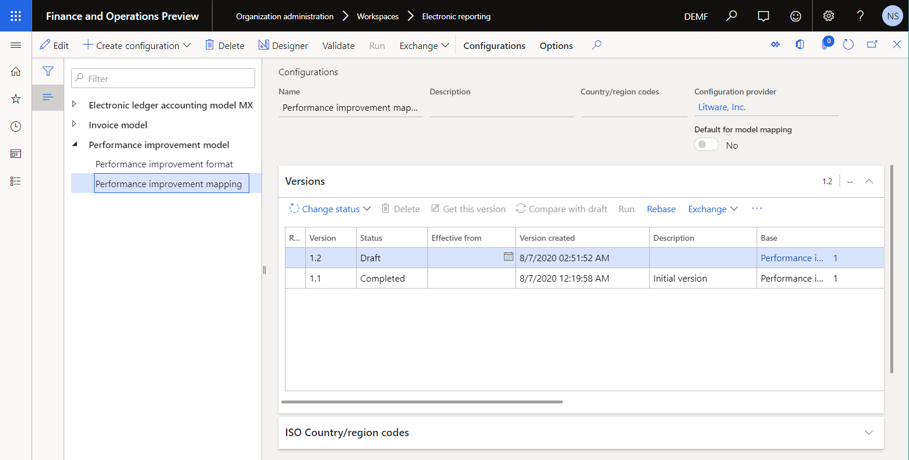
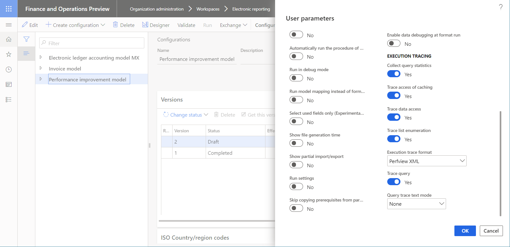
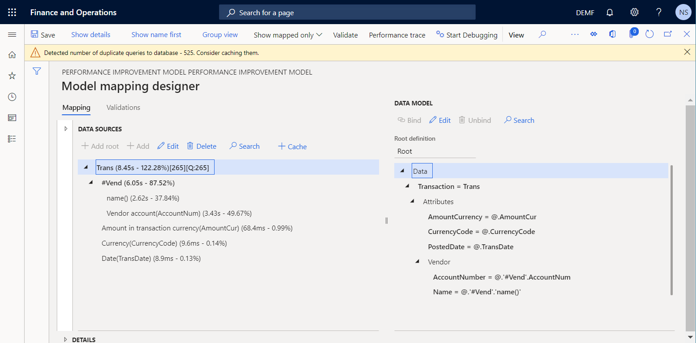
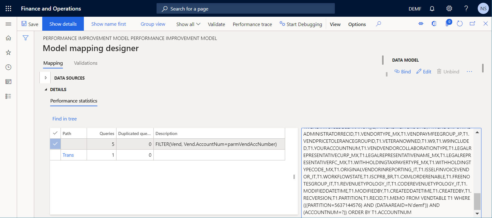

---
# required metadata

title: Improve performance of ER solutions by adding parameterized CALCULATED FIELD data sources
description: This topic provides information about how to improve performance of ER solutions by adding parameterized CALCULATED FIELD data sources.
author: NickSelin
manager: AnnBe
ms.date: 08/12/2020
ms.topic: article
ms.prod: 
ms.service: dynamics-ax-platform
ms.technology: 

# optional metadata

# ms.search.form: ERModelMappingDesigner, EROperationDesigner, ERExpressionDesignerFormula
# ROBOTS: 
audience: Application User, Developer, IT Pro
# ms.devlang: 
ms.reviewer: kfend
ms.search.scope: Core, Operations
# ms.tgt_pltfrm: 
ms.custom: 
ms.assetid: 
ms.search.region: Global
# ms.search.industry: 
ms.author: nselin
ms.search.validFrom: 
ms.dyn365.ops.version: 10.0.5

---

# Improve performance of ER solutions by adding parameterized CALCULATED FIELD data sources

[!include [banner](../includes/banner.md)]

This tutorial provides guidelines about how to take [performance traces](trace-execution-er-troubleshoot-perf.md) for executed ER formats, and how to use the information from these traces to help improve performance by configuring a parametrized **Calculated field** data source.

As part of the process of designing [Electronic reporting (ER)](general-electronic-reporting.md) configurations to generate business documents, you define the method that is used to get data out of the application and enter it in the output that is generated. You can design a parametrized ER data source of the **Calculated field** type to reduce the number of database calls and significantly reduce the time and cost that are involved in collecting the details of ER format execution.

## Prerequisites

- To complete the examples in this topic, you must have the access to one of the following [roles](../sysadmin/tasks/assign-users-security-roles.md):

    - Electronic reporting developer
    - Electronic reporting functional consultant
    - System administrator

- The company must be set to **DEMF**.

- Follow the steps in [Appendix 1](#appendix1) of this topic to download the components of the sample Microsoft ER solution that are required to complete the steps of this tutorial.

- Follow the steps in [Appendix 2](#appendix2) of this topic to configure the minimal set of ER parameters before you can start to use the ER framework to improve the performance of the sample Microsoft ER solution.

## Import the sample ER solution

Assume that you need to design a new ER solution to generate a new report that presents vendor transactions. Currently, you can find the transactions for a selected vendor on the **Vendor transactions** page (go to **Account payable \> Vendors \> All vendors**, select a vendor, and then, on the Action Pane, on the **Vendor** tab, in the **Transactions** group, select **Transactions**). However, you want to have transactions of all vendors at the same time in one electronic document in XML format. This solution will consist of several ER configurations that contain the required data model, model mapping, and format components. You will import the sample ER solution to start using it for generation of a vendor transactions report.

1. Sign in to the Finance instance that has been provisioned for your company.
2. In this tutorial, you will create and modify configurations for the **Litware, Inc.** sample company. Therefore, make sure that this configuration provider has been added to your Finance instance and selected as active. For instructions, see the [Create configuration providers and mark them as active](https://docs.microsoft.com/dynamics365/unified-operations/dev-itpro/analytics/tasks/er-configuration-provider-mark-it-active-2016-11) procedure.
3. In the **Electronic reporting** workspace, select the **Reporting configurations** tile.
4. On the **Configurations** page, import the ER configurations that you downloaded as a prerequisite into Finance, in the following order: data model, model mapping, format. For each configuration, follow these steps:

    1. On the Action Pane, select **Exchange \> Load from XML file**.
    2. Select **Browse** to select the appropriate file for the required ER configuration in XML format.
    3. Select **OK**.

    

## Review the sample ER solution

### Review model mapping

1. In the configuration tree, expand the content of the **Performance improvement model** item.
2. Select **Performance improvement mapping**.
3. Select **Designer** on the **Configurations** page.
4. Select **Designer** on the **Model to datasource mapping** page.
   
    This ER model mapping is designed to do the following:
    
    - Fetch the list of vendor transactions residing in the **VendTrans** table (**Trans** data source).
    - For every transaction, fetch from the **VendTable** table the record of a vendor for which the current transaction has been posted (**#Vend** data source).
    
    Note that the **#Vend** data source is configured as fetching the corresponded vendor record by using the existing many-to-one relation **@.'>Relations'.VendTable_AccountNum**.

    The model mapping in this configuration implements the base data model for any of the ER formats created for this model and executed in Finance. As a result, the content of the **Trans** data sources is exposed for ER formats such as abstract **model** data sources.

    

5.  Close the **Model mapping designer** page.
6.  Close the **Model to datasource mapping** page.

### Review format

1. In the configuration tree, expand the content of the ***Performance improvement model** item.
2. Select **Performance improvement format**.
3. Select **Designer**.
4. Select the **Mapping** tab.
5. Select **Expand/Collapse**.
6. Expand the **Model**, **Data,** and **Transaction** items. 

    This ER format is designed to generate a vendor transactions report in XML format.

    

7. Close the **Format designer** page.

## Run the sample ER solution to trace execution

Assume that you've finished designing the first version of the ER solution. You now want to test it in your Finance instance and analyze execution performance.

### Turn on the ER performance trace

1. Select the **DEMF** company.
2. Complete the steps of the [Turn on the ER performance trace](trace-execution-er-troubleshoot-perf.md#turn-on-the-er-performance-trace) section to generate a performance trace while an ER format is executed.

    

### Run the ER format

1. Go to **Organization administration** \> **Electronic reporting** \> **Configurations**.
2. On the **Configurations** page, in the configuration tree, select the **Performance improvement format** item.
3. On the Action Pane, select **Run**.

## Use the performance trace to analyze model mapping performance

1. On the **Configurations** page, in the configuration tree, select **Performance improvement mapping**.
2. On the Action Pane, select **Designer**.
3. Select **Designer** and on the **Model mapping designer** page, on the Action Pane, select **Performance trace**.
4. Select the latest generated trace and then select **OK**.

New information is now available for some data source items of the current model mapping:

- The actual time that was spent getting data by using the data source.
- The same time expressed as a percentage of the total time that was spent running the whole model mapping.

The **Performance statistics** table shows that the **Trans** data source calls the **VendTrans** table once. The value **\[265\]\[Q:265\]** of the **Trans** data source indicates that 265 vendor transactions have been fetched from the application table and returned to the data model.

The **Performance statistics** table now shows that the current model mapping duplicates database requests while the **#Vend** data source is run. This duplication occurs because:

- The vendor table is called two times (in total 530) for each iterated vendor transaction (in total 265):

    - One call is made to enter the vendor account number.
    - One call is made to enter the vendor name.

- The vendor table is called for each iterated vendor transaction even though the fetched transactions have been posted for only five vendors. Of the 530 calls, 525 are duplicates.

Notice that more that 80% (approximately six seconds) of the model mapping execution time (approximately eight seconds) has been spent retrieving values from the **VendTable** application table that is too much for two attributes of five vendors compared with the volume of information from the **VendTrans** application table.

You can use caching for the **#Vend** data source to reduce the number of calls that are made to get the vendor details for every transactions and improve the performance of the model mapping.

> [!NOTE] 
> The **Trans\#Vend** data source caching will be performed within the scope of the current transaction of the **Trans** data source at runtime.

Caching the **#Vend** data source will reduce the number of duplicated calls from 525 to 260 but will not totally eliminate the duplication. You can configure a new parameterized data source of the **Calculated field** type to achieve this.

## Improve the model mapping based on information from the execution trace

### Modify the logic of the model mapping

Complete these steps to use caching and a data source of the **Calculated field** type, to help prevent duplicate calls to the database.

1. On the **Configurations** page, in the configuration tree, select **Performance improvement mapping**.
2. On the Action Pane, select **Designer**.
3. Select **Designer**.
4. Follow these steps to add a new data source of the **Table records** type, to access records in the **VendTable** application table:

    1. In the **Data source types** pane, expand **Dynamics 365 for Operations** and select **Table records**.
    2. Select **Add root**, and in the **Name** field, enter **Vend**.
    3. In the **Table** field, enter **VendTable** and then select **OK**.

5. Follow these steps to add a new data source of the **Empty container** type to hold a new parameterized data source of the **Calculated field** type as you can parameterize calls to only the data sources of the **Calculated field** type that reside in a container:

    1. In the **Data source types** pane, expand **General** and select **Empty container**.
    2. Select **Add root** and in the **Name** field, enter **Box**.
    3. Select **OK**.

    

6. Follow these steps to add a new parameterized data source of the **Calculated field** type:

    1. On the **Model mapping designer** page, in the **Data sources** pane, select **Box**.
    2. In the **Data source types** pane, expand **Functions** and select **Calculated field**.
    3. Select **Add** and in the **Name** field, enter **Vend**.
    4. Select **Edit formula** and onthe **Formula designer** page, select **Parameters** to specify what parameters must be provided when this data source is called.
    5. On the **Parameters** dialog, select **New** and in the **Name** field, enter **parmVendAccNumber**.
    6. In the **Type** field, select **String** and then select **OK**.
    7. In the **Formula** field, enter `FIRSTORNULL(FILTER(Vend, Vend.AccountNum=parmVendAccNumber))`.
    8. Select **Save** and close the **Formula designer** page.
    9. Select **OK** to complete the new data source entry.

7. Follow these steps to mark the added data source as cached during the execution:

    1. On the **Model mapping designer** page, in the **Data sources** pane, select **Box\Vend**.
    2. Select **Cache**.
    
    > [!NOTE] 
    > The **Box\Vend** data source caching will be performed in the scope of all vendor transactions of the **Trans** data source at runtime.

8. Follow these steps to update the nested **Trans\#Vend** data source to use the **Box\Vend** data source:

    1. On the **Model mapping designer** page, in the **Data sources** pane, expand **Trans**.
    2. Select the **Trans\#Vend** data source and then select **Edit** > **Edit formula**.
    3. In the **Formula** field, enter `Box.Vend(@.AccountNum)`.
    4. Select **Save** and then close the **Formula designer** page.
    5. Select **OK** to complete the modification of the selected data source.

9. Select **Save**.

    

10. Close the **Model mapping designer** page.
11. Close the **Model mappings** page.

### Complete the modified version of the ER model mapping

1. On the **Configurations** page, on the **Versions** FastTab, select version **1.2** of the **Performance improvement mapping** configuration.
2. Select **Change status**.
3. Select **Complete**, and then select **OK**.

## Run the modified ER solution to trace execution

Repeat the steps in the [Run the ER format](#run-format) section earlier in this topic to generate a new performance trace.

## Use the performance trace to analyze model mapping performance

1. On the **Configurations** page, in the configuration tree, select the **Performance improvement mapping** item.
2. On the Action Pane, select **Designer**.
3. Select **Designer**.
4. On the **Model mapping designer** page, on the Action Pane, select **Performance trace**.
5. Select the latest generated trace.
6. Select **OK**.

Notice that the adjustments that you made to the model mapping have eliminated duplicate queries to database. The number of calls to database tables and data sources for this model mapping has also been reduced. The total execution time has been reduced ~ 20 times (from ~8 seconds to ~400 milliseconds) improving the performance of the whole ER solution. 

## Appendix 1: Download the components of the sample Microsoft ER solution

You must also download and locally store the following files.

| File                                        | Content                               |
|---------------------------------------------|---------------------------------------|
| Performance improvement model.version.1     | [Sample ER data model configuration](https://mbs.microsoft.com/customersource/Global/AX/downloads/hot-fixes/365optelecrepeg)    |
| Performance improvement mapping.version.1.1 | [Sample ER model mapping configuration](https://mbs.microsoft.com/customersource/Global/AX/downloads/hot-fixes/365optelecrepeg) |
| Performance improvement format.version.1.1  | [Sample ER format configuration](https://mbs.microsoft.com/customersource/Global/AX/downloads/hot-fixes/365optelecrepeg)    |

## Appendix 2: Configure the ER framework

You must configure the minimal set of ER parameters before you can start to use the ER framework to improve the performance of the sample Microsoft ER solution.

### Configure ER parameters

1. Go to **Organization administration** \> **Workspaces** \> **Electronic reporting**.
2. On the **Localization configurations** page, in the **Related links** section, select **Electronic reporting parameters**.
3. On the **Electronic reporting parameters** page, on the **General** tab, set the **Enable design mode** option to **Yes**.
4. On the **Attachments** tab, set the following parameters:

    - In the **Configurations** field, select the **File** type for the **DEMF** company.
    - In the **Job archive**, **Temporary**, **Baseline**, and **Others** fields, select the **File** type.

For more information about ER parameters, see [Configure the ER framework](electronic-reporting-er-configure-parameters.md).

### Activate an ER configuration provider

Every ER configuration that is added is marked as owned by an ER configuration provider. The ER configuration provider that is activated in the **Electronic reporting** workspace is used for this purpose. Therefore, you must activate an ER configuration provider in the **Electronic reporting** workspace before you start to add or edit ER configurations.

> [!NOTE]
> Only the owner of an ER configuration can edit the configuration. Therefore, before an ER configuration can be edited, the appropriate ER configuration provider must be activated in the **Electronic reporting** workspace.

#### Review the list of ER configuration providers

1. Go to **Organization administration** \> **Workspaces** \> **Electronic reporting**.
2. On the **Localization configurations** page, in the **Related links** section, select **Configuration providers**.
3. On the **Configuration provider table** page, each provider record has a unique name and URL. Review the contents of this page. If a record for **Litware, Inc.** (`https://www.litware.com`) already exists, skip the next procedure, [Add a new ER configuration provider](#ActivateProvider).

#### Add a new ER configuration provider

1. Go to **Organization administration** \> **Workspaces** \> **Electronic reporting**.
2. On the **Localization configurations** page, in the **Related links** section, select **Configuration providers**.
3. On the **Configuration providers** page, select **New**.
4. In the **Name** field, enter **Litware, Inc.**
5. In the **Internet address** field, enter `https://www.litware.com`.
6. Select **Save**.

#### Activate an ER configuration provider

1. Go to **Organization administration** \> **Workspaces** \> **Electronic reporting**.
2. On the **Localization configurations** page, in the **Configuration providers** section, select the **Litware, Inc.** tile, and then select **Set active**.

For more information about ER configuration providers, see [Create configuration providers and mark them as active](tasks/er-configuration-provider-mark-it-active-2016-11.md).

## Additional resources

-   [Electronic Reporting overview](general-electronic-reporting.md)
-   [Trace the execution of ER formats to troubleshoot performance issues](trace-execution-er-troubleshoot-perf.md)
-   [Support parameterized calls of ER data sources of the Calculated field type](er-calculated-field-type.md)
