---
# required metadata

title: Inspect the configured ER component to prevent potential runtime issues
description: This topic explains how to inspect the configured Electronic reporting (ER) components to prevent potential runtime issues.
author: NickSelin
manager: AnnBe
ms.date: 11/12/2020
ms.topic: article
ms.prod: 
ms.service: dynamics-ax-platform
ms.technology: 

# optional metadata

ms.search.form: ERSolutionTable, ERDataModelDesigner, ERModelMappingTable, ERModelMappingDesigner, EROperationDesigner
# ROBOTS: 
audience: Application User, Developer, IT Pro
# ms.devlang: 
ms.reviewer: kfend
ms.search.scope: Core, Operations
# ms.tgt_pltfrm: 
ms.custom: 220314
ms.assetid: 
ms.search.region: Global
# ms.search.industry: 
ms.author: nselin
ms.search.validFrom: 2016-06-30
ms.dyn365.ops.version: Version 7.0.0

---

# Inspect the configured ER component to prevent potential runtime issues

[!include[banner](../includes/banner.md)]

Every configured [Electronic reporting (ER)](general-electronic-reporting.md) [format](general-electronic-reporting.md#FormatComponentOutbound) and [model mapping](general-electronic-reporting.md#data-model-and-model-mapping-components) component can be [validated](er-fillable-excel.md#validate-an-er-format) at design time to complete the consistency check to prevent potential runtime issues including execution errors and performance degradation. For every discovered issue, the path to a problematic element is provided. For some of these issues, the automatic fix is offered.

By default, this validation is applied automatically in the following cases for an ER configuration that contains the ER components mentioned above:

- When you [import](general-electronic-reporting.md#importing-an-er-component-from-lcs-to-use-it-internally) a new [version](general-electronic-reporting.md#component-versioning) of an ER configuration to your Dynamics 365 Finance instance.
- When you change the [status](general-electronic-reporting.md#component-versioning) of the editable ER configuration from **Draft** to **Completed**.
- When you [rebase](general-electronic-reporting.md#upgrading-a-format-selecting-a-new-version-of-base-format-rebase) an editable ER configuration by applying a new base version.

You can explicitly run this validation. To do this, select one of the following three options, and complete the steps:

- Option 1
    1.  Go to **Organization administration \> Electronic reporting \> Configurations**.
    2.  In the configurations tree in the left pane, select the  ER configurations you want that contain the ER format or ER model mapping component.
    3.  On the **Versions** FastTab, select the version you want of the selected ER configuration.
    4.  On the **Configurations** page, on the Action Pane, select **Validate**.
    
- Option 2 for an ER format
    1.  Go to **Organization administration \> Electronic reporting \> Configurations** page.
    2.  In the configurations tree in the left pane, select the ER configurations you want that contain the ER format component.
    3.  On the **Versions** FastTab, select the version you want of the selected ER configuration.
    4.  On the **Configurations** page, on the Action Pane, select **Designer**.
    5.  On the **Format designer** page, on the Action Pane, select **Validate**.
    
- Option 3 for an ER model mapping
    1.  Go to **Organization administration \> Electronic reporting \> Configurations** page.
    2.  In the configurations tree in the left pane, select the ER configurations you want that contain the ER model mapping component.
    3.  On the **Versions** FastTab, select the version you want of the selected ER configuration.
    4.  On the **Configurations** page, on the Action Pane, select **Designer**.
    5.  On the **Model to datasource mapping** page, on the Action Pane, select **Designer**.
    6.  On the **Model mapping designer** page, on the Action Pane, select **Validate**.

You can skip this validation during the configuration's import. To do this, complete the following steps:

1.  Go to **Organization administration \> Electronic reporting \> Configurations** page.
2.  On the **Configurations** page, on the Action Pane, on the **Configurations** tab, in the **Advanced settings** group, select **User parameters**.
3.  Set the **Validate the configuration after importing** option to **No**.

You can also skip this validation during the version's status change or rebase. To do this, complete the following steps:

1.  Go to **Organization administration \> Electronic reporting \> Configurations** page.
2.  On the **Configurations** page, on the Action Pane, on the **Configurations** tab, in the **Advanced settings** group, select **User parameters**.
3.  Set the **Skip validation at configuration's status change and rebase** option to **Yes**.

ER groups consistency check inspections by the following categories:
 - **Executability**: Includes inspections that detect critical issues that may happen at runtime, mostly at an **Error** level. 
 - **Performance**: Includes inspections that detect issues that may cause non-efficient execution of configured ER components, mostly at a **Warning** level.
 - **Data integrity**: Includes inspections that detect issues that may cause data loss or runtime issues, mostly at a **Warning** level.

## List of inspections

Review the content of the provided article to find out what kind of components’ inspections ER provides and how ER components might be reconfigured to get rid of potential issues.

| Number     | Category       | Level   | Message                                                                                     |
|------------|----------------|---------|---------------------------------------------------------------------------------------------|
| [Type conversion](#i1)                                                | Executability  | Error   | Cannot convert expression of type **?** to field of type **?**. |
|                                                                       |                |         | Runtime error: **Exception of type** |
| [Type compatibility](#i2)                                             | Executability  | Error   | The configured expression cannot be used as the binding of the current format element to a data source as this expression returns value of the data type **?** that is beyond the scope of data types that are supported by the current format element of type **?**. |
|                                                                       |                |         | Runtime error: **Exception of type** |
| [Missing configuration element](#i3)                                  | Executability  | Error   | Path not found **?**. |
|                                                                       |                |         | Runtime error: **Element of the configuration ? not found** |
| [Executability of an expression with FILTER function](#i4)            | Executability  | Error   | The list expression of `FILTER` function is not queryable. |
|                                                                       |                |         | Runtime error: **Filtering is not supported. Validate the configuration to get more details about this.** |
| [Executability of a GROUPBY data source](#i5)                         | Executability  | Error   | Path **?** does not support querying. |
|                                                                       | Executability  | Error   | Group by function cannot be executed with query. |
|                                                                       |                |         | Runtime error: **Group by function can not be executed with query.** |
| [Executability of a JOIN data source](#i6)                                             | Executability  | Error   | Cannot join a list **?** that is not a filter in query. |
|                                                                       |                |         | Runtime error: **Function Joined datasource should be a filter expression calculated field has been incorrectly called.** |
| [Preferability of FILTER vs WHERE function](#i7)                      | Performance    | Warning | Using `FILTER` function for the expression is preferable than `WHERE` from the performance perspective. Click **Fix** button to replace it automatically. |
| [Preferability of ALLITEMSQUERY vs ALLITEMS function](#i8)            | Performance    | Warning | Using `ALLITEMSQUERY` function for the expression is preferable than `ALLITEMS` from the performance perspective. Click **Fix** button to replace it automatically. |
| [Consideration of empty list cases](#i9)                              | Executability  | Warning | List **?** does not have any check for empty list case, it can result an error at run time. Add a check for empty list case. |
|                                                                       |                |         | Runtime error: **List is empty at ?** |
|                                                                       |                |         | [Potential issue](#i9a): **Line is getting populated once while a data source it is populated from contains multiple records** |
| [Executability of an expression with FILTER function (caching)](#i10) | Executability  | Error   | `FILTER` function cannot be applied to the selected type of data source. A data source of the *Table records* type is applicable only when it is not cached and has no manually added nested data sources. |
|                                                                       |                |         | Runtime error: **Filtering is not supported. Validate the configuration to get more details about this.** |
| [Missing binding](#i11)                                               | Executability  | Warning | Path **?** has no binding to any datasource in using model's mapping. |
|                                                                       |                |         | Runtime error: **Path ? is not bound** |
| [Not linked template](#i12)                                           | Data integrity | Warning | File **?** is linked to no file components and will be removed after changing status of configuration version. |
| [Not synced format](#i13)                                             | Data integrity | Warning | Defined name **?** does not exist in Excel sheet **?**  |

## <a name="i1">Type conversion</a>

ER checks whether the data type of a data model field is compatible with data type of an expression that is configured as the binding of this field. When the data types are incompatible, a validation error occurs in the ER model mapping designer stating that ER can't convert an expression of type A to a field of type B. The following steps show how this issue may occur.

1.  Start configuring the ER data model and the ER model mapping components simultaneously.
2.  In the data model tree, add a new field named **X**, select the **Integer** data type.
  
    

3.  In the **Model mapping data sourcesMM pane, add a new data source of the type, **Calculated field**.
4.  Name the data source **Y**, and configure it to contain the `INTVALUE(100)` expression.
5.  Bind **X** to **Y**.*
6.  In the data model designer, change the data type of **X** from **Integer** to **Int64**.
7.  Select **Validate** to inspect the editable model mapping component on the **Model mapping designer** page.

    

8.  Select **Validate** to inspect the model mapping component of the selected ER configurations on the **Configurations** page.

    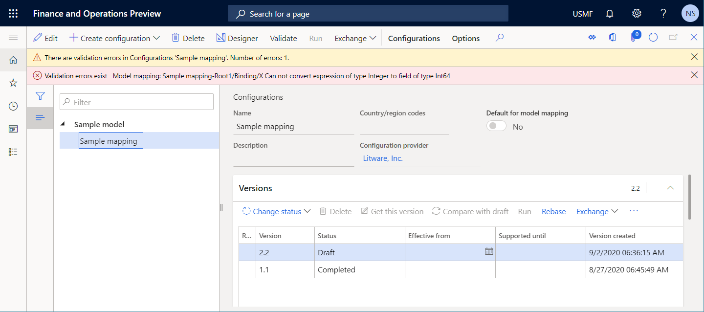

    > [!NOTE]
    > A validation error occurs which states that the expression `INTVALUE(100)` of the data source **Y** returns the value of the **Integer** type that can't be stored in the **X** data model's field of the **Int64** type.

The following illustration shows the runtime error that occurs when you ignore this warning and select **Run** to execute a format that is configured to use this model mapping:

### Automatic resolution availability

The option to automatically resolve this issue is not available.

### Manual resolution

#### Option 1

Update the data model structure by changing data type of the data model field to make it equal to data type of the expression configured for the binding of this field. For the example above, the data type of field **X** must be changed back to **Integer**.

#### Option 2

Update the model mapping by changing the expression of the data source that is bound with the data model field. Using the example, the expression of the data source **Y** must be changed to `INT64VALUE(100)`.

## <a name="i2">Type compatibility</a>

ER checks if the data type of a format element is compatible with the data type of an expression that is configured as the binding of this format element. When they are incompatible, a validation error occurs in the ER Operations designer. The error states that the configured expression can't be used as the binding of the current format element to a data source. This is because the expression returns a value of data type A that is beyond the scope of data types supported by the current format element of type B. The following steps show how this issue may occur.

1.  Start configuring the ER data model and the ER format components simultaneously.
2.  In the data model tree, add a new field, name it **X** and select the **Integer** data type.
3.  In the format structure tree, add a new format element of the **Numeric** type.
4.  Name the new format element **Y**, and in the **Numeric type** field, select the **Integer** data type.
5.  Bind **X** to **Y**.
6.  In the format structure tree, change the **Numeric type** value of the **Y** format element from **Integer** to **Int64**.
7.  Select **Validate** to inspect the editable format component on the **Format designer** page.

    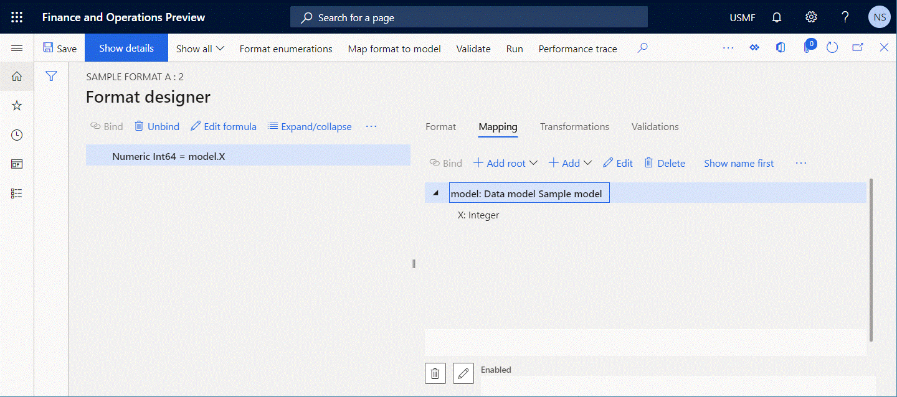

    > [!NOTE]
    > A validation error occurs that states the configured expression can only accept **Int64** values. The format element **Y** can't be populated with the value of the data model's field **X** of the **Integer** type.

### Automatic resolution availability

The option to automatically resolve this issue is not available.

### Manual resolution

#### Option 1

Update the format structure by changing data type of the **Numeric** format element to make it equal to the data type of the expression configured for the binding of this element. In the example above, the **Numeric type** value of the format element **X** must be changed back to **Integer**.

#### Option 2

Update the format mapping of the format element **X** by changing the expression from `model.X` to `INT64VALUE(model.X)`.

## <a name="i3">Missing configuration element</a>

ER checks if the binding expressions contains only data sources that are configured in the editable ER component. The validation error occurs in the ER Operations designer or the ER model mapping designer for every binding that contains a data source that is missing in the editable ER component.

1.  Start configuring the ER data model and the ER model mapping components simultaneously.
2.  In the data model tree, add a new field, name it **X**, and select the **Integer** data type.

    

3.  In the model mapping data sources pane, add a new data source of the *Calculated field* type and name it **Y**.
4.  Configure it as containing the `INTVALUE(100)` expression.
5.  Bind **X** to **Y**.
6.  In the model mapping designer, on the data sources pane, delete the data source **Y**.
7.  Select **Validate** to inspect the editable model mapping component on the **Model mapping designer** page.

    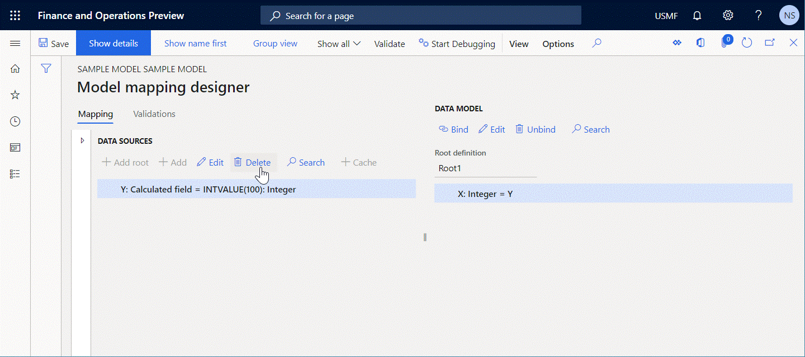

    > [!NOTE]
    > A validation error occurs which states that the path to the data source **Y** is not found while this data source is used in the binding of the **X** data model's field.

### Automatic resolution availability

The **Unbind** option is offered to automatically resolve this issue. When you selected this option, the missing data source binding is removed.

### Manual resolution

#### Option 1

Unbind the data model **X** field to stop referring to the non-existing data source **Y**.

#### Option 2

Add back the data source **Y** on the data sources pane of the ER model mapping designer.

## <a name="i4">Executability of an expression containing the FILTER function</a>

The built-in ER function [FILTER](er-functions-list-filter.md) is used to access application tables, views, or data entities by placing a single SQL call for getting required data as the list of records. A data source of the *Record list* type is used as an argument of this function to specify a particular application source for this call. ER checks whether a direct SQL query to a data source that is referred in the FILTER function can be established. When the referred data source is not SQL queryable, the validation error is thrown in the ER model mapping designer telling that the containing FILTER function ER expression cannot be executed at runtime. The presented below steps show how this issue may occurs.

1.  Start configuring the ER model mapping component.
2.  Add a new data source of the *Dynamics 365 for Operations \ Table records* type:
    1.  Name it as **Vendor**.
    2.  In the **Table** field, select **VendTable** to specify that this data source will request the **VendTable** table.
3.  Add a new data source of the *Calculated field* type:
    1.  Name it as **FilteredVendor**.
    2.  Configure it as containing the `FILTER(Vendor, Vendor.AccountNum="US-101")` expression.
4.  Select **Validate** to inspect the editable model mapping component on the **Model mapping designer** page to make sure that the using in the `FILTER(Vendor, Vendor.AccountNum="US-101")` expression **Vendor** data source is queryable.
5.  Modify the **Vendor** data source by adding a new nested field of the *Calculated field* type for getting the trimmed vendor account number:
    1.  Name it as **$AccNumber**.
    2.  Configure it as containing the `TRIM(Vendor.AccountNum)` expression.
6.  Select **Validate** to inspect the editable model mapping component on the **Model mapping designer** page to make sure that the using in the `FILTER(Vendor, Vendor.AccountNum="US-101")` expression **Vendor** data source is queryable.

    

    >[!NOTE]
    > The validation error is thrown as the **Vendor** data source contains a nested field of the *Calculated field* type that does not allow to translate the expression of the **FilteredVendor** data source to the direct SQL statement.

This illustration shows the runtime error that is thrown when you ignore this warning and select **Run** to execute a format that is configured to use this model mapping:

### Automatic resolution availability

The option to automatically resolve this issue is not offered.

### Manual resolution

#### Option 1

Instead of adding a nested field of the *Calculated field* type for the **Vendor** data source, add the **$AccNumber** for the **FilteredVendor** data source and configure its expression as `TRIM(FilteredVendor.AccountNum)`. It will allow to execute the `FILTER(Vendor, Vendor.AccountNum="US-101")` expression on SQL level and calculate the nested **$AccNumber** field after that.

#### Option 2

Change the **FilteredVendor** expression from `FILTER(Vendor, Vendor.AccountNum="US-101")` to `WHERE(Vendor, Vendor.AccountNum="US-101")`. It is not recommended for a table containing the large volume of data (transactional tables) - all records will be fetched, and the selection of the required records will be performed in memory. This can be a cause of poor performance. For more, see [WHERE ER function](er-functions-list-where.md).

## <a name="i5">Executability of a GROUPBY data source</a>

The GROUPBY data source divides the query result into groups of records, usually for the purpose of performing one or more aggregations on each group. Every GROUPBY data source can be configured as executed either on database level or in memory. When a GROUPBY data source is configured to be executed on database level, ER checks whether a direct SQL query can be established to a data source that is referred in this data source. When the referred data source is not SQL queryable, the validation error is thrown in the ER model mapping designer telling that the configured GROUPBY data source cannot be executed at runtime. The presented below steps show how this issue may occurs.

1.  Start configuring the ER model mapping component.
2.  Add a new data source of the *Dynamics 365 for Operations \ Table records* type:
    1.  Name it as **Trans**.
    2.  In the **Table** field, select **VendTrans** to specify that this data source will request the **VendTrans** table.
3.  Add a new data source of the *Group by* type:
    1.  Name it as **GroupedTrans**.
    2.  Configure it as follows:
        1.  Select the **Trans** data source as the source of records to be grouped.
        2.  Select the **Query** value in the **Execution location** field to indicate that you want to execute this data source on database level.

        

4.  Select **Validate** to inspect the editable model mapping component on the **Model mapping designer** page to make sure that the configured **GroupedTrans** data source is queryable.
5.  Modify the **Trans** data source by adding a new nested field of the *Calculated field* type for getting the trimmed vendor account number:
    1.  Name it as **$AccNumber**.
    2.  Configure it as containing the `TRIM(Trans.AccountNum)` expression.

        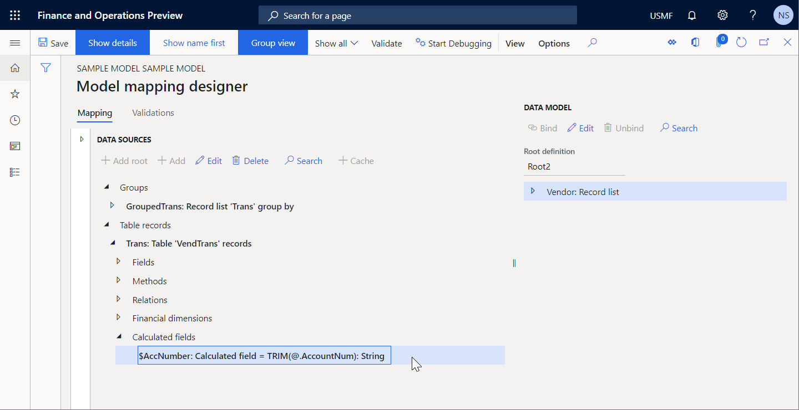

6.  Select **Validate** to inspect the editable model mapping component on the **Model mapping designer** page to make sure that the configured **GroupedTrans** data source is queryable.

    

    >[!NOTE]
    > The validation error is thrown as the **Trans** data source contains a nested field of the *Calculated field* type that does not allow to translate the call for the **GroupedTrans** data source to the direct SQL statement.

This illustration shows the runtime error that is thrown when you ignore this warning and select **Run** to execute a format that is configured to use this model mapping:

### Automatic resolution availability

The option to automatically resolve this issue is not offered.

### Manual resolution

#### Option 1

Instead of adding a nested field of the *Calculated field* type for the **Trans** data source, add the **$AccNumber** for the **GroupedTrans.lines** item of the **GroupedTrans** data source and configure its expression as TRIM(GroupedTrans.lines.AccountNum). It will allow to execute the **GroupedTrans** data source on SQL level and calculate the nested **$AccNumber** field after that.

#### Option 2

Change the value of the **Execution location** field for the **GroupedTrans** data source from **Query** to **In memory**. It is not recommended for a table containing the large volume of data (transactional tables) - all records will be fetched, and the grouping and aggregations will be performed in memory. This can be a cause of poor performance.

## <a name="i6">Executability of a JOIN data source</a>

The [JOIN](er-join-data-sources.md) data source combines records from two or more database tables based on related fields. Every JOIN data source can be configured as executed either on database level or in memory. When a JOIN data source is configured to be executed on database level, ER checks whether a direct SQL query can be established to data sources that are referred in this data source. When at least one referred data source is not SQL queryable, the validation error is thrown in the ER model mapping designer telling that the configured JOIN data source cannot be executed at runtime. The presented below steps show how this issue may occurs.

1.  Start configuring the ER model mapping component.
2.  Add a new data source of the *Dynamics 365 for Operations \ Table records* type:
    1.  Name it as **Vendor**.
    2.  In the **Table** field, select **VendTable** to specify that this data source will request the **VendTable** table.
3.  Add a new data source of the *Dynamics 365 for Operations \ Table records* type:
    1.  Name it as **Trans**.
    2.  In the **Table** field, select **VendTrans** to specify that this data source will request the **VendTrans** table.
4.  Add a new data source of the *Calculated field* type as the nested field of the **Vendor** data source:
    1.  Name it as **FilteredTrans**.
    2.  Configure it as containing the `FILTER(Trans, Trans.AccountNum=Vendor.AccountNum)` expression.
5.  Add a new data source of the *Join* type:
    1.  Name it as **JoinedList**.
    2.  Configure it as follows:
        1.  Add the **Vendor** data source as the first set of records to join.
        2.  Add the **Vendor.FilteredTrans** data source as the second set of records to join selecting the **INNER** type.
        3.  Select the **Query** value in the **Execute** field to indicate that you want to execute this data source on database level.

        

6.  Select **Validate** to inspect the editable model mapping component on the **Model mapping designer** page to make sure that the configured **JoinedList** data source is queryable.
7.  Modify the expression of the **Vendor.FilteredTrans** data source from `FILTER(Trans, Trans.AccountNum=Vendor.AccountNum)` to `WHERE(Trans, Trans.AccountNum=Vendor.AccountNum)`.
8.  Select **Validate** to inspect the editable model mapping component on the **Model mapping designer** page to make sure that the configured **JoinedList** data source is queryable.

    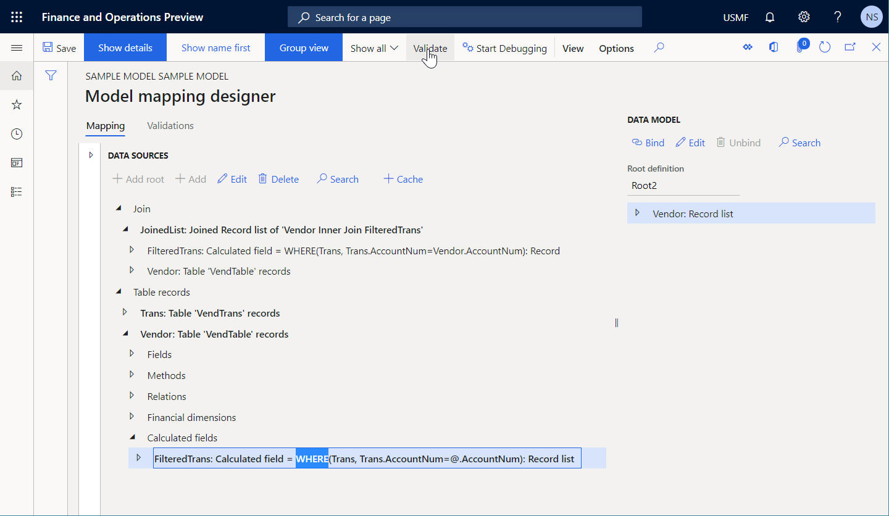

    >[!NOTE]
    > The validation error is thrown as the expression of the **Vendor.FilteredTrans** data source cannot be translated to the direct SQL call that consequently does not allow to translate the call for the **JoinedList** data source to the direct SQL statement.

    

This illustration shows the runtime error that is thrown when you ignore this warning and select **Run** to execute a format that is configured to use this model mapping:

### Automatic resolution availability

The option to automatically resolve this issue is not offered.

### Manual resolution

#### Option 1

Modify the expression of the **Vendor.FilteredTrans** data source from `WHERE(Trans, Trans.AccountNum=Vendor.AccountNum)` back to `FILTER(Trans, Trans.AccountNum=Vendor.AccountNum)` as it has been advised by the thrown warning.

#### Option 2

Change the value of the **Execute** field for the **JoinedList** data source from **Query** to **In memory**. It is not recommended for a table containing the large volume of data (transactional tables) - all records will be fetched, and the join will be performed in memory. This can be a cause of poor performance. The appropriate validation warning is thrown informing about this risk.

## <a name="i7">Preferability of FILTER vs WHERE function</a>

The built-in ER function [FILTER](er-functions-list-filter.md) is used to access application tables, views, or data entities by placing a single SQL call for getting required data as the list of records while [WHERE](er-functions-list-where.md) function fetches all records from the given source and performs records selection in memory. A data source of the *Record list* type is used as an argument of both functions to specify a particular source for getting records. ER checks whether the direct SQL call to a data source that is referred in the WHERE function can be established. When the referred data source is SQL queryable, the validation warning is thrown in the ER model mapping designer suggesting using FILTER function instead of WHERE as more efficient one. The presented below steps show how this issue may occurs.

1.  Start configuring the ER model mapping component.
2.  Add a new data source of the *Dynamics 365 for Operations \ Table records* type:
    1.  Name it as **Trans**.
    2.  In the **Table** field, select **VendTrans** to specify that this data source will request the **VendTrans** table.
3.  Add a new data source of the *Calculated field* type as the nested field of the **Vendor** data source:
    1.  Name it as **FilteredTrans**.
    2.  Configure it as containing the `WHERE(Trans, Trans.AccountNum="US-101")` expression.
4.  Add a new data source of the *Dynamics 365 for Operations \ Table records* type:
    1.  Name it as **Vendor**.
    2.  In the **Table** field, select **VendTable** to specify that this data source will request the **VendTable** table.
5.  Add a new data source of the *Calculated field* type:
    1.  Name it as **FilteredVendor**.
    2.  Configure it as containing the `WHERE(Vendor, Vendor.AccountNum="US-101")` expression.
6.  Select **Validate** to inspect the editable model mapping component on the **Model mapping designer** page.

    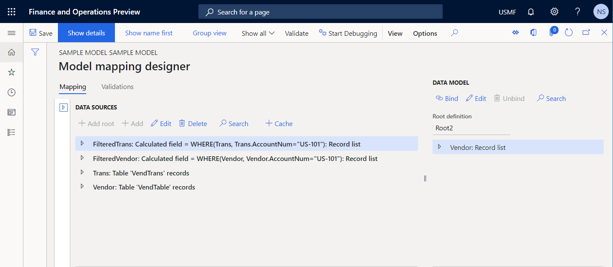

    >[!NOTE]
    > The validation warnings are thrown informing that it is preferrable to use FILTER function instead of WHERE for the **FilteredVendor** and **FilteredTrans** data sources.

    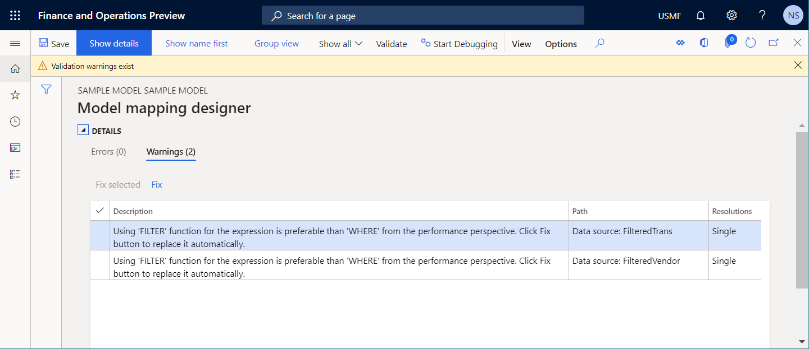

### Automatic resolution availability

You can select the **Fix** option to automatically replace WHERE function by FILTER one in an expression of every data source that has been encountered in the  **Warning** grid for this kind of inspection.

You can check a single warning in the **Warning** grid and select the **Fix selected** option to automatically change the only expression of a data source that is mentioned in the checked warning.

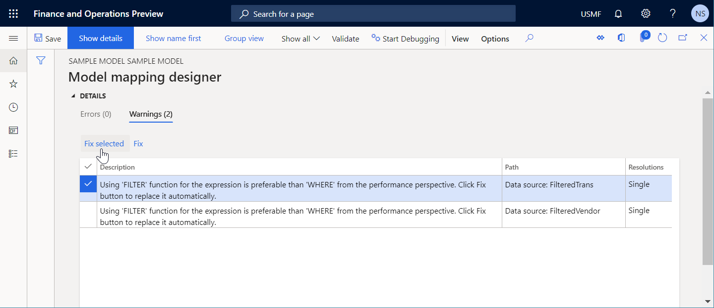

### Manual resolution

You can manually adjust expressions of all mentioned in the validation grid data sources replacing WHERE function by FILTER one.  

## <a name="i8">Preferability of ALLITEMSQUERY vs ALLITEMS function</a>

The built-in ER functions [ALLITEMS](er-functions-list-allitems.md) as well as [ALLITEMSQUERY](er-functions-list-allitemsquery.md) are used to get the flattened *Record list* value that consists of a list of records that represent all items that match the specified path. ER checks whether the direct SQL call to a data source that is referred in the ALLITEMS function can be established. When the referred data source is SQL queryable, the validation warning is thrown in the ER model mapping designer suggesting using ALLITEMSQUERY function instead of ALLITEMS as more efficient one. The presented below steps show how this issue may occurs.

1.  Start configuring the ER model mapping component.
2.  Add a new data source of the *Dynamics 365 for Operations \ Table records* type:
    1.  Name it as **Vendor**.
    2.  In the **Table** field, select **VendTable** to specify that this data source will request the **VendTable** table.
3.  Add a new data source of the *Calculated field* type to get records for several vendors:
    1.  Name it as **FilteredVendor**.
    2.  Configure it as containing the `FILTER(Vendor, OR(Vendor.AccountNum="US-101",Vendor.AccountNum="US-102"))` expression.
4.  Add a new data source of the *Calculated field* type to get transactions of all filtered vendors:
    1.  Name it as **FilteredVendorTrans**.
    2.  Configure it as containing the `ALLITEMS(FilteredVendor.'<Relations'.'VendTrans.VendTable_AccountNum')` expression.
5.  Select **Validate** to inspect the editable model mapping component on the **Model mapping designer** page.

    

    >[!NOTE]
    > The validation warning is thrown informing that it is preferrable to use ALLITEMSQUERY function instead of ALLITEMS for the **FilteredVendorTrans** data source.

    

### Automatic resolution availability

You can select the **Fix** option to automatically replace ALLITEMS function by ALLITEMSQUERY one in an expression of every data source that has been encountered in the  **Warning** grid for this kind of inspection.

You can check a single warning in the **Warning** grid and select the **Fix selected** option to automatically change the only expression of a data source that is mentioned in the checked warning.

### Manual resolution

You can manually adjust expressions of all mentioned in the validation grid data sources replacing ALLITEMS function by ALLITEMSQUERY one.  

## <a name="i9">Consideration of empty list cases</a>

You can configure your ER format or model mapping component as getting value of a field of a data source of the *Record list* type. ER checks whether your design considers the case when a called data source contains no records (is empty) to prevent runtime errors when value is fetched from a field of non-existing record. The presented below steps show how this issue may occurs.

1.  Start configuring the ER data model, the ER model mapping, and the ER format components simultaneously.
2.  In the data model tree, add a new **Root3** root item.
3.  Modify the **Root3** item by adding a new nested **Vendor** item of the *Record list* type.
4.  Modify the **Vendor** item:
    1.  Add a new nested **Name** field of the *Sting* type.
    2.  Add a new nested **AccountNumber** field of the *Sting* type.

    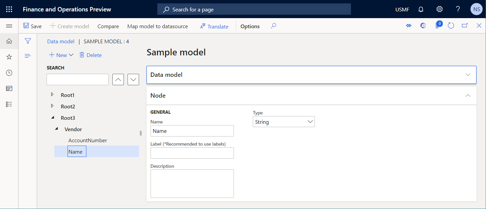

5.  In the model mapping data sources pane, add a new data source of the *Dynamics 365 for Operations \ Table records* type:
    1.  Name it as **Vendor**.
    2.  In the **Table** field, select **VendTable** to specify that this data source will request the **VendTable** table.
6.  Add a new data source of the *General \ User input parameter* type to inquiry a vendor account on runtime dialog page:
    1.  Name it as **RequestedAccountNum**.
    2.  In the **Label** field, enter **Vendor account number**.
    3.  In the **Operations data type name** field, leave **Description**.
7.  Add a new data source of the *Calculated field* type to filter an inquired vendor:
    1.  Name it as **FilteredVendor**.
    2.  Configure it as containing the `FILTER(Vendor, Vendor.AccountNum=RequestedAccountNum)` expression.
8.  Bind data model items to configured data sources:
    1.  **FilteredVendor** to **Vendor**
    2.  **FilteredVendor.AccountNum** to **Vendor.AccountNumber**
    3.  **FilteredVendor.'name()'** to **Vendor.Name**

    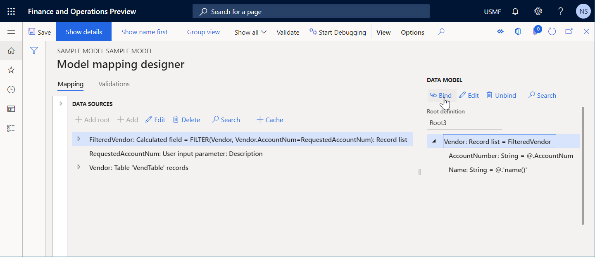

9.  In the format structure tree, add the following items to generate an outbound document in XML format containing details of inquired vendors:
    1.  Add the **Statement** root XML element.
    2.  For the **Statement** XML element, add the nested **Party** XML element.
        1.  For the **Party** XML element, add the nested **Name** XML attribute.
        2.  For the **Party** XML element, add the nested **AccountNum** XML attribute.
10. Bind format elements to provided data sources:
    1.  **Statement\Party\Name** format element to the **model.Vendor.Name** data source field
    2.  **Statement\Party\AccountNum** format element to the **model.Vendor.AccountNumber** data source field
11. Select **Validate** to inspect the editable format component on the **Format designer** page.

    
    
    >[!NOTE]
    
    > Validation errors are thrown informing that an error might be thrown for the configured **Statement\Party\Name** and **Statement\Party\AccountNum** format components at runtime when the **model.Vendor** list will be empty.

    

This illustration shows the runtime error that is thrown when you ignore this warning and select **Run** to execute this format selecting the account number of non-existing vendor. As the requested vendor does not exist, the **model.Vendor** list will be empty containing no records:

### Automatic resolution availability

For the selected warning row in the **Warnings** grid, you can select the **Unbind** option to automatically remove from the format elements the binding which is pointed in the **Path** column.

### Manual resolution

#### Option 1

You can bind the **Statement\Party\Name** format element to the **model.Vendor** data source item. This binding calls at runtime the **model.Vendor** data source first. When **model.Vendor** returns the empty record list, nested format elements are not executed. Therefore, the validation warnings are no thrown for this format configuration.

#### Option 2

Change the binding of the **Statement\Party\Name** format element from `model.Vendor.Name` to `FIRSTORNULL(model.Vendor).Name`. The updated binding conditionally converts the first record of the **model.Vendor** data source of the *Record list* type to a new data source of the *Record* type containing the same set of fields:

- When at least one record is available in the **model.Vendor** data source, the fields of the created record is filled in by values of fields of the first record of the **model.Vendor** data source. Therefore, the updated binding returns the vendor name in this case.
- Otherwise, every field of the created record is filled in by value that is default for the data type of this field. Therefore, the blank string as the default value of the **String** data type is returned in this case.

Therefore, the validation warning is not thrown for the **Statement\Party\Name** format element when it is bound to the `FIRSTORNULL(model.Vendor).Name` expression.

#### Option 3

Change the binding of the **Statement\Party\Name** format element from `model.Vendor.Name` to `IF(NOT(ISEMPTY(model.Vendor)), model.Vendor.Name, "Not available")` when you want to explicitly specify what data is populated to a generated document when the **model.Vendor** data source of the *Record list* type returns no records (the **Not available** text in this example). The expression `IF(COUNT(model.Vendor)=0, model.Vendor.Name, "Not available")` can be alternatively used.

### <a name="i9a">Additional consideration</a>

This inspection also warns you about one more potential issue. As you bound **Statement\Party\Name** and **Statement\Party\AccountNum** format elements to the appropriate fields of the **model.Vendor** data source of the *Record list* type, by default these bindings will be executed taking values of the appropriate fields of the first records of the **model.Vendor** data source when this list is not empty. As you have not bound the **Statement\Party** format element with the **model.Vendor** data source, the **Statement\Party** element will not be iterated for every record of the **model.Vendor** data source during the format execution. Therefore, a generated document will be populated with information only from the first record of the using record list when this list contains multiple records. It might be an issue if this format is designed with the intention to populate a generated document with information about all vendors from the **model.Vendor** data source. For resolving this issue, bind the **Statement\Party** element with the **model.Vendor** data source.

## <a name="i10">Executability of an expression containing the FILTER function (caching)</a>

Several built-in ER functions ([FILTER](er-functions-list-filter.md), [ALLITEMSQUERY](er-functions-list-allitemsquery.md), etc.) are used to access application tables, views or data entities by placing a single SQL call for getting required data as the list of records. A data source of the *Record list* type is used as an argument of each of these functions to specify a particular application source for this call. ER checks whether the direct SQL call to a data source that is referred in such function can be established. When the referred data source is not SQL queryable as it has been marked as [cached](trace-execution-er-troubleshoot-perf.md#improve-the-model-mapping-based-on-information-from-the-execution-trace), the validation error is thrown in the ER model mapping designer telling that the containing one of these functions ER expression cannot be executed at runtime. The presented below steps show how this issue may occurs.

1.  Start configuring the ER model mapping component.
2.  Add a new data source of the *Dynamics 365 for Operations \ Table records* type:
    1.  Name it as **Vendor**.
    2.  In the **Table** field, select **VendTable** to specify that this data source will request the **VendTable** table.
3.  Add a new data source of the *General \ User input parameter* type to inquiry a vendor account on runtime dialog page:
    1.  Name it as **RequestedAccountNum**.
    2.  In the **Label** field, enter **Vendor account number**.
    3.  In the **Operations data type name** field, leave **Description**.
4.  Add a new data source of the *Calculated field* type to filter an inquired vendor:
    1.  Name it as **FilteredVendor**.
    2.  Configure it as containing the `FILTER(Vendor, Vendor.AccountNum=RequestedAccountNum)` expression.
5.  Mark the configured **Vendor** data source as cached.

    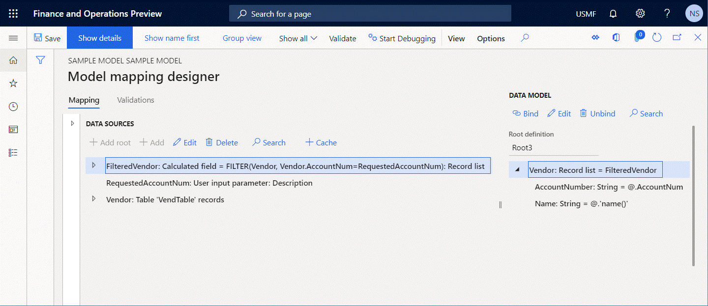

6.  Select **Validate** to inspect the editable model mapping component on the **Model mapping designer** page.

    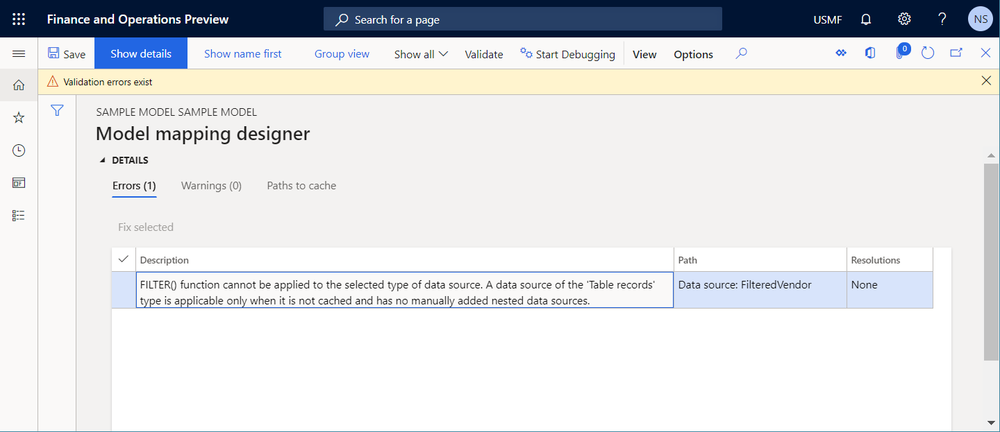

    >[!NOTE]
    > The validation error is thrown informing that the FILTER function cannot be applied to the cached **Vendor** data source.

This illustration shows the runtime error that is thrown when you ignore this warning and select **Run** to execute this format:

### Automatic resolution availability

The option to automatically resolve this issue is not offered.

### Manual resolution

#### Option 1

Remove the **Cache** flag from the **Vendor** data source. It will make the **FilteredVendor** data source executable but the referred in the **Vendor** data source **VendTable** table will be accessed every time the **FilteredVendor** data source is called.

#### Option 2

Modify the expression of the **FilteredVendor** data source from `FILTER(Vendor, Vendor.AccountNum="US-101")` to `WHERE(Vendor, Vendor.AccountNum="US-101")`. In this case the referred in the **Vendor** data source **VendTable** table will be accessed only during the first call of the **Vendor** data source but the selection of records will be performed in memory. Note, that this can be a cause of poor performance.

## <a name="i11">Missing binding in a model mapping for a bound format element</a>

When you configure the ER format component, the base ER data model is offered as a default data source for this ER format. When the configured ER format is executed, the [default model mapping](er-country-dependent-model-mapping.md) for the base model is used to fill in the data model by application data. So, the ER format designer warns you about the situation when you bind a format element to an item of the data model which is not bound to any data source in the model mapping that is currently selected as a default for the editable format. Such binding cannot be executed at runtime as the running format cannot be able to fill in a bound element with application data. Therefore, an error will be thrown at runtime. The presented below steps show how this issue may occurs.

1.  Start configuring the ER data model, the ER model mapping, and the ER format components simultaneously.
2.  In the data model tree, add a new **Root3** root item.
3.  Modify the **Root3** item by adding a new nested **Vendor** item of the *Record list* type.
4.  Modify the **Vendor** item:
    1.  Add a new nested **Name** field of the *Sting* type.
    2.  Add a new nested **AccountNumber** field of the *Sting* type.

    

5.  In the model mapping data sources pane, add a new data source of the *Dynamics 365 for Operations \ Table records* type:
    1.  Name it as **Vendor**.
    2.  In the **Table** field, select **VendTable** to specify that this data source will request the **VendTable** table.
6.  Add a new data source of the *General \ User input parameter* type to inquiry a vendor account on runtime dialog page:
    1.  Name it as **RequestedAccountNum**.
    2.  In the **Label** field, enter **Vendor account number**.
    3.  In the **Operations data type name** field, leave **Description**.
7.  Add a new data source of the *Calculated field* type to filter an inquired vendor:
    1.  Name it as **FilteredVendor**.
    2.  Configure it as containing the `FILTER(Vendor, Vendor.AccountNum=RequestedAccountNum)` expression.
8.  Bind data model items to configured data sources:
        1.  **FilteredVendor** to **Vendor**
        2.  **FilteredVendor.AccountNum** to **Vendor.AccountNumber**

    >[!NOTE]
    > Note that the **Vendor.Name** data model field remains unbound.

    

9.  In the format structure tree, add the following items to generate an outbound document in XML format containing details of inquired vendors:
    1.  Add the **Statement** root XML element.
    2.  For the **Statement** XML element, add the nested **Party** XML element.
        1.  For the **Party** XML element, add the nested **Name** XML attribute.
        2.  For the **Party** XML element, add the nested **AccountNum** XML attribute.
10. Bind format elements to provided data sources:
    1.  **Statement\Party** format element to the **model.Vendor** data source item
    2.  **Statement\Party\Name** format element to the **model.Vendor.Name** data source field
    3.  **Statement\Party\AccountNum** format element to the **model.Vendor.AccountNumber** data source field
11. Select **Validate** to inspect the editable format component on the **Format designer** page.

    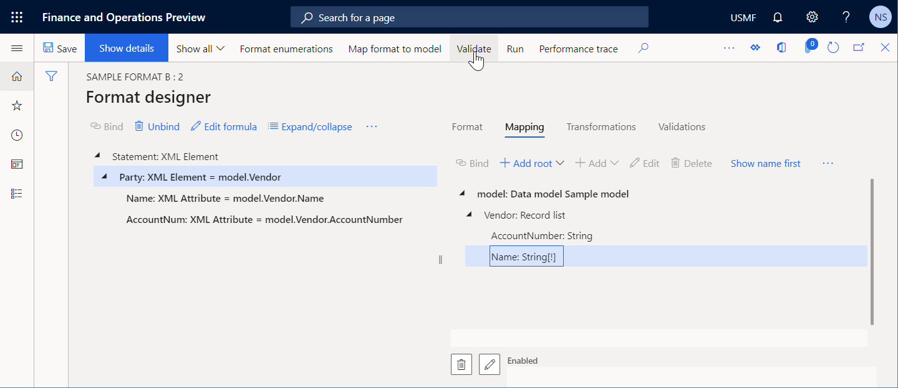

    >[!NOTE]
    > Validation warning is thrown informing that the **model.Vendor.Name** data source field is not bound to any data source in the model mapping that is configured to be used by this format. Therefore, the **Statement\Party\Name** format element might not be filled in at runtime causing a runtime exception.

    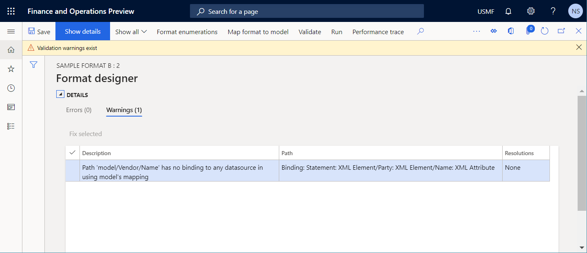

This illustration shows the runtime error that is thrown when you ignore this warning and select **Run** to execute this format:

### Automatic resolution availability

The option to automatically resolve this issue is not offered.

### Manual resolution

#### Option 1

Modify the configured model mapping by adding a binding for the **model.Vendor.Name** data source field.

#### Option 2

Modify the configured format by removing a binding for the **Statement\Party\Name** format element.

## <a name="i12">A template is not linked to any file component</a>

When you [manually](er-fillable-excel.md#manual-entry) configure an ER format component to generate an outbound document by using a template, you must manually add the **Excel\File** element, add a required template as an attachment of the editable component and select this attachment in the added **Excel\File** element indicating that this element will fill in the selected template at runtime. When you configure a format component version in the **Draft** [status](general-electronic-reporting.md#component-versioning), you might add several templates to the editable component selecting each of them in the **Excel\File** element one-by-one to run this ER format and see how different templates are filled in at runtime. When you have some templates that are not selected in any of **Excel\File** elements, ER format designer warns you that such templates will be deleted from the editable ER format component version when the status of it is changed from **Draft** to **Completed**. The presented below steps show how this issue may occurs.

1.  Start configuring the ER format component.
2.  In the format structure tree, add the **Excel\File** element.
3.  For the added **Excel\File** element, add an Excel workbook file **A.xlsx** as an attachment by using the document type that is configured in [ER parameters](electronic-reporting-er-configure-parameters.md#parameters-to-manage-documents) to specify the storage of templates of ER formats.
4.  For the added **Excel\File** element, add another Excel workbook file **B.xlsx** as an attachment by using the same document type as for the workbook A.
5.  Select the  Excel workbook file A in the added **Excel\File** element.
6. Select **Validate** to inspect the editable format component on the **Format designer** page.

    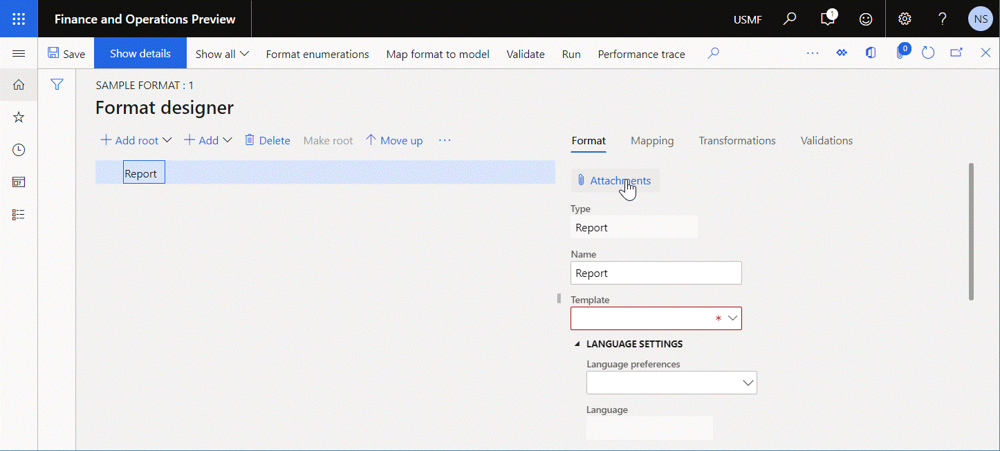

    >[!NOTE]
    > Validation warning is thrown informing that the **B.xlsx** file is linked to no file components and will be removed after changing status of configuration version.

### Automatic resolution availability

The option to automatically resolve this issue is not offered.

### Manual resolution

Modify the configured format by removing all templates that are not linked to any of **Excel\File** elements.

## <a name="i13">ER format structure is not in sync with using Excel template</a>

When you [configure](er-fillable-excel.md) an ER format component to generate an outbound document by using an Excel template, you can manually add the **Excel\File** element, add a required template as an attachment of the editable component and select this attachment in the added **Excel\File** element indicating that this element will fill in the selected template at runtime. As the added Excel template has been designed externally, the editable ER format might contain Excel names that are missing in the added Excel template. ER format designer warns you about inconsistencies between properties of ER format elements that refer to non-existing names of the added Excel template. The presented below steps show how this issue may occurs.

1.  Start configuring the ER format component.
2.  In the format structure tree, add the **Excel\File** element **Report**.
3.  For the added **Excel\File** element, add an Excel workbook file **A.xlsx** as an attachment by using the document type that is configured in [ER parameters](electronic-reporting-er-configure-parameters.md#parameters-to-manage-documents) to specify the storage of templates of ER formats.
    > Make sure that the added Excel workbook does not contain the **ReportTitle** name.
4.  Add the **Excel\Cell** element **Title** as the nested element of the **Report** element entering **ReportTitle** to the **Excel range** field.
5. Select **Validate** to inspect the editable format component on the **Format designer** page.

    

    >[!NOTE]
    > Validation warning is thrown informing that the **ReportTitle** name does not exist in the Excel **Sheet1** sheet of the using template.

    

### Automatic resolution availability

The option to automatically resolve this issue is not offered.

### Manual resolution

#### Option 1

Modify the configured format by removing all elements that refer to Excel names that are missing in using Excel template.

#### Option 2

[Update](er-fillable-excel.md#template-import) the editable ER format by importing an Excel template. The structure of the editable ER format will be [synchronized](modify-electronic-reporting-format-reapply-excel-template.md) with the structure of the imported Excel template.

### Additional consideration

To learn how the format structure can be synced with an ER template in the template editor of [Business document management](er-business-document-management.md), see [Update the structure of a business document template](er-bdm-update-structure.md).

## Additional resources

[ALLITEMS ER function](er-functions-list-allitems.md)

[ALLITEMSQUERY ER function](er-functions-list-allitemsquery.md)

[INT64VALUE ER function](er-functions-conversion-int64value.md)

[INTVALUE ER function](er-functions-conversion-intvalue.md)

[FILTER ER function](er-functions-list-filter.md)

[WHERE ER function](er-functions-list-where.md)

[Use JOIN data sources to get data from multiple application tables in ER model mappings](er-join-data-sources.md)

[Trace the execution of ER formats to troubleshoot performance issues](trace-execution-er-troubleshoot-perf.md)

[Business document management overview](er-business-document-management.md)
