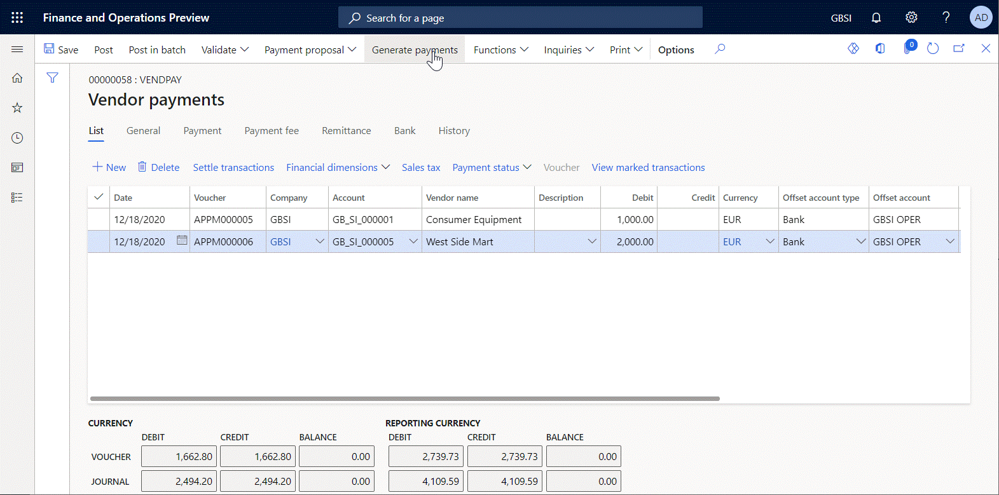
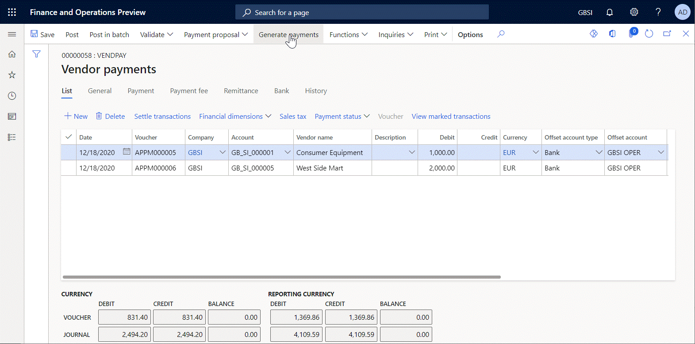

--- 
# required metadata 
 
title: Design ER configurations to generate reports in Word format supprssing content controls
description: The following steps explain how a user in either the System administrator or Electronic reporting functional consultant role can configure an Electronic reporting formats to generate reports as Microsoft Word files supprssing content controls. 
author: NickSelin
manager: AnnBe 
ms.date: 12/17/2020
ms.topic: business-process 
ms.prod:  
ms.service: dynamics-ax-applications 
ms.technology:  
 
# optional metadata 
 
ms.search.form: ERWorkspace, ERSolutionTable, EROperationDesigner,  LedgerJournalTable, LedgerJournalTransVendPaym   
audience: Application User 
# ms.devlang:  
ms.reviewer: kfend
# ms.tgt_pltfrm:  
# ms.custom:  
ms.search.region: Global
# ms.search.industry: 
ms.author: nselin
ms.search.validFrom: 2020-01-01 
ms.dyn365.ops.version: Version 10.0.6 
---

# Suppress Word content controls in generated reports

[!include [banner](../includes/banner.md)]

To generate reports as Microsoft Word documents, you must design a template for these reports as a Word document. This template must contain the Word content controls as placeholders for data that will be filled in at runtime. To use the created Word document as a template of your reports, you can [configure](er-design-configuration-word.md) a new [Electronic reporting (ER)](general-electronic-reporting.md) [solution](er-quick-start1-new-solution.md) that must include an ER [configuration](general-electronic-reporting.md#Configuration) containing an ER [format](general-electronic-reporting.md#FormatComponentOutbound) component. This ER format must be configured to use the designed template for reports generation.

In version of Finance 10.0.6 and later, you can configure formulas in your ER format to suppress some of such Word content controls in a generated document.

The following steps explain how a user in either the System administrator or Electronic reporting functional consultant role can configure an ER format to generate reports as Microsoft Word files suppressing in a generated report some of content controls that have been configured in using Word template.

These steps can be performed in the GBSI company.

To complete these steps, you must first complete the steps in the following task guides:

-   [Design a configuration for generating reports in OPENXML format](./tasks/er-design-reports-openxml-2016-11.md)
-   [Re-use ER configurations with Excel templates to generate reports in Word format](./tasks/er-design-configuration-word-2016-11.md)

When you completed the steps of these task guides, you prepared the following:

-   The **Sample worksheet report** ER format that is configured to generate a document in Word format
-   The [draft](general-electronic-reporting.md#component-versioning) version of **Sample worksheet report** ER format that is marked as runnable 
-   The **Electronic** method of payments that is configured to use the **Sample worksheet report** ER format for vendor payments processing

In advance, you must also download and save locally the following template for the sample report:

-   [Bounded Template 2 of Payment Report (SampleVendPaymDocReportBounded2.docx)](<https://go.microsoft.com/fwlink/?linkid=862266>)

## <a name="tag-control">Review the downloaded Word template</a>

1.  Open the downloaded SampleVendPaymDocReportBounded2.docx in the Microsoft Word desktop application.
2.  Verify that this template contains the summary section to present total payment amounts for every currency code that has been met in the processed payments.
     
    -   The summary section resides in a separated table of this Word document.
    -   The first row of this table holds titles of table columns as the section header.
    -   The second row of this table holds the repeating content control as the section details.
    -   This control is mapped to the **SummaryLines** field of the **Report** custom XML part.
    -   Based on this mapping, this control is associated with the **SummaryLines** element of the editable ER format.
    > [!NOTE]
    > Note that this repeating content control is tagged by the **SummaryLines** key that matches the field of the custom XML part to which it has been mapped.

## Select the existing ER report configuration

We will re-use the existing ER configuration that you configured while you completed steps of mentioned above task guides.

1.  In the **Navigation pane**, go to **Modules \> Organization administration \> Workspaces \> Electronic reporting**.
2.  Select **Reporting configurations**. 
3.  On the **Configurations** page, in the configuration tree in the left pane, expand **Payment model**.
4.  In the configuration tree, select **Payment model\Sample worksheet report**.
5.  Select **Designer** to edit the draft version of the selected ER format.

## Replace the current template with the new one

Currently, the SampleVendPaymDocReportBounded.docx document is used as a template to generate the output in Word format. We will replace this template by a new  template in Word format that you downloaded earlier, SampleVendPaymDocReportBounded2.docx.

1.  On the **Format designer** page, select **Attachments**.
2.  On the **Attachments** page, select **Delete** to remove the existing template. Select **Yes** to confirm deletion.
3.  Select **New > File**.
4.  Select **Browse**. Navigate to and select SampleVendPaymDocReportBounded2.docx that you previously downloaded.
5.  Select **OK**.
6.  Close the **Attachments** page. 
7.  On the **Format designer** page, in the **Template** field, enter or select the SampleVendPaymDocReportBounded2.docx Word template that you downloaded in the previous step.

## Execute the format to create Word output

1.  In the **Navigation pane**, go to **Modules \> Accounts payable \> Payments \> Payment journal**.
2.  On the **Vendor payments** page, select the **List** tab.
3.  Mark all payments as selected.
4.  Select **Payment status \> None**.
5.  Select **Generate payments**.
    -   In the **Method of payment** field, select the **Electronic** value.
    -   In the **Bank account** field, select the **GBSI OPER** value.
    -   Select **OK**.
6.  On the **Electronic report parameters** dialog box, select **OK**.
7.  Analyze the generated output.
     
    > Note that the created output is presented in Word format and contains the summary section.

## <a name="configure-to-suppress-control">Configure the editable format to suppress the summary section</a>

Assume that you want to suppress the summary section in a generated document upon the request of a user who runs this ER format. You need to modify the editable ER format accordingly.

1.  Open the draft version of the ER format for editing:
    -   In the **Navigation pane**, go to **Modules \> Organization administration \> Workspaces \> Electronic reporting**.
    -   Select **Reporting configurations**. 
    -   On the **Configurations** page, in the configuration tree in the left pane, expand **Payment model**.
    -   In the configuration tree, select **Payment model\Sample worksheet report**.
    -   Select **Designer**.
2.  On the **Format designer** page, expand **Word**.
3.  Select **Word\SummaryLines**.
4.  Select the **Mapping** tab.
5.  Add a new data source to gather at runtime from end-user information whether the summary section must be suppressed:
    -   Select **Add root**.
    -   In the **Add data source** dialog box, select **General\User input parameter** to open the **'User input parameter' data source properties** dialog box.
    -   In the **Name** field, enter **uipSuppress**.
    -   In the **Label** field, enter **Suppress summary section**.
    -   In the **Operations data type name** field, select or enter **NoYes**.
    -   Select **OK**.
6.  Add a new data source of the application enumeration **NoYes** type:
    -   Select **Add root**.
    -   In the **Add data source** dialog box, select **Dynamics 365 for Operations\Enumeration** to open the **'Enumeration ' data source properties** dialog box.
    -   In the **Name** field, enter **enumNoYes**.
    -   In the **Label** field, enter **Suppress options**.
    -   In the **Operations data type name** field, select or enter **NoYes**.
    -   Select **OK**.
7.  For the selected **SummaryLines** format element, configure the formula to specify when the Word content control that is associated with the selected format element must be suppressed:
    -   In the **Removed** section of the **Mapping** tab, select the **Edit** option to open the **[Formula designer](general-electronic-reporting-formula-designer.md)** page.
        +   In the **Formula** field, enter the `uipSuppress = enumNoYes.Yes` formula.
        +   Select **Save** and close the **Formula designer** page.
        > [!NOTE]
        > This formula will be applied to a generated document **after execution of all other format elements**. To execute this formula, a Word content control that is tagged as a format element for which this formula is configured (**SummaryLines** in this case) will be found in a generated document and entirely removed from it along with the row of a Word table that holds this control. So, the details row of the summary section will be removed from a generated document.
        >
        > [!NOTE]
        > You may configure at design time the **Removed** formula for a format element while the using Word template does not contain a Word content control with a tag that matches the name of a format element to which the **Removed** property is configured. When you validate such a format at design time, a [warning](er-components-inspections.md#i14) is thrown informing you about this inconsistency.
        >
        > [!NOTE]
        > An exception is thrown at runtime if the using Word template does not contain a Word content control with a tag that matches the name of the format element to which the **Removed** property is configured.
    -   In the **Removed** section of the **Mapping** tab, set the **With parent** option to **Yes**.
        > [!NOTE]
        > You must set this option to **Yes** to remove the entire Word table as the parent object of the row that holds the summary section details. When you set this option to **No**, the section header row remains in a generated document.
8.  Select **Save** to store changes of the editable format.
     

## Execute the modified format to create Word output

1.  In the **Navigation pane**, go to **Modules \> Accounts payable \> Payments \> Payment journal**.
2.  For the entered earlier payment journal, select **Lines**.
3.  In the list of the **Vendor payments** page, mark all rows.
4.  Select **Payment status \> None**.
5.  Select **Generate payments**.
    -   In the **Method of payment** field, select the **Electronic** value.
    -   In the **Bank account** field, select the **GBSI OPER** value.
    -   Select **OK**.
6.  On the **Electronic report parameters** dialog box, do the following:
    -   In the **Suppress summary section** field, select the **Yes** value.
    -   select **OK**.
7.  Analyze the generated output.
     
    > Note that the created output does not contain the summary section as it has been suppressed.

## Additional resources

- [Design a configuration for generating reports in OPENXML format](./tasks/er-design-reports-openxml-2016-11.md)
- [Design a new ER configuration to generate reports in Word format](er-design-configuration-word.md)
- [Re-use ER configurations with Excel templates to generate reports in Word format](./tasks/er-design-configuration-word-2016-11.md)
- [Inspect the configured ER component to prevent runtime issues](er-components-inspections.md#i14)
