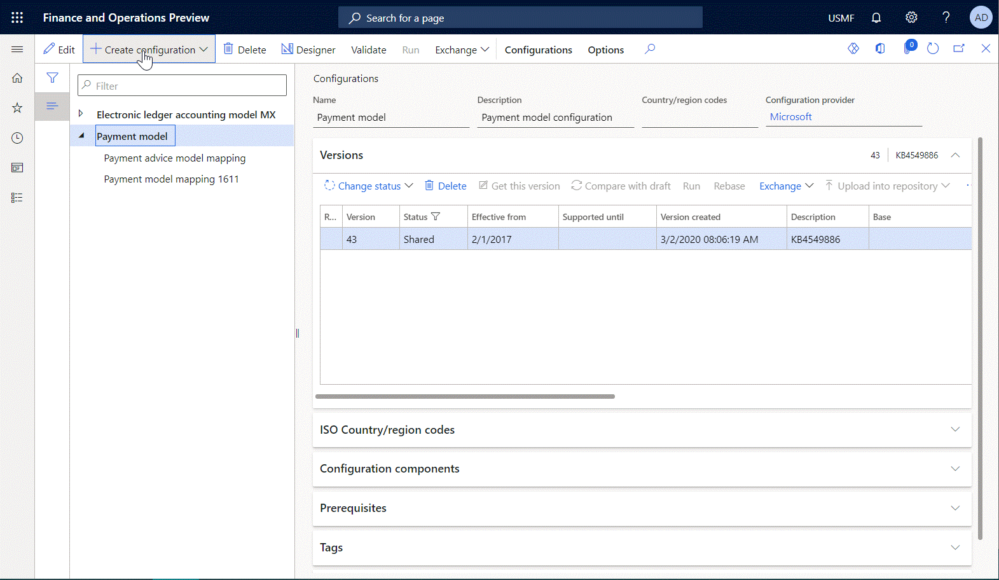
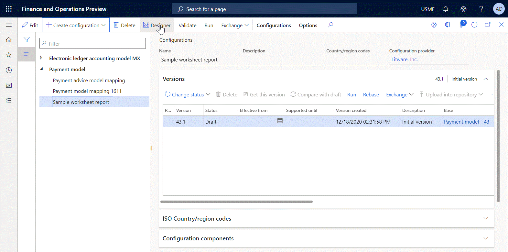
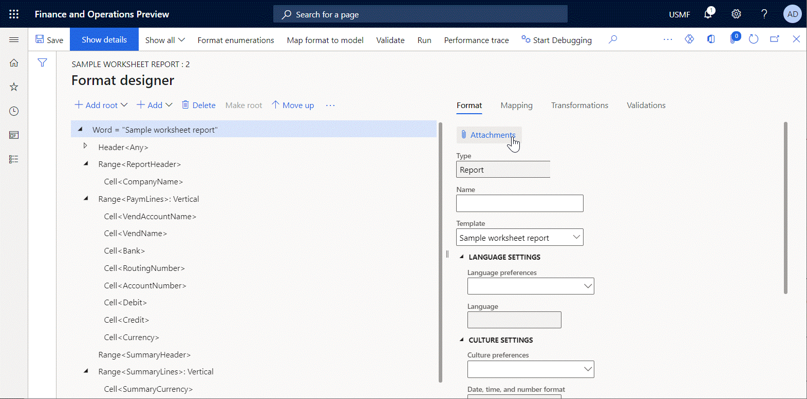
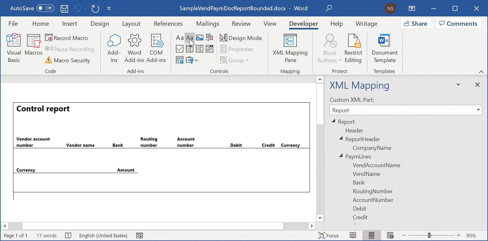

--- 
# required metadata 
 
title: Design ER configurations to generate reports in Word format
description: The following steps explain how a user in either the System administrator or Electronic reporting functional consultant role can configure an Electronic reporting formats to generate reports as Microsoft Word files. 
author: NickSelin
manager: AnnBe 
ms.date: 17/12/2020
ms.topic: business-process 
ms.prod:  
ms.service: dynamics-ax-applications 
ms.technology:  
 
# optional metadata 
 
ms.search.form: ERWorkspace, ERSolutionTable, EROperationDesigner,  LedgerJournalTable, LedgerJournalTransVendPaym   
audience: Application User 
# ms.devlang:  
ms.reviewer: kfend
# ms.tgt_pltfrm:  
# ms.custom:  
ms.search.region: Global
# ms.search.industry: 
ms.author: nselin
ms.search.validFrom: 2020-01-01 
ms.dyn365.ops.version: Version 10.0.6 
---

# Design ER configurations to generate reports in Word format

[!include [banner](../includes/banner.md)]

To generate reports as Microsoft Word documents, you must design a template for these reports by using, for example, the Microsoft Word desktop application. The following illustration shows the sample template of the control report that can be generated to show details of processed vendor payments.

To use the created Word document as a template of your reports in Microsoft Word format, you can configure a new [Electronic reporting (ER)](general-electronic-reporting.md) [solution](er-quick-start1-new-solution.md) that must include an ER [configuration](general-electronic-reporting?toc=/dynamics365/finance/toc.json#Configuration) containing an ER [format](general-electronic-reporting.md#FormatComponentOutbound) component.

> [!NOTE]
> When you create a new ER format configuration to generate reports in Word format, you must either select the **Word** format type or keep the **Format type** field blank on the **Create configuration** dialog box.

The ER format component of this solution must contain the **Excel\\File** format element, and that format element must be linked to the Word document that will be used as the template for the generated report at runtime.  To configure your ER format component, you must open the [draft](general-electronic-reporting.md#component-versioning) version of the created ER configuration in the ER format designer Add the **Excel\File** element, attach your Word template to the editable ER format and link this template to the added **Excel\File** element.

> [!NOTE]
> When you attach a template, you must use a [document type](https://docs.microsoft.com/dynamics365/fin-ops-core/fin-ops/organization-administration/configure-document-management#configure-document-types) that has been [configured](electronic-reporting-er-configure-parameters.md#parameters-to-manage-documents) earlier in ER parameters to store templates of ER formats.

You can add **Excel\\Range** and **Excel\\Cell** nested elements for the **Excel\\File** element to specify the structure of data that will be put in the generated report at runtime. Then you must bind added elements to data sources of the editable ER format to specify what actual data must be populated to a generated document at runtime.

When you save changes of the ER format at design time, the hierarchical format structure is stored in the attached Word template as a [custom XML part](https://docs.microsoft.com/visualstudio/vsto/custom-xml-parts-overview?view=vs-2019) that is named **Report**. You must access the modified template, download it from Finance, store locally and open in the Microsoft Word desktop application. The following illustration shows the stored locally sample template of the control report that contains the **Report** custom XML part.

When bindings of **Excel\\Range** and **Excel\\Cell** format elements are executed at runtime, the delivered by every binding data comes to a generated Word document as an individual field of the **Report** custom XML part. To populate values of such custom XML part fields to a generated document, you need to add the appropriate Word [content controls](https://docs.microsoft.com/office/client-developer/word/content-controls-in-word) to your Word template as placeholders for data that will be filled in at runtime. To specify how content controls are filled in, map every content control to the appropriate field of the **Report** custom XML part.

Then you must replace the initial Word template of the editable ER format by the modified template that now contains Word content controls that were mapped to the fields of the **Report** custom XML part.

When you run the configured ER format, the attached Word template is used to generate a new report. The actual data is stored in the Word report as a custom XML part that is named **Report**. When the generated report is opened, the Word content controls are filled in with data from the **Report** custom XML part.

## Additional resources

- [Re-use ER configurations with Excel templates to generate reports in Word format](./tasks/er-design-configuration-word-2016-11.md)
- [Embed images and shapes in documents that you generate by using ER](electronic-reporting-embed-images-shapes.md#embed-an-image-in-a-word-document)
