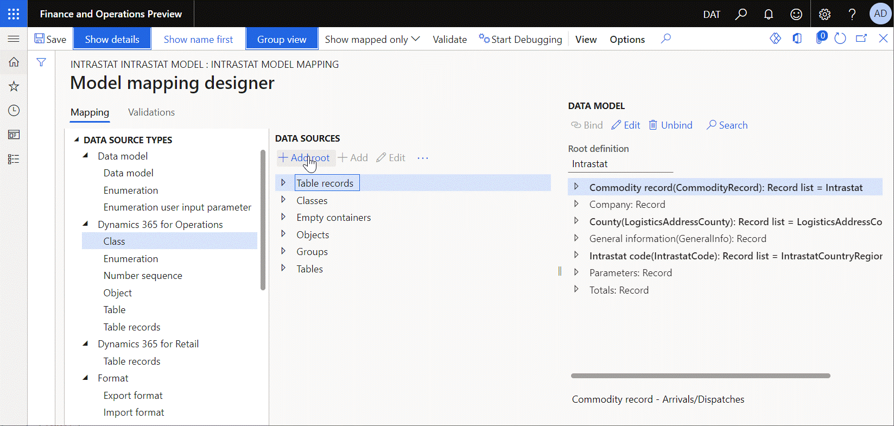
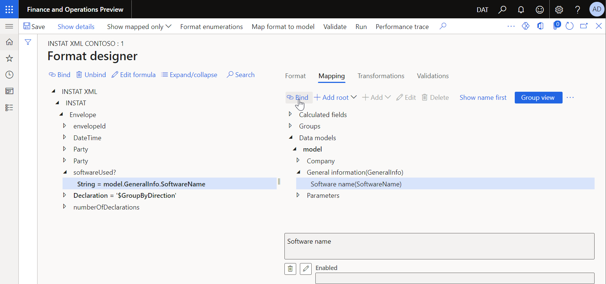

---
# required metadata

title: Supported composite data types for Electronic reporting formulas
description: This topic provides information about composite data types that are supported in Electronic reporting (ER) formulas.
author: NickSelin
ms.date: 06/02/2021
ms.topic: article
ms.prod: 
ms.technology: 

# optional metadata

ms.search.form: ERDataModelDesigner, ERExpressionDesignerFormula, ERMappedFormatDesigner, ERModelMappingDesigner
# ROBOTS: 
audience: Application User, IT Pro
# ms.devlang: 
ms.reviewer: kfend
# ms.tgt_pltfrm: 
ms.custom: 
ms.assetid: 
ms.search.region: Global
# ms.search.industry: 
ms.author: nselin
ms.search.validFrom: 2016-02-28
ms.dyn365.ops.version: AX 7.0.0
---

# Supported composite data types for Electronic reporting formulas

[!include [banner](../includes/banner.md)]

This topic describes composite data types that are supported in [Electronic reporting (ER)](general-electronic-reporting.md) expressions. The composite data types are [class](#class), [container](#container), [record](#record), [record list](#record-list), and [object](#object).

## Class

The *class* data type refers to a public application class. In ER, it is represented as a [*record*](#record) that contains an individual field for every public method of the referred class. When the call of the method is parameterized, you must also specify the required arguments of the appropriate types in an ER expression that is configured to call the method. 

In ER [mapping](general-electronic-reporting.md#data-model-and-model-mapping-components) and [format](general-electronic-reporting.md#FormatComponentOutbound) components you can add the **Class** data source that is presented as a data source and that returns a value of the *class* type. This data source exposes public methods of the class that can be called at runtime.

>[!NOTE]
> Only methods returning a value can be called from ER expressions.
> 
> Only methods with a range of zero to eight arguments can be called from ER expressions.

The default value of a *class* is **null**.

The following illustration shows how the data source **System information(xInfo)** of the **Class** type is added to make the instance of the **xInfo** application class and call the **productName()** method of it to receive the name of the current application.

The following illustration shows how the ER format is configured to place the provided application name to a generated document.

## Container

The *container* data type holds binary content. A *container* value can be used to pass certain information from storage to a generated document. This data type is frequently used in the ER framework to place media content like a company logo on generated documents. 

> [!NOTE]
> Every media item can be presented as a *container* value, but not every *container* value represents a media item. Therefore, when you configure an ER format to place to an image on a generated document and use a *container* to do that, an exception similar to **Error executing code: Binary (object), method constructFromContainer called with invalid parameters** may be thrown when the referred *container* returns something other than media content.

The default value of a *container* is **null**.

The following illustration shows how the **Bitmap(Image)** field of the *Container* type is bound to the data model **Logo** field of the **Container** type in the **Sales invoice** model mapping. This bond makes the company logo available for any ER format that is designed for the **SalesInvoce** root definition and uses this model mapping at runtime.

## Record

A *record* is the collection of named fields each of which is associated with a value of either [primitive](er-formula-supported-data-types-primitive.md) or composite data type. Usually, a *record* is used to represent a single record of a record list. In this case, every single item represents individual fields, methods, and relations.

The default value of a *record* is **empty**.

>[!NOTE]
> When you get value of a field of an empty *record*, it returns the default value of the appropriate data type.

A *record* can be obtained by using the following function:

-   [FIRST](er-functions-list-first.md)
-   [FIRSTORNULL](er-functions-list-firstornull.md)
-   [EMPTYRECORD](er-functions-record-emptyrecord.md)
-   [NULLCONTAINER](er-functions-record-nullcontainer.md)

For more information about the transformation of *record* values, see [List of ER functions in the list category](er-functions-category-list.md).

## Record list

A *record list* is a list of items of the *record* type. Usually, a *record list* is used to represent the list of records that has been fetched from a database table. 

By default, records of a *record list* are accessed sequentially. You can use the [INDEX](er-functions-list-index.md) function to access a particular record by using the *integer* index.

The default value of a *record list* is **empty**. You can use the [ISEMPTY](/er-functions-list-isempty.md) function to evaluate whether a *record list* is empty.

> [!NOTE]
> An exception is thrown at runtime at the attempt to get a value of a field of a *record* of an empty *record list*. To learn how to prevent such runtime exceptions, review the [Consideration of empty list cases](er-components-inspections.md#i9) section of the [Inspect the configured ER component to prevent runtime issues](er-components-inspections.md) article.

A *record list* can be initiated by using the following function:

-   [ALLITEMS](er-functions-list-allitems.md)
-   [ALLITEMSQUERY](er-functions-list-allitemsquery.md)
-   [EMPTYLIST](er-functions-list-emptylist.md)
-   [LIST](er-functions-list-list.md)
-   [LISTDISTINCT](er-functions-list-listdistinct.md)

For more about transformation of *record list* values, see [List of ER functions in the list category](er-functions-category-list.md). To learn how to introduce *record list* items, fill them in by application data, and then use the data to generate business documents, see [Design a new ER solution to print a custom report](er-quick-start1-new-solution.md).

## Object

An *object* refers to a stateful instance of a *class*. Usually, an *object* is initiated in source code and passed to an ER model mapping providing details of execution context.

The default value of an *object* is **null**.

The following illustration shows how the data source **ReportDataContract** of the *Object* type is added to pass information about a generated invoice from source code to the **Project invoice** model mapping. The invoice instance text is passed as part of the execution context. 

To learn how to pass details of the execution context from source code to the running ER solution, review the [Develop application artefacts to call the designed report](er-quick-start1-new-solution.md#DevelopCustomCode) section of the [Design a new ER solution to print a custom report](er-quick-start1-new-solution.md) quick start guide.

## Additional resources

- [Electronic Reporting overview](general-electronic-reporting.md)
- [Electronic reporting formula language](er-formula-language.md)
- [Supported primitive data types](er-formula-supported-data-types-primitive.md)
