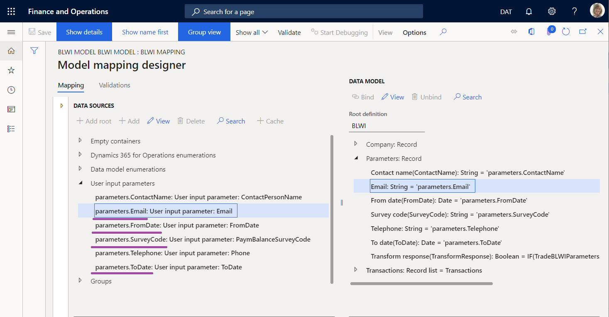
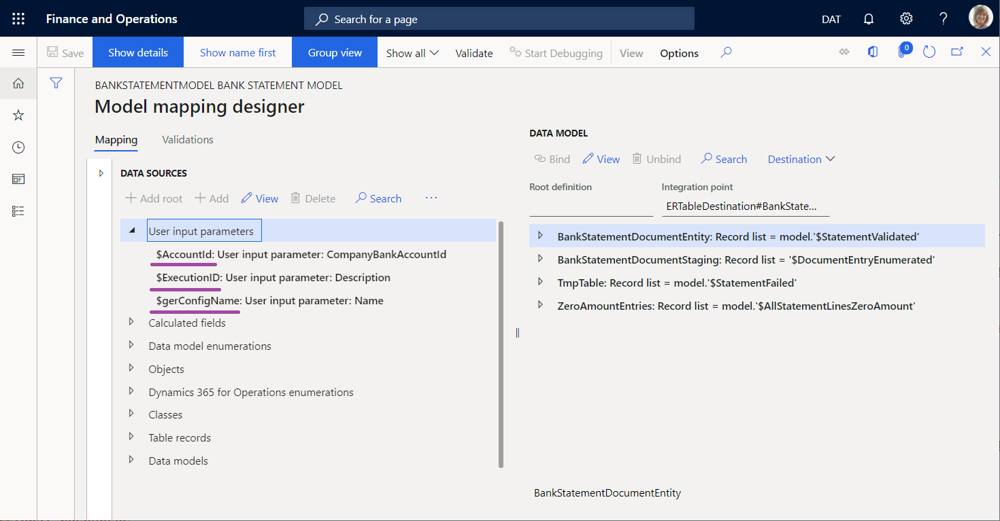

---
# required metadata

title: ER Initiate values of data sources of the USER INPUT PARAMETER type from source code
description: This topic describes how values of data sources of the USER INPUT PARAMETER type can be initiated from source code.
author: NickSelin
manager: AnnBe
ms.date: 11/24/2020
ms.topic: article
ms.prod: 
ms.service: dynamics-ax-platform
ms.technology: 

# optional metadata

# ms.search.form:  
audience: Developer, IT Pro
# ms.devlang: 
ms.reviewer: kfend
ms.search.scope:  Operations
# ms.tgt_pltfrm: 
# ms.custom: 
ms.search.region: Global 
# ms.search.industry: 
ms.author: nselin
ms.search.validFrom: 2017-11-01
ms.dyn365.ops.version: Platform update 8
---

# Initiate values of data sources of the USER INPUT PARAMETER type from source code

[!include [banner](../includes/banner.md)]

When you design ER [model mapping](general-electronic-reporting.md#data-model-and-model-mapping-components) and ER [format](general-electronic-reporting.md#FormatComponentOutbound) components, you can use data sources of the *User input parameter* type to obtain necessary values from the ER user dialog that is offered at runtime before the execution of an ER format begins. This dialog can be programmatically turned off when the required parameters are entered on another page, when an ER format is executed in unattended (batch) mode, etc. When the ER dialog is turned off, you need to initiate values of data sources of the *User input parameter* type from source code.

## Format components for outgoing electronic documents

You can configure an ER [format](general-electronic-reporting.md#FormatComponentOutbound) to generate an outbound document. When you configure such a format, an ER [data model](general-electronic-reporting.md#data-model-and-model-mapping-components) is selected as a data source using to fill in an outbound document. You must configure an ER [model mapping](general-electronic-reporting.md#data-model-and-model-mapping-components) to specify how the selected data model is filled in by application data at runtime. Designing your model mapping, you specify data sources that will pick up desire values from different sources to populate them to your data model. Among others, you might use data sources of the *User input parameter* type to fill in your data model by values that are entered by end user on the ER user dialog page that is offered first when you [run](er-apis-app73.md#code-to-run-a-format-mapping-for-data-export) an ER format. 

For an ER format that is configured to generate an outbound document, the ER dialog can be programmatically turned off by using the `_showPromptDialog` parameter of the `createFormatMappingRunByFormatMappingId()` method of the `ERObjectsFactory` class. In this case you need to initiate values of data sources of the *User input parameter* type from source code. For doing this, you can use the following pattern:

```xpp
ERModelDefinitionInputParametersAction Obj = new ERModelDefinitionInputParametersAction();
Obj.addParameter(<path to an ER data source>, <data source value>);
ERObjectsFactory::createFormatMappingRunByFormatMappingId(formatMappingID, fileName, false)
            .withParameter(Obj)
            .run();
```

For ER formats that are configured to generate an outbound document, the path to an ER data source is constructed from the prefix and the suffix that are separated by slash character. The prefix represents the name of a data source of the *Model* type that resides in the running ER format. The suffix represents the path to a data source of the *User input parameter* type that resides in a [model mapping](general-electronic-reporting.md#data-model-and-model-mapping-components) that is used by the running ER format as the implementation of the relevant [data model](general-electronic-reporting.md#data-model-and-model-mapping-components).

> [!TIP]
> Nodes of a data source path is separated by slash character. Use the `ERPath::Combine()` method to construct a path.

For more information, review the source code of the `BankPaymBalanceXML` application class that can be used as an example. [Import](er-download-configurations-global-repo.md) from the Global repository to your Finance instance the **BLWI format (BE)** ER format [configuration](general-electronic-reporting.md#Configuration) that is called by using this application class. The base **BLWI model** configuration will be imported automatically along with the imported ER format configuration.

```x++
    /// <summary>
    /// Runs export via ER solution.
    /// </summary>
    [Microsoft.Dynamics.BusinessPlatform.SharedTypes.InternalUseOnlyAttribute]
    protected void runER()
    {
        const str erParmEmail = 'model/parameters.Email';
        const str erParmFromDate = 'model/parameters.FromDate';
        const str erParmToDate = 'model/parameters.ToDate';
        const str erParmSurveyCode = 'model/parameters.SurveyCode';

        ERModelDefinitionInputParametersAction modelDefinitionInputParametersAction = new ERModelDefinitionInputParametersAction();

        modelDefinitionInputParametersAction.addParameter(erParmEmail, email)
            .addParameter(erParmFromDate, fromDate)
            .addParameter(erParmToDate, toDate)
            .addParameter(erParmSurveyCode, BankPaymBalanceSurvey::find(surveyCodeRecId).SurveyCode);

        ERObjectsFactory::createFormatMappingRunByFormatMappingId(tradeBLWIParameters.ERFormatMappingID, fileName)
            .withFileDestination(fileDestination)
            .withParameter(modelDefinitionInputParametersAction)
            .run();
    }
```

The `email`, `fromDate`, `toDate`, etc. variables are used to store values that have been entered on other than ER dialog page before an ER format has been called. The `runER()` method of this class [runs](er-apis-app73.md#code-to-run-a-format-mapping-for-data-export) an ER format mapping using these variables to initiate values of several data sources. The prefix of every path of such a data source (`erParmEmail`, `erParmFromDate`, `erParmToDate`, etc. constants in the sample code) is defined as the name of a format data source of the *Model* type (**model** value).


The suffix of every path of such a data source is defined as the path to the relevant data source of a model mapping that is used at runtime (`parameters.Email`, `parameters.FromDate`, `parameters.ToDate`, etc. in the sample code).



## Format components for inbound electronic documents

You can also configure an ER [format](general-electronic-reporting.md#FormatComponentInbound) that can be [run](er-apis-app73.md#code-to-run-a-format-mapping-for-data-import) to parse an inbound document and update application data. This format must contain a format mapping that refers to a model mapping of the *To destination* type using to update application data based on the content of an inbound document. In such a model mapping you can also use data sources of the *User input parameter* type to get values at runtime from the ER user dialog page and use them for application data update.

When an ER format is executed to parse an inbound document, the ER dialog can be programmatically turned off by using the `_showPromptDialog` parameter of the `createMappingDestinationRunByImportFormatMappingId()` method of the `ERObjectsFactory` class.

For ER formats that are configured to parse an inbound document, the path to an ER data source is constructed as the path to a data source of the *User input parameter* type that resides in a model mapping of the *To destination* type that is called from the running ER format to update application data.

For more information, review the source code of the `BankStatementImportBatch` application class that can be used as an example.

```xpp
        var integrationPoint = classStr(ERTableDestination) + '#' + tableStr(BankStatementDocumentEntity);
        ERmodelDefinitionInputParametersAction inputParameters = new ERmodelDefinitionInputParametersAction();
        inputParameters.addParameter('$ExecutionID', _executionID)
            .addParameter('$gerConfigName', _gerConfigName)
            .addParameter('$AccountId', bankAccount);

        var runner = ERObjectsFactory::createMappingDestinationRunByImportFormatMappingId(_erModelMappingId, integrationPoint);
        runner.withParameter(inputParameters);
        runner.init();
        
        if (runner.promptsContractedModelMapping())
        {
            var parameters = runner.getParameters();
            var traverser = new ERModelDefinitionParametersTraverser(parameters);
            while (traverser.moveNext())
            {
                ERIImportFormatDataSourceContract current = ERCast::asObject(traverser.current()) as ERImportFormatDataSourceContract;
                if (current)
                {
                    current.parmInputDataStream(File::UseFileFromURL(DMFStagingWriter::getDownloadURLFromFileId(_uploadedStatement)));
                }
            }
        }

        runner.runUnattended();
```

Pay attention to the `_executionID`, `_gerConfigName`, and `bankAccount` variables that are used to initiate values of `$ExecutionID`, `$gerConfigName`, and `$AccountId` data sources.

Import from the Global repository to your Finance instance the **Camt.053 Format** ER format configuration that is called by using this application class. The **Bank statement model** configuration will be imported automatically along with the imported ER format configuration. Additionally, import the **Bank statement mapping to destination** ER configuration that contains a model mapping using to update application data.



## Limitations

> [!NOTE]
> Note that you can initiate only values of data sources of the *User input parameter* type that are configured in an ER model mapping that is used at runtime. Values of data sources of the *User input parameter* type that are configured in an ER format cannot be initiated from source code.

## Additional resources

[Electronic reporting (ER) overview](general-electronic-reporting.md)

[Parse incoming documents](er-parse-incoming-documents.md)
