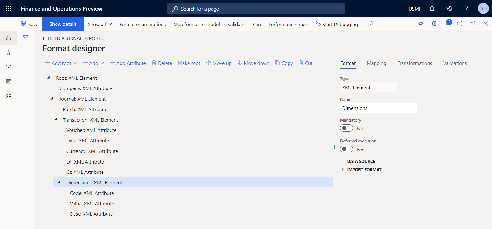
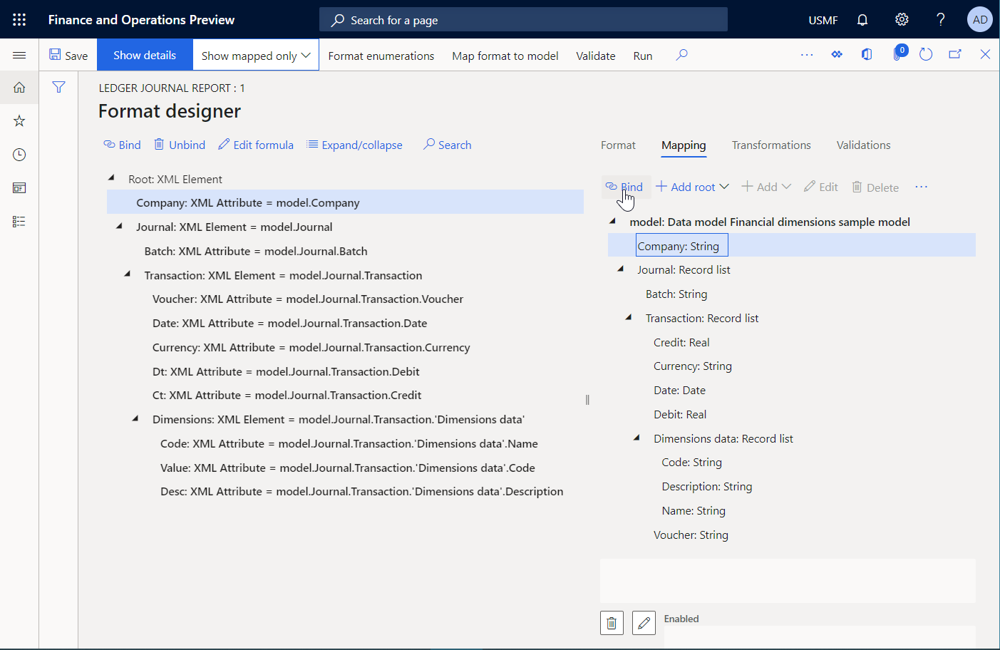

--- 
# required metadata 
 
title: ER Use financial dimensions as a data source (Part 3 - Design the report)
description: This topic describes how to configure an Electronic reporting (ER) model to use financial dimensions as a data source for ER reports. (Part 3)
author: NickSelin
manager: AnnBe 
ms.date: 05/27/2020
ms.topic: business-process 
ms.prod:  
ms.technology:  
 
# optional metadata 
 
ms.search.form: ERSolutionTable, ERSolutionCreateDropDialog, EROperationDesigner, ERComponentTypeDropDialog   
audience: Application User 
# ms.devlang:  
ms.reviewer: kfend
# ms.tgt_pltfrm:  
# ms.custom:  
ms.search.region: Global
# ms.search.industry: 
ms.author: nselin
ms.search.validFrom: 2016-06-30 
ms.dyn365.ops.version: Version 7.0.0 
---
# ER Use financial dimensions as a data source (Part 3 - Design the report)

[!include [banner](../../includes/banner.md)]

The following steps explain how a user assigned to the system administrator or electronic reporting developer role can configure an Electronic reporting (ER) model to use financial dimensions as a data source for ER reports. These steps can be performed in any company.

To complete these steps, you must first complete the steps in the "ER Use financial dimensions as a data source (Part 2: Model mapping)" procedure.

## Design a report to present financial dimensions
1. Go to Organization administration > Electronic reporting > Configurations.
2. In the tree, select 'Financial dimensions sample model'.
3. Click Create configuration to open the drop dialog.
4. In the New field, enter 'Format based on data model Financial dimensions sample model'.
    * Use the model that was created in advance as the data source for your new report.  
5. In the Name field, type 'Ledger journal report'.
6. In the Data model definition field, select Entry.
7. Click Create configuration.
8. Click Designer.
9. Click Add root to open the drop dialog.
10. In the tree, select 'XML\Element'.
11. In the Name field, type 'Root'.
12. Click OK.
13. Click Add to open the drop dialog.
14. In the tree, select 'XML\Attribute'.
15. In the Name field, type 'Company'.
16. Click OK.
17. Click Add to open the drop dialog.
18. In the tree, select 'XML\Element'.
19. In the Name field, type 'Journal'.
20. Click OK.
21. In the tree, select 'Root: XML Element\Journal: XML Element'.
22. Click Add to open the drop dialog.
23. In the tree, select 'XML\Attribute'.
24. In the Name field, type 'Batch'.
25. Click OK.
26. Click Add to open the drop dialog.
27. In the tree, select 'XML\Element'.
28. In the Name field, type 'Transaction'.
29. Click OK.
30. In the tree, select 'Root: XML Element\Journal: XML Element\Transaction: XML Element'.
31. Click Add to open the drop dialog.
32. In the tree, select 'XML\Attribute'.
33. In the Name field, type 'Voucher'.
34. Click OK.
35. Click Add Attribute.
36. In the Name field, type 'Date'.
37. Click OK.
38. Click Add Attribute.
39. In the Name field, type 'Currency'.
40. Click OK.
41. Click Add Attribute.
42. In the Name field, type 'Dt'.
43. Click OK.
44. Click Add Attribute.
45. In the Name field, type 'Ct'.
46. Click OK.
47. Click Add to open the drop dialog.
48. In the tree, select 'XML\Element'.
49. In the Name field, type 'Dimensions'.
50. Click OK.
51. In the tree, select 'Root: XML Element\Journal: XML Element\Transaction: XML Element\Dimensions: XML Element'.
52. Click Add to open the drop dialog.
53. In the tree, select 'XML\Attribute'.
54. In the Name field, type 'Code'.
55. Click OK.
56. Click Add Attribute.
57. In the Name field, type 'Value'.
58. Click OK.
59. Click Add Attribute.
60. In the Name field, type 'Desc'.
61. Click OK.

## Map report elements to data sources
1. Click the Mapping tab.
2. In the tree, expand 'model: Data model Financial dimensions sample model'.
3. In the tree, expand 'model: Data model Financial dimensions sample model\Journal: Record list'.
4. In the tree, expand 'model: Data model Financial dimensions sample model\Journal: Record list\Transaction: Record list'.
5. In the tree, expand 'model: Data model Financial dimensions sample model\Journal: Record list\Transaction: Record list\Dimensions data: Record list'.
6. In the tree, select 'Root: XML Element\Journal: XML Element\Transaction: XML Element\Dimensions: XML Element\Desc: XML Attribute'.
7. In the tree, select 'model: Data model Financial dimensions sample model\Journal: Record list\Transaction: Record list\Dimensions data: Record list\Description: String'.
8. Click Bind.
9. In the tree, select 'Root: XML Element\Journal: XML Element\Transaction: XML Element\Dimensions: XML Element\Value: XML Attribute'.
10. In the tree, select 'model: Data model Financial dimensions sample model\Journal: Record list\Transaction: Record list\Dimensions data: Record list\Code: String'.
11. Click Bind.
12. In the tree, select 'Root: XML Element\Journal: XML Element\Transaction: XML Element\Dimensions: XML Element\Code: XML Attribute'.
13. In the tree, select 'model: Data model Financial dimensions sample model\Journal: Record list\Transaction: Record list\Dimensions data: Record list\Name: String'.
14. Click Bind.
15. In the tree, select 'model: Data model Financial dimensions sample model\Journal: Record list\Transaction: Record list\Dimensions data: Record list'.
16. In the tree, select 'Root: XML Element\Journal: XML Element\Transaction: XML Element\Dimensions: XML Element'.
17. Click Bind.
18. In the tree, select 'Root: XML Element\Journal: XML Element\Transaction: XML Element\Ct: XML Attribute'.
19. In the tree, select 'model: Data model Financial dimensions sample model\Journal: Record list\Transaction: Record list\Credit: Real'.
20. Click Bind.
21. In the tree, select 'Root: XML Element\Journal: XML Element\Transaction: XML Element\Dt: XML Attribute'.
22. In the tree, select 'model: Data model Financial dimensions sample model\Journal: Record list\Transaction: Record list\Debit: Real'.
23. Click Bind.
24. In the tree, select 'Root: XML Element\Journal: XML Element\Transaction: XML Element\Currency: XML Attribute'.
25. In the tree, select 'model: Data model Financial dimensions sample model\Journal: Record list\Transaction: Record list\Currency: String'.
26. Click Bind.
27. In the tree, select 'Root: XML Element\Journal: XML Element\Transaction: XML Element\Date: XML Attribute'.
28. In the tree, select 'model: Data model Financial dimensions sample model\Journal: Record list\Transaction: Record list\Date: Date'.
29. Click Bind.
30. In the tree, select 'Root: XML Element\Journal: XML Element\Transaction: XML Element\Voucher: XML Attribute'.
31. In the tree, select 'model: Data model Financial dimensions sample model\Journal: Record list\Transaction: Record list\Voucher: String'.
32. Click Bind.
33. In the tree, select 'Root: XML Element\Journal: XML Element\Transaction: XML Element'.
34. In the tree, select 'model: Data model Financial dimensions sample model\Journal: Record list\Transaction: Record list'.
35. Click Bind.
36. In the tree, select 'Root: XML Element\Journal: XML Element\Batch: XML Attribute'.
37. In the tree, select 'model: Data model Financial dimensions sample model\Journal: Record list\Batch: String'.
38. Click Bind.
39. In the tree, select 'Root: XML Element\Journal: XML Element'.
40. In the tree, select 'model: Data model Financial dimensions sample model\Journal: Record list'.
41. Click Bind.
42. In the tree, select 'Root: XML Element\Company: XML Attribute'.
43. In the tree, select 'model: Data model Financial dimensions sample model\Company: String'.
44. Click Bind.
45. Click Save.
46. Close the page.

[!INCLUDE[footer-include](../../../../includes/footer-banner.md)]