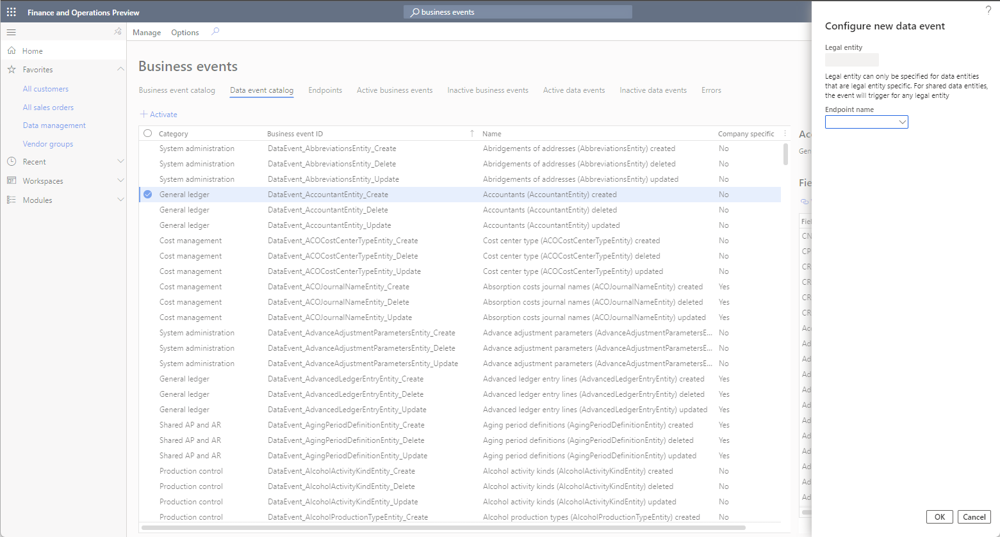

---
# required metadata

title: Data events
description: This topic provides an overview of data events.
author: jaredha
ms.date: 10/18/2021
ms.topic: article
ms.prod:
ms.technology: 

# optional metadata

# ms.search.form:
audience: Developer, IT Pro
# ms.devlang: 
ms.reviewer: sericks
# ms.tgt_pltfrm: 
# ms.custom: NotInToc
ms.search.region: Global
# ms.search.industry:
ms.author: jaredha
ms.search.validFrom: 2021-10-15
ms.dyn365.ops.version: 10.0.22
---

# Data events

Data events are events based on changes to data in Dynamics 365 Finance and Operations apps. Create, update, and delete (CUD) events can be enabled for each entity. For example, if the **Create** event is enabled on the **Purchase order headers V2** entity, an event notification is emitted each time a new purchase order is created in the database.

All OData-enabled entities in Finance and Operations apps, both standard and custom, can emit data events. In the data events catalog, each event for an entity is listed as a data event to which subscriptions can be established. The concept of activating the data event and associating it to an endpoint is similar to the concept of business events. When a data event happens, the payload of the event contains the corresponding entity record.

> [!NOTE]
> Data events are only available in environments for which the Power Platform integration has been enabled. For more information, see [Enable Microsoft Power Platform integration](../power-platform/enable-power-platform-integration.md).

## Data events catalog

Go to **System administration** > **Setup** > **Business event** to access the data events catalog from the **Business events** page. The data events catalog provides a complete list of the available data events in the Finance and Operations apps environment. For each data event, the category, event ID, name, and whether the event is company-specific is provided. You can filter the list by category and data event ID.

## Activating data events

Data events are not active by default. To activate a data event from the data event catalog, select the events in the list, and then select **Activate**. 

Data events can be activated in all legal entities or in specific legal entities. In the **Legal entity** field of the **Configure new data event** pane, select the legal entity in which you want to activate the data event. If you leave the **Legal entity** field blank, the selected data events will be activated in all legal entities. If a data event is required in multiple specific legal entities, the event must be configured separately for each legal entity.

Only company-specific data events can be configured for specific legal entities. When configuring data events that aren't company-specific, the **Legal entity** field isn't editable, and the data event is enabled for all legal entities.

Select a configured endpoint to activate the data event. For information on configuring endpoints business events and data events, see [Managing endpoints](home-page.md#managing-endpoints).

Activating a data event adds the event to the list on the **Active data events** tab of the page and makes it available for subscription through the selected endpoint.

## Deactivating data events

On the **Active data events** tab, you can deactivate data events. To deactivate a data event, select the events in the list, and the select **Deactivate**. The events are removed from the list of active data events and added to the **Inactive data events** list. 

Data events, similar to business events, can be deactivated when business event processing is temporarily paused. This may be needed because of system maintenance, bulk data imports, or bulk data processing. Bulk data processing with data events enabled on related data entities may send a high volume of data events that may or may not be needed. This can impact system performance.

When data events are no longer needed to meet business requirements, you can delete the data event from the **Active data events** or **Inactive data events** list. This removes the event from the list and deletes all error history for the event. Deactivating the data event may be used rather than deleting the event if the history of errors for the data event must be preserved. For more information on error logs for business events and data events, see [Errors](home-page.md#errors).

## Download the data event schema

The **Data events catalog** page also displays the fields that are passed to the data event that make up the event schema. This includes the field name and label. Selecting the **Download schema** action allows you to download the JavaScript Object Notation (JSON) schema for the event. This is helpful when external integration systems require the schema of the payload for a business event during development.

[!include[banner](../includes/banner.md)]

[!include [rename-banner](~/includes/cc-data-platform-banner.md)]
