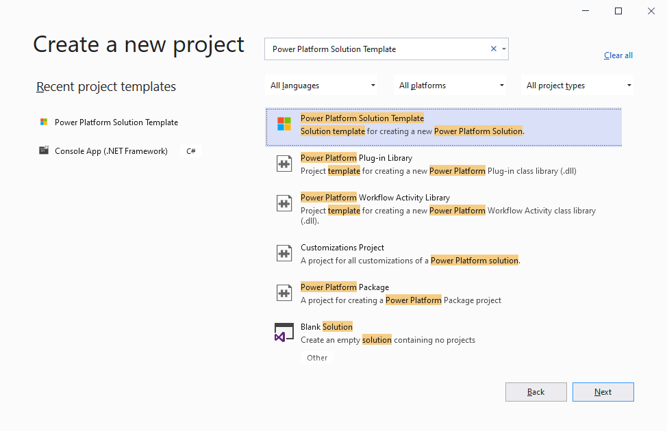
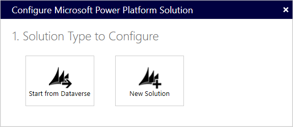
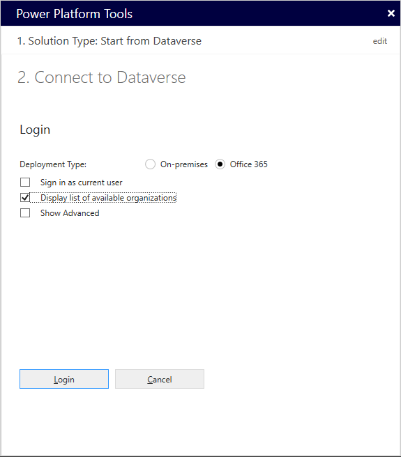

---
# required metadata

title: Subscribing to events in Dataverse
description: This topic provides information on subscribing to and managing Finance and Operations apps business events in Microsoft Dataverse
author: jaredha
ms.date: 11/03/2021
ms.topic: article
ms.prod:
ms.technology: 

# optional metadata

# ms.search.form:
audience: Developer, IT Pro
# ms.devlang: 
ms.reviewer: sericks
# ms.tgt_pltfrm: 
# ms.custom: NotInToc
ms.search.region: Global
# ms.search.industry:
ms.author: jaredha
ms.search.validFrom: 2021-11-03
ms.dyn365.ops.version: 10.0.22
---

# Subscribing to events in Dataverse
[!include[banner](../includes/banner.md)]

> [!IMPORTANT]
> Enabling the Power Platform integration is prerequisite for subscribing to Finance and Operations business events and data events in Dataverse, as outlined in this topic. For more information on enabling the Power Platform integration for a Finance and Operations apps environment, see [Enabling the Power Platform integration](./power-platform/enable-power-platform-integration).

It is possible to subscribe to Finance and Operations business events and data events from Dataverse by registering plug-ins and SDK steps on the events in Dataverse. This topic outlines using the **Power Platform Tools** extension for Visual Studio to register a plug-in for the Finance and Operations event. The subscriptions are then displayed in the business event catalog in the Finance and Operations application with any other subscriptions. This endpoint then functions as other endpoints in the Finance and Operations business event catalog.

## Set up your development environment

### Install Power Platform Tools

The Power Platform Tools for Visual Studio is an extension with code templates for Dataverse plug-ins, as well as a Dataverse explorer that shows tables, business events, and virtual entity data events. The explorer allows you to register plugins directly from within Visual Studio, and the C# code for the plug-in can be deployed into Dataverse directly from the solution.

To install the Power Platform Tools extension, follow the steps outlined in [Install Power Platform Tools](/powerapps/developer/data-platform/tools/devtools-install).

### Create a project

After installing the Power Platform Tools extension, you can create a new project.

1. Open Microsoft Visual Studio 2019 or later.
2. In the **Get started** dialog, select **Create a new project**.
3. In the **Create a new project** dialog, search for and select **Power Platform Solution Template**, and select **Next**.
  
  

4. In the **Configure your new project** dialog, enter a project name, select the location where you want the solution file saved, and select **Create**.
5. In the **Configure Microsoft Power Platform Solution** dialog, for **Solution Type to Configure**, select **Start from Dataverse**.

  

6. In the **Power Platform Tools** dialog, under **Connect to Dataverse**:
  - Select a **Deployment Type** of **Office 365**
  - Select **Display list of available orgaizations**
  - Select **Login** and enter the credentials to sign into the Dataverse environment linked to your Finance and Operations environment.
  - Select the Power Platform environment you want to work with from the list of organizations, and select **Login**.
  - Select **Next**.

  

7. On the third step, **Select Solution**, select the Power Platform solution in which you want to create the event subscription. If you don't yet have a solution created, you can create one in the maker portal by following the steps in the [Create a solution](/powerapps/maker/data-platform/create-solution) documentation.

  

8. Select **Done**.
9. For the first step, **Select Items for Template**, on the **Visual Studio Template Selection Microsoft Power Platform** dialog, select **Add New Templates**.

  

10. Under **Select Template Projects**, select **Add Plugin Project**, and select **Next**.
11. In the **Plugins** field under **Assign project Names**, provide a name for the plug-in project. This will be the name of the Visual Studio project. It will also, by default, be the name of the assembly.

  

12. Select **Done**.

### Sign the assemblies

Dataverse assemblies need to be signed. You can either set up a self-signed key in the solution or provide another key if you have one available. To create a self-signed key:

1. In the **Solution Explorer**, right-click on the project name, and select **Properties**.
2. On the **Signing** tab, mark the **Sign the assembly** checkbox.
3. In the **Choose a strong name key file** drop-down list, select **New**.
4. Enter a name and password for the key, and select **OK**.

## Subscribe to a Finance and Operations event

Once setup is complete, you can begin writing code. You can create C# class library that runs business logic in Dataverse when a Finance and Operations business event or data event occurs to which the plug-in is subscribed. In this example, each time a new worker record is created in Finance and Operations, our plug-in will update the new worker record to set the anniversary date to today's date.

### Register a new step

1. In Visual Studio, on the **View** menu, select **Power Platform Explorer**. The Power Platform Explorer shows a list of components from the Dataverse environment you selected during the development environment setup. This includes tables, choices, and event catalogs, among other components. 
2. Under the **Event Catalog** node, expand **Finance and Operations**.

## Deploy the plug-in

You can now deploy your plug-in to the Power Platform solution. to do this, in the **Solution Explorer**, right-click the project and select **Deploy**.

## Troubleshooting

If the deployment fails, you can troubleshoot by turning on verbose logging. 
