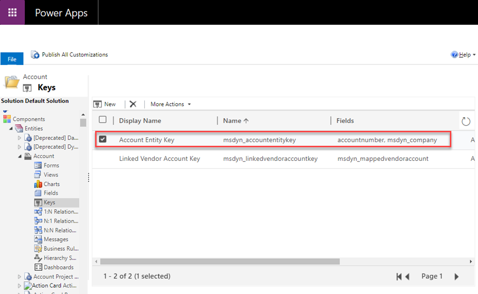
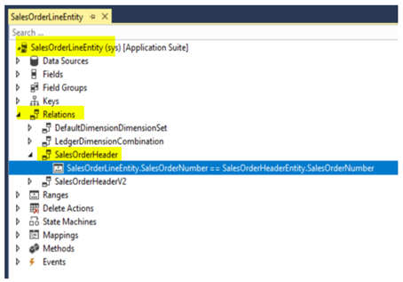

# Customization guidance for dual-write

[!include [banner](../../includes/banner.md)]

[!include [rename-banner](~/includes/cc-data-platform-banner.md)]

Dual-write provides out of box maps for some business processes, but there might be scenarios where you need additional fields, maps, or transformations. The dual-write platform is extensible and lets you create custom maps and extend existing maps with custom fields to sync data between Finance and Operations apps and Dataverse. This topic provides guidance and best practices for these customizations.

Before customizing any maps, you should be familiar with the tasks in [Customize table and column mappings](customizing-mappings.md).

## Guidance when the entity is in both the Finance and Operations app and Dataverse

If the entity is in both environments, create a dual-write map if the entity is in both environments.

+ Integration keys for the entity in both environments should match. If the entity key is not available on any side, make sure to create entity keys. These integration key fields should be mapped with each other in the map.
+ Company field should not be present in the mapping if the entity is a legal entity-specific, because the company field would already be part of the key. For an example, review the **Customer groups (msdyn\_customergroups)** entity mapping.
+ Add filters to either the Finance and Operations environment or the Dataverse environment to trigger the dual-write map only on certain criteria. The **Customers V3 - Accounts or CDS Contacts V2 (Contacts)** map has several filters that you can use as examples.

## Guidance when the entity is in only the Finance and Operations app

If the entity is in only the Finance and Operations app, create a new entity in Dataverse and then add a map.

+ If the Finance and Operations entity contains legal entity-specific data, make sure to add a lookup field to **cdm\_companies** in the new Dataverse entity. If the Finance and Operations entity is global, then a field for company is not required in the Dataverse entity.
+ Add keys to the Dataverse entity mimicking the Finance and Operations entity key. Dual-write requires the same entity keys on both Finance and Operations and Dataverse environments. The key fields on both Finance and Operations and Dataverse should be mapped to each other. Do not add the **company** field in the mapping. For an example, review the **Vendors V2 - msdyn\_vendors mapping**.

## Guidance when the entity is only in Dataverse

If the entity is only in Dataverse, create a new entity in the Finance and Operations environment and then add a map.

Create the new entity, including all the required fields. Make sure it is Data management-enabled and public so that the entity can be consumed by Odata. For more information on creating a new entity, see [Build and consume data entities](../build-consuming-data-entities.md).

+ If data in Finance and Operations is supposed to be legal entity-specific, make sure to add a lookup field to **cdm\_companies** in the Dataverse entity. If the Finance and Operations entity is global, then a field for company is not required in the Dataverse entity.
+ Make sure that both entities have the entity key fields. Dual-write requires the same entity keys on both Finance and Operations and Dataverse environments.  The key fields on both Finance and Operations and Dataverse should be mapped to each other. Do not add the **company** field in the mapping. For an example, review the **Vendors V2 - msdyn\_vendors mapping**.

## Add attributes to a mapping

If the entities exist in both environments and are mapped, you can add attributes to the map. For more information, see [Customize table and column mappings](customizing-mappings.md).

## Create and update do not trigger the attributes to sync to Dataverse

In some situations, the entities exist in both environments, but create and update do not trigger the attributes to sync to Dataverse. Navigate to the **BusinessEventsDefinition** table by using SQL in the Finance and Operations virtual machine or using table browser. Ensure that there is a record for the combination of the affected table that has an updated date (in the **RefTableName** field) and entity name (in the **RefEntityName** field).

## Guidance when entities are not available in either the Finance and Operations app or Dataverse

If the entities don't exist in either environment, you can create tables in both environments and then create the app by following these steps:

1. Create a new table in Dataverse with all the required fields by following the steps in [Create a custom table](/modules/create-manage-entities/2-custom-entity). If the table should store legal entity-specific data make sure to add a lookup field to **cdm\_companies** in the new Dataverse table. If the table stores global data, then a field for company is not required in the Dataverse table.
2. Create a new entity in Finance and Operations with all the required fields. Make sure it is Data management-enabled and public so that the entity can be consumed by Odata. For more information on creating a new entity, see [Build and consume data entities](../build-consuming-data-entities.md).
3. To enable table maps for dual-write, define an alternative key in the Dataverse table. The value of the alternative key in Dataverse must match the key that is defined in the Finance and Operations app. For example, in a Finance and Operations app, CustomerAccount is the key for the Account table, as shown in the following screenshot.

    

    In Dataverse, **accountnumber** is defined as the key for the Account table.

    

    If you check the the **Customers V3** table map, you can see that **accountnumber** is mapped to **CustomerAccount**.

## Best practices for dual-write

+ Changes must be in a transaction. It is important to evaluate the number of records per transaction based on your table design and evaluate how transaction blocks are structured as part of the process in X++. Two examples are shown here.

    ```xpp
    ttsbegin;
    // Transaction start
    table1record1.insert();
    table1record2.insert();
    table1record3.insert();
    table1recordN.insert();
    ttscommit;
    // Transaction end
    ```

    ```xpp
    ttsbegin;
    // Transaction start
    while (// loop conditions// )
    {
        table1recordN.insert();
    }
    ttscommit;
    // Transaction end
    ```

+ The following are not handled by business events and are therefore not handled by dual-write:
    + **doUpdate** method
    + **doInsert** method
    + set-based operations (**insert** and **update**)
    + records where **skipBusinessEvents(true)** is marked
+ Business events must be registered for the data source that is mapped. There can be data sources that are outer-joined and marked as readonly in the Finance and Operations app. These data sources are not tracked.
+ Changes are triggered only if the modifications are on the mapped fields in the Finance and Operations app. In customer engagement apps, all field modifications trigger dual-write sync.
+ Every filter evaluation should provide a valid result.
+ Data sources that do not have any fields mapped are not tracked.
+ Entity relationships within the Finance and Operations app must indicate to dual-write that the two entities are linked and there are relationships that exist between the two records within the same transaction. Dual-write batching depends on entity relationships explicitly defined and considered to sequence the record insertion if both parent and child record are part of the same transaction on related entities. If there is a business process in Finance and Operations apps that involves several entities and has to be enabled as batch mode for customer engagement, dual-write expects the relationships to be identified and defined on the entity. The following screenshot shows the relationship between **Sales Order header V2** and **Sales Order Line V2**.

    

+ To avoid performance issues, avoid using large number of data sources in dual-write data tables that raise multiple events for a record change. Do not map unwanted fields in dual-write and avoid excessive business logic on tables and entities.
+ If a custom entity in the Finance and Operations app is company-specific (the primary company context property of entity is set to **DataAreaId**), then the related Dataverse table should have company lookup as one of the key columns. Mapping between the shared entity and the company-specific entity is not allowed. You can determine if a Finance and Operations app entity is shared or company-specific by looking at the **entity** property in Visual Studio Application Explorer. For more information, see [Cross company behavior of Data entities](../cross-company-behavior.md).

    

## Filter guidance for maps

You can apply filters to both Finance and Operations entities and Dataverse tables. Filters should only be applied on fields present on the dual-write maps. Verify the filter results before adding them to dual-write maps.

For Finance and operation entities, filter expressions can be verified using the following code example in an X++ runnable class. Replace the expression and the entity name and run the class.

```xpp
var entityName = "PROJECTENTITY";
var filterExpression = '(ParentProject == "")';
Query query = new Query();
query.literals(NoYes::Yes);
QueryBuildDataSource qbd =
query.addDataSource(tablename2id(entityName));
qbd.addRange(fieldname2id(qbd.table(),identifierStr(RecVersion))).
value(filterExpression);
qbd.addSelectionField(fieldname2id(qbd.table(),identifierStr(RecId)));
QueryRun qRun = new QueryRun(query);
// This provides the actual sql statement to execute
var actualSqlStatement = query.getSQLStatement();
while(qRun.next())
{
    var rec = qRun.get(tableName2Id(entityName));
}
```

For Dataverse tables, filter expressions can be verified by adding the expression as filter condition on the Odata expression.

```powerappsfl
https://<Env URL>/api/data/v9.0/<TableName>?$filter=<fieldname> eq <value>
```

For more information about filters, including more examples, see [Examples and patterns for filtering](dual-write-faq.md#where-can-i-find-examples-and-patterns-for-filtering-dual-write-maps).

[!INCLUDE[footer-include](../../../../includes/footer-banner.md)]
