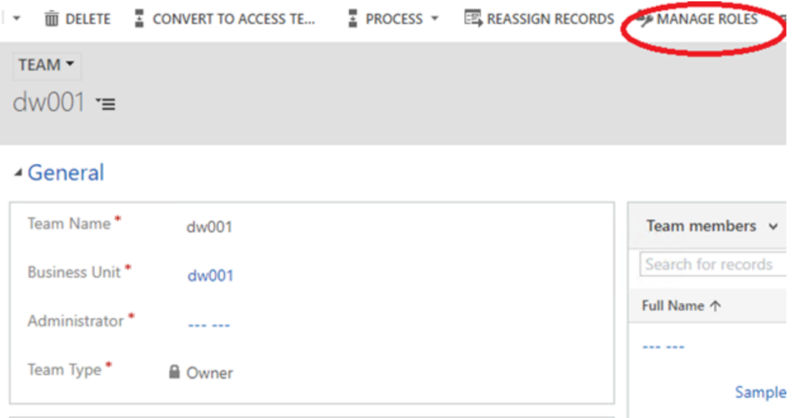

---
# required metadata

title: Troubleshoot live synchronization issues
description: This topic provides troubleshooting information that can help you fix issues with live synchronization.
author: RamaKrishnamoorthy 
ms.date: 03/16/2020
ms.topic: article
ms.prod: 
ms.technology: 

# optional metadata

ms.search.form: 
# ROBOTS: 
audience: Application User, IT Pro
# ms.devlang: 
ms.reviewer: rhaertle
# ms.tgt_pltfrm: 
ms.custom: 
ms.assetid: 
ms.search.region: global
ms.search.industry: 
ms.author: ramasri
ms.dyn365.ops.version: 
ms.search.validFrom: 2020-03-16

---

# Troubleshoot live synchronization issues

[!include [banner](../../includes/banner.md)]

[!include [rename-banner](~/includes/cc-data-platform-banner.md)]


This topic provides troubleshooting information for dual-write integration between Finance and Operations apps and Dataverse. Specifically, it provides information that can help you fix issues with live synchronization.

> [!IMPORTANT]
> Some of the issues that this topic addresses might require either the system admin role or Microsoft Azure Active Directory (Azure AD) tenant admin credentials. The section for each issue explains whether a specific role or credentials are required.

## Live synchronization throws a 403 Forbidden error when you create a row in a Finance and Operations app

You might receive the following error message when you create a row in a Finance and Operations app:

*\[{\\"error\\":{\\"code\\":\\"0x80072560\\",\\"message\\":\\"The user is not a
member of the organization.\\"}}\], The remote server returned an error: (403)
Forbidden."}}".*

To fix the issue, follow the steps in [System requirements and prerequisites](requirements-and-prerequisites.md). To complete those steps, the dual-write application users who are created in Dataverse must have the system admin role. The default owning team must also have the system admin role.

## Live synchronization for any table consistently throws a similar error when you create a row in a Finance and Operations app

**Required role to fix the issue:** System admin

You might receive an error message like the following every time that you try to save table data in a Finance and Operations app:

*Cannot save the changes to the database. Unit of Work can not commit transaction. Unable to write data to entity uoms. Writes to UnitOfMeasureEntity failed with error message Unable to sync with entity uoms.*

To fix the issue, you must make sure that the prerequisite reference data exists in both the Finance and Operations app and Dataverse. For example, if the customer that you're in the Finance and Operations app belongs to a specific customer group, make sure that the customer group exists in Dataverse.

If data exists on both sides, and you've confirmed that the issue isn't data-related, follow these steps.

1. Stop the related table.
2. Sign in to the Finance and Operations app, and make sure that rows for the failing table exist in the DualWriteProjectConfiguration and DualWriteProjectFieldConfiguration tables. For example, here is what the query looks like if the **Customers** table is failing.

    ```sql
    Select projectname, externalenvironmentURL ,\* 
    from DUALWRITEPROJECTCONFIGURATION 
    where INTERNALENTITYNAME = 'Customers V3' and
        EXTERNALENTITYNAME = 'accounts' 
    ```

3. If there are rows for the failing table even after you stop the table mapping, delete the rows that are related to the failing table. Make a note of the **projectname** column in the DualWriteProjectConfiguration table, and fetch the row in the DualWriteProjectFieldConfiguration table by using the project name to delete the row.
4. Start the table mapping. Validate whether the data is synced without any issues.

## Handle read or write privilege errors when you create data in a Finance and Operations app

You might receive a "Bad Request" error message that resembles the following example when you create data in a Finance and Operations app.


To fix the issue, you must assign the correct security role to the team of the mapped Dynamics 365 Sales or Dynamics 365 Customer Service business unit to enable the missing privilege.

1. In the Finance and Operations app, find the business unit that is mapped in the Data Integration connection set.

    

2. Sign in to the environment in the model-driven app in Dynamics 365, navigate to **Setting \> Security**, and find the team of the mapped business unit.

    

3. Open the page for the team for editing, and then select **Manage roles** to open the **Manage Team Roles** dialog box.

    

4. Assign the role that has the read/write privilege for the relevant tables, and then select **OK**.

## Fix synchronization issues in an environment that has a recently changed Dataverse environment

**Required role to fix the issue:** System admin

You might receive the following error message when you create data in a Finance and Operations app:

*{"entityName":"CustCustomerV3Entity","executionStatus":2,"fieldResponses":\[\],"recordResponses":\[{"errorMessage":"**Unable
to generate payload for entity
CustCustomerV3Entity**","logDateTime":"2019-08-27T18:51:52.5843124Z","verboseError":"Payload
creation failed with error Invalid URI: The URI is
empty."}\],"isErrorCountUpdated":true}*

Here is what the error looks like in the model-driven app in Dynamics 365:

*An unexpected error occurred from ISV code. (ErrorType = ClientError) Unexpected exception from plug-in (Execute): Microsoft.Dynamics.Integrator.DualWriteRuntime.Plugins.PostCommitPlugin: System.Exception: failed to process entity account - (A connection attempt failed because the connected party did not properly respond after a period of time, or established connection failed because connected host has failed to respond*

This error occurs when the Dataverse environment is incorrectly reset at the same time that you try to create data in the Finance and Operations app.

To fix the issue, follow these steps.

1. Sign in to the Finance and Operations virtual machine (VM), open SQL Server Management Studio (SSMS), and look for rows in the DUALWRITEPROJECTCONFIGURATIONENTITY table where **internalentityname** equals **Customers V3** and **externalentityname** equals **accounts**. Here is what the query looks like.

    ```sql
    select projectname, externalenvironmentURL ,\* 
    from DUALWRITEPROJECTCONFIGURATION 
    where INTERNALENTITYNAME = 'Customers V3' and EXTERNALENTITYNAME = 'accounts'
    ```

2. Use the project name from the results of the previous query to run the following query.

    ```sql
    select \* 
    from DUALWRITEPROJECTFIELDCONFIGURATION 
    where projectname = <project name from previous query>
    ```

3. Make sure that the **externalenvironmentURL** column has the correct Dataverse or app URL. Delete any duplicate rows that point to the wrong Dataverse URL. Delete the corresponding rows in the DUALWRITEPROJECTFIELDCONFIGURATION and DUALWRITEPROJECTCONFIGURATION tables.
4. Stop the table mapping, and then restart it


[!INCLUDE[footer-include](../../../../includes/footer-banner.md)]