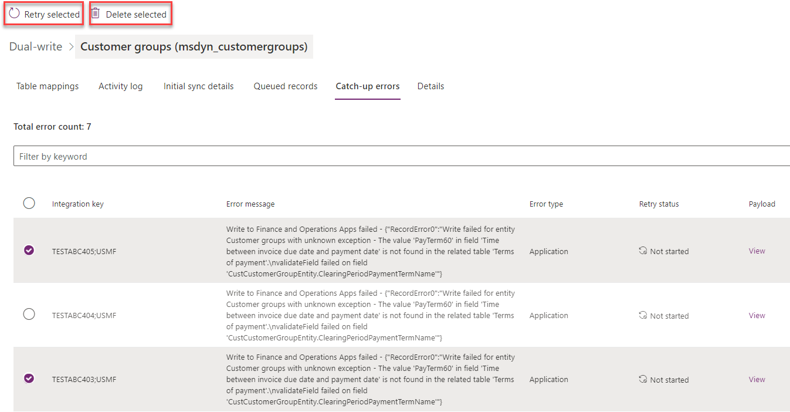

# Error management and alert notifications

[!include [banner](../../includes/banner.md)]

[!include [rename-banner](~/includes/cc-data-platform-banner.md)]

Microsoft has invested lots of time and effort into making dual-write resilient to errors. However, if you encounter an issue while or after you enable table maps for dual-write, you can select specific table maps to get a consolidated view of all the activities and errors for them. This consolidated view includes error logs. The goal is to help you during troubleshooting by providing a single view of the activities for a table map.

## Consolidated error management

The activity log provides a chronological list of events that a specific table map goes through from the **Not Running** status to the **Running** status. For example, the list can include mappings that are created, updates of column mappings, and mappings that are run. Additionally, if errors occur, you can download the logs to get the next level of details.

## Re-running execution for Initial sync

If you encounter issues while you copy pre-existing data between Finance and Operations apps and Dataverse, the **Initial sync details** tab provides a count of the errors. 

Clicking on the individual project will show you the direction in which the sync failed (Finance and Operations app to Dataverse or vice-versa) and details of why it failed. You can choose to fix the underlying issues and then select **Re-run execution** which retries the entire execution, along with the records that failed or errored out in the last sync. Once this completes, initial sync is completed and the table returns to the **Running** state. There may be cases where you want to ignore the errors and add new incremental data. In these cases, you can select **Rerun execution without errors**, which lets you add new data and not retry the errored records. 

Once it is done, the status is marked **Completed** and then you can change the table to the **Running** state. 

## Queued records insights and error management

The ability to pause a table map was designed to address planned or unplanned maintenance. To ensure business continuity, especially during planned or unplanned maintenance, you can pause table maps, manually or automatically via rules. This lets users continue to do their work and create records while the app is being recovered from maintenance.

When you pause a table map that is in the **Running** state, all records created or updated are queued until you resume the table map. The queued records are stored in secure Azure storage and replayed back when you resume and put the table map back into **Running** state.

> [!NOTE]
> When a table map is in the **Paused** state, there are limits to the number of records and amount of time you can queue the records. Whichever limits occurs first will apply. We will start with soft limits and eventually enforce harder limits to protect you from exceeding the storage limits.

Records created or updated for a table map in the **Paused** state can be viewed under **Queued records** for each table map.

The **Total queued record count** shows the total number of records queued for a given table map. You can click on **Load more** to see additional records in the paginated view. You can also filter the records on the integration key.

When you resume the table map, it switches from the **Pause** state to the **Running** state and writes the records from the queue to the destination application. It is possible that some records error out and fail to write due to various reasons including business validations on destination app. In these cases, the records will continue to remain in the queue and can be viewed under the **Catch-up errors** tab.

The detailed Error message will help you fix the underlying issue after which you could **Retry selected** records or **Retry All** records. Once the retry is successful, **Retry status** will be marked as **Completed**.

> [!NOTE]
> Errored records will be available in the queue for 7 days after which will the queue will be purged. In some cases, you may no longer need these records and they can be deleted from the queue.

## Alert notifications

As an admin, you can create one or more alert settings to handle cases of planned or unplanned maintenance. For example, you can set up the dual-write system to notify you by email if a specific error threshold is reached because of, for example, network errors. The dual-write system can also take action on your behalf. For example, it can pause or stop dual-write.

The following illustration shows an example where dual-write will be paused if 10 errors of the **Application error** type occur within 15 minutes.

By selecting **Create alert settings**, you can create more alerts. You can also select whether notifications should be sent to an individual or a group, and whether the dual-write system should take any action on your behalf.

This feature is especially useful if there is unplanned maintenance. For example, one of the apps becomes unavailable and, based on your defined thresholds, dual-write goes into a paused state where all new requests are queued (that is, they aren't lost). After you fix the underlying issue, and both apps are running smoothly, you can resume from the paused state. The updates will then be read back from the queue and written to the recovered app.

## Next steps

[Application lifecycle management](app-lifecycle-management.md)

[!INCLUDE[footer-include](../../../../includes/footer-banner.md)]
