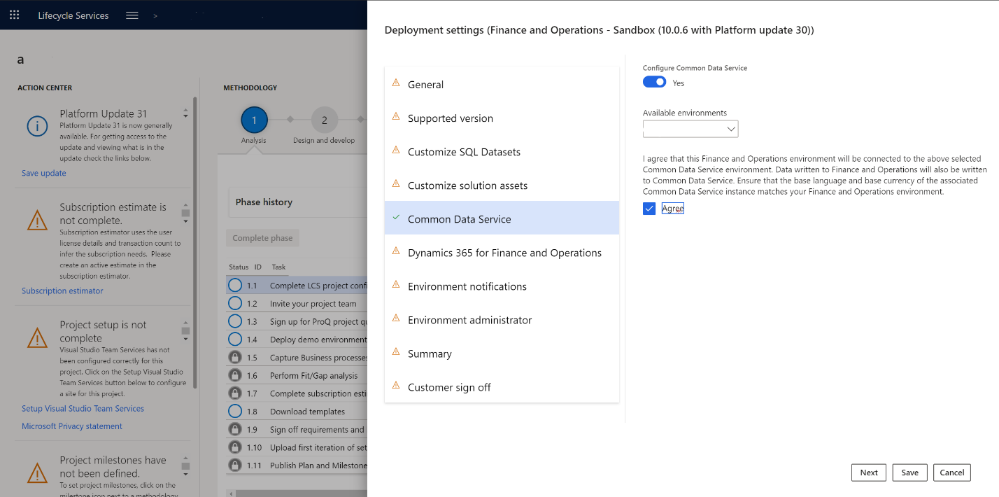
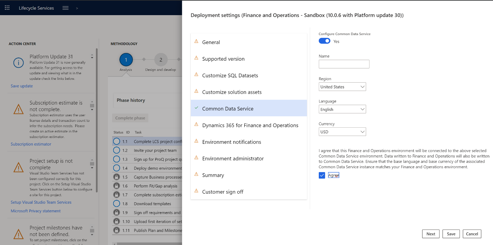
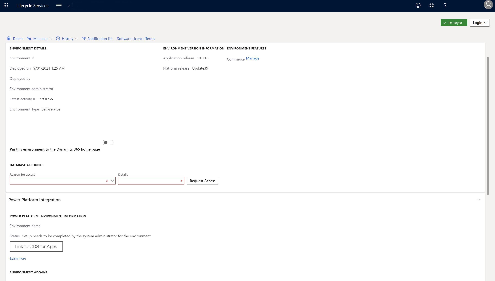

---
# required metadata

title: Dual-write setup from Lifecycle Services
description: This topic explains how to set up a dual-write connection between a new Finance and Operations environment and a new Common Data Service environment from Microsoft Dynamics Lifecycle Services (LCS).
author: RamaKrishnamoorthy
manager: AnnBe
ms.date: 01/06/2020
ms.topic: article
ms.prod: 
ms.service: dynamics-ax-applications
ms.technology: 

# optional metadata

ms.search.form: 
# ROBOTS: 
audience: Application User, IT Pro
# ms.devlang: 
ms.reviewer: rhaertle
# ms.tgt_pltfrm: 
ms.custom: 
ms.assetid: 
ms.search.region: global
ms.search.industry: 
ms.author: ramasri
ms.dyn365.ops.version: 
ms.search.validFrom: 2020-01-06

---

# Dual-write setup from Lifecycle Services

[!include [banner](../../includes/banner.md)]

[!include [preview-banner](../../includes/preview-banner.md)]

[!include [rename-banner](~/includes/cc-data-platform-banner.md)]

This topic explains how to set up a dual-write connection between a new Finance and Operations environment and a new Common Data Service environment from Microsoft Dynamics Lifecycle Services (LCS).

## Prerequisites

You must be an admin to set up a dual-write connection.

+ You must have access to the tenant.
+ You must be an admin in both Finance and Operations environments and Common Data Service environments.

## Set up a dual-write connection

Follow these steps to set up the dual-write connection.

1. In LCS, go to your project.
2. Select **Configure** to deploy a new environment.
3. Select the version. 
4. Select the topology. If only one topology is available, it's automatically selected.
5. Complete the first steps in the **Deployment settings** wizard.
6. On the **Common Data Service** tab, follow one of these steps:

    - If a Common Data Service environment is already provisioned for your tenant, you can select it.

        1. Set the **Configure Common Data Service** option to **Yes**.
        2. In the **Available environments** field, select the environment to integrate with your Finance and Operations data. The list includes all environments where you have admin privileges.
        3. Select the **Agree** check box to indicate that you agree to the terms and conditions.

        

    - If your tenant doesn't already have a Common Data Service environment, a new environment will be provisioned.

        1. Set the **Configure Common Data Service** option to **Yes**.
        2. Enter a name for the Common Data Service environment.
        3. Select the region to deploy the environment in.
        4. Select the default language and currency for the environment.

            > [!NOTE]
            > You can't change the language and currency later.

        5. Select the **Agree** check box to indicate that you agree to the terms and conditions.

        

7. Complete the remaining steps in the **Deployment settings** wizard.
8. After the environment has a status of **Deployed**, open the environment details page. The **Common Data Service environment information** section shows the names of the Finance and Operations environment and the Common Data Service environment that are linked.

    

9. An admin of the Finance and Operations environment must sign in to LCS and select **Link to CDS for Apps** to complete the link. The environment details page shows the admin's contact information.

    After the link is completed, the status is updated to **Environment linking successfully completed**.

10. To open the **Data integration** workspace in the Finance and Operations environment and control the templates that are available, select **Link to CDS for Apps**.

    

> [!NOTE]
> You can't unlink environments by using LCS. To unlink an environment, open the **Data integration** workspace in the Finance and Operations environment, and then select **Unlink**.
