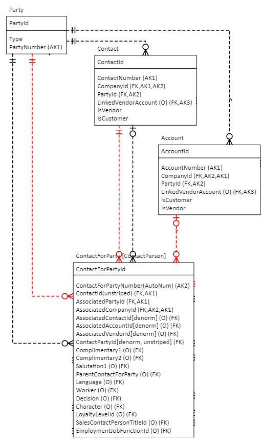

---
# required metadata

title: Using power portal with party data model
description: This topic describes the changes to the power portal web roles due to party data model in dual-write.
author: RamaKrishnamoorthy 
manager: AnnBe
ms.date: 03/22/2021
ms.topic: article
ms.prod: 
ms.service: dynamics-ax-applications
ms.technology: 

# optional metadata

ms.search.form: 
# ROBOTS: 
audience: Application User, IT Pro
# ms.devlang: 
ms.reviewer: rhaertle
# ms.tgt_pltfrm: 
ms.custom: 
ms.assetid: 
ms.search.region: global
ms.search.industry: 
ms.author: ramasri
ms.dyn365.ops.version: 
ms.search.validFrom: 2021-03-22

---

# Using Power Portal with Party data Model

[!include [banner](../../includes/banner.md)]

[!include [rename-banner](~/includes/cc-data-platform-banner.md)]
When you install dual-write orchestration solution version 2.0.999.0 and above, you will notice that the customer portal web-roles aren’t working as expected. It is because, the dual-write orchestration solution brings in Party and GAB functionality that contains data model changes around account and contact entities that allow many-to-many relationships for advanced business scenarios. These data model changes are not supported by portal web-roles (including customer portal) that are either shipped out of the box or existing in the system prior to dual-write. For the web-roles to work as expected, you need to create new web-roles using the new data model. This page explains the steps for creating new web-roles with the advanced data model. 

Here is how the table relationship looks like without the Party and GAB data model: 

   

Here is how the table relationship looks like with Party and GAB data model: 

   

### Here are the steps to create a new table permissions:
The way the entities interact changes, but the entity permissions in the customer portal have not been updated. To create these new entity permissions, do the following steps:
1.	Navigate to https://make.powerapps.com and go to your apps. 
2.	Select your Portal Management app
3.	In the side bar navigate to Security > Entity permissions

### Now you’ll need to create 3 new entity permissions:
1.	Contact to Party Connection      
2.	Party to Account Connection
3.	Account to Order Connection
        
#### Contact to Party Connection:
Set the following values to each parameter:
+ Name: Party to Account Connection (or your choice)
+ Table Name: msdyn_contactforparty
+ Website: Customer Portal
+ Scope: Contact
+ Select all privileges
+ Web roles: Authenticated Users, Customer Representative (or your choice)
+ Save

#### Party to Account Connection
Set the following values to each parameter:
+ Name: Party to Account Connection (or your choice)
+ Entity Name: account
+ Website: Customer Portal
+ Scope: Parent
+ Parent Entity Permission: Contact to Party Connection
+ Select all privileges
+ Save

#### Account to Order Connection:
Set the following values to each parameter:
+ Name: Account to Order Connection (or your choice)
+ Entity Name: salesorder
+ Website: Customer Portal
+ Scope: Parent
+ Parent Entity Permission: Party to Account Connection
+ Select all privileges
+ Save

