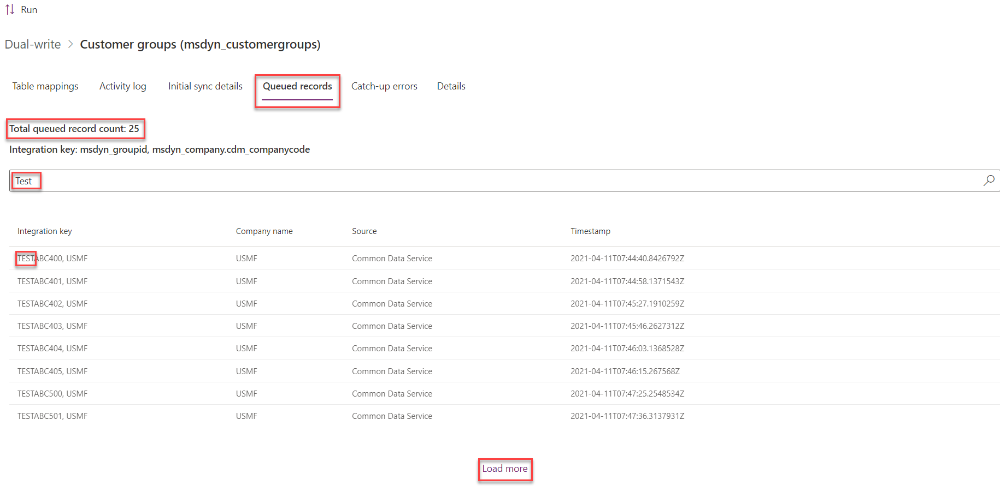

# Pause dual-write for maintenance

[!include [banner](../../includes/banner.md)]

[!include [rename-banner](~/includes/cc-data-platform-banner.md)]

Pausing a table map lets you address planned or unplanned maintenance. To ensure business continuity, especially during planned or unplanned maintenance, you can pause table maps, manually or automatically via rules. This lets users continue to do their work and create records while the app is being maintained.

When you pause a table map that is in the **Running** state, all records created or updated are queued until you resume the table map. The queued records are stored in secure Azure storage and replayed back when you resume and put the table map back into **Running** state.

> [!NOTE]
> When a table map is in the **Paused** state, there are limits to the number of records and amount of time you can queue the records. Whichever limits occurs first will apply. The process starts with soft limits and eventually enforces harder limits to protect you from exceeding the storage limits.

Records created or updated for a table map in the **Paused** state can be viewed under **Queued records** for each table map.

The **Total queued record count** shows the total number of records queued for a given table map. You can click on **Load more** to see additional records in the paginated view. You can also filter the records on the integration key.

When you resume the table map, it switches from the **Pause** state to the **Running** state and writes the records from the queue to the destination application. It is possible that some records error out and fail to write due to various reasons including business validations on destination app. In these cases, the records will continue to remain in the queue and can be viewed under the **Catch-up errors** tab. For more information, see [Catch-up errors from pausing a table map](errors-and-alerts.md#catch-up-errors-from-pausing-a-table-map).

[!INCLUDE[footer-include](../../../../includes/footer-banner.md)]

