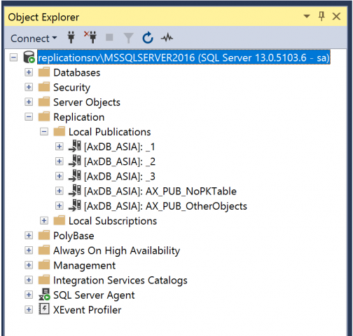
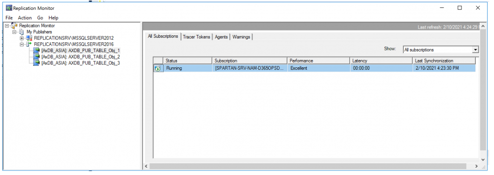
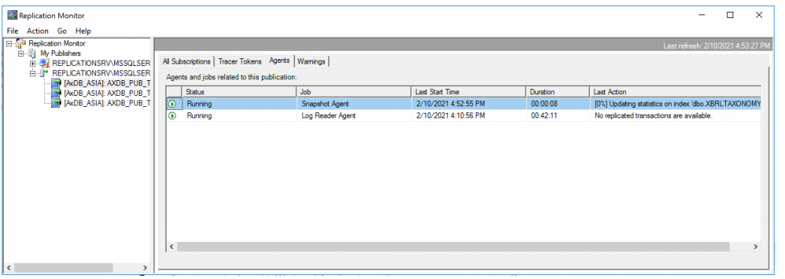
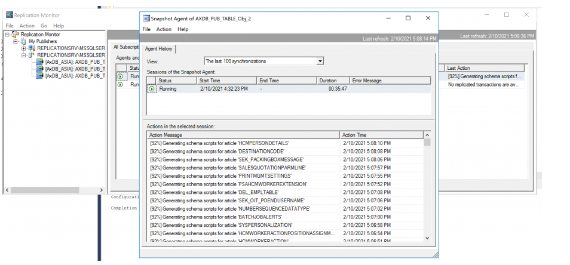

---
# required metadata

title: Replication setup
description: This template contains examples of Markdown syntax, as well as guidance on setting the metadata.
author: sarvanisathish
ms.date: 04/02/2021
ms.topic: article
audience: IT Pro
ms.reviewer: sericks
ms.search.region: Global
ms.author: sarvanis
ms.search.validFrom: 2021-04-30
---

# Replication setup

[!include[banner](../includes/banner.md)]

## Prerequisites

-	Source SQLServer should have enabled/installed replication feature.
-	SQL Agent should be running in the source database server.
-	SA Authentication: User should have DB_Owner privilege in Source Database & Target Database. In Source Database, the user should have access to masterDb and sourceDb
-	Update the target firewall by allow-listing the source IP. This can be done via LCS portal and this allows only for 8Hrs. After allow-listing execute this below sp in the target database to have access more than 8 Hrs.

    To reate database-level firewall setting for IP a.b.c.d:
  
     ```sql
     EXECUTE sp_set_database_firewall_rule N'AX 2012 Upgrade', 'a.b.c.d', 'a.b.c.d'; 
     ```
- To Optimize the Replication Latency/Performance below are the few fine-tuned distributors parameters.
    1. MaxBcpThreads
    2. NumberOfPublishers
    3. Distributor DB paths

- When Setting up Distributor:
    The script creates a Database in the Source Server. So, make sure you have enough space (Recommended is minimum it should have the size of the source database). In params.json, you can specify the Distributor database path, so this database can be created in the specified path.

- Update params.json

    ```sql
    {
    "sourceServer" : "<<your source database server>>" eg: LAPTOP\\MSSQLSERVER2012", Don't use localhost
    "sourceDatabase" : "<<your source database, database to be migrated>>",
    "sourceServerUserName" : "<<SQL Login Username>>",
    "sourceServerPWD" : <<SQL Login Password>>,
    "targetServer" : "<<your target/spartan database server>>" eg:"dbmigration.database.windows.net",
    "targetDatabase" : "<<your target database>>",
    "targetServerUserName" : "axdbadmin",
    "targetServerPWD" : "<<admin password>>",
    "snapShotWorkingDir" : "<<snap shot creation folder>>" ensure you have enough space in the drive eg: D:\\SQLServer\\SnapShot",
    "distributorDbDataFolder":"<<distributor datafile path>>" ensure you have enough space in the drive,
    "distributorLogFolder":"<<distributor logfile path>>" ensure you have enough space in the drive,
    "maxBCPThreads":<<you can set 1 for one core, but max this value can be 8>> Recomended:4 - 8,
    "numberOfPublishers":<<how name publisher creation for PK Tables >> Recommended: less than or equal to(>=)3 based on t he maxBCPThreads
    "ignoreTablesList":<<xml list of tables you want to exclude from replication>> edit ignoretables.xml file under data folder and use same schema
    "ignoreFunctionsList":<<xml list of functions you want to exclude from replication>> edit ignorefunctions.xml file under data folder and use same schema
    }
    ```
    
    XML Schema: To ignore selected tables, views and functions during replication

    ```xml
    <IgnoreTables>                      <IgnoreFunctions>
        <Name>SYSDATABASELOG</Name>         <Name></Name>
    </IgnoreTables>                      </IgnoreFunctions>
    ```
    
## Configuring replication

SQLTransactionalReplication folder has all the PowerShell scripts that required to configure the SQL transactional replication. These scripts should be executed in the same sequence as below and wait for it to finish.

1. **Replication_01_DataBaseCleanup.ps1** - Will empty the target database.
2. **Replication_02_Distributor.ps1** - Upon completing distributor database will get created in the source database server under system database.
3. **Replication_03_PublisherTables.ps1** - Once the publisher scripts are executed successfully, publication will get created under the replication folder. Note that this will take some time to complete. Created publishers AXDB_PUB_TABLE_Obj_[*].

    > [WARNING!]
    > Wait for data replication to complete before executing cutover scripts. You can check the status in the following ways:
    > 1. Replication monitor: On the source server, right click 'Replication' folder and select **Launch Replication Monitor**. 
    > 2. Run GetStatus.ps1 script embedded in the replication toolkit. 'DataReplicationStatus' must be set to complete for each of the AXDB_PUB_TABLE_Obj_[*] publication.
  
4. **Replication_04_PublisherOtherObjects.ps1** - Replicates functions to target database by creating new publication. This step can be omitted if you don't want to move functions. Note that this will be completed quickly. Creates publisher AX_PUB_OtherObjects.
5. **CutOver_01_PublisherNoPK**.ps1 - This creates two publications to replicate: 
        - Non Primary Key tables 
        - Locked tables with publication names: AX_PUB_NoPKTable, AXDB_PUB_TABLE_Locked
7. **CutOver_02_PKDeletion_PostReplication.ps1** - This will clean up the temp tables created for no primary key tables. Deletes publication AX_PUB_NoPKTable.
8. **CutOver_03_RetrieveAndCreateNoPKConstraints.ps1** - This extracts constraints for the non PK tables from the source and create them in the target database.
9. **CutOver_04_RemoveReplication.ps1** - After successful replication of database, we can execute this script to remove replication setup. If you want to remove the Snap Shot folder without error execute this below SP in the source Db (or) after execution you will get an exception unable to remove the snap shot folders and can be removed manually.

```sql
EXEC master.dbo.sp_configure 'show advanced options', 1
RECONFIGURE WITH OVERRIDE
EXEC master.dbo.sp_configure 'xp_cmdshell', 1
RECONFIGURE WITH OVERRIDE
```

Below are the publications that will get created on source database when setting up the replication.


## To know replication status and get exception

Execute the power shell script and wait for it to finish.

**GetStatus.ps1** - If we execute this script, Replication status table will be listed, with this scheam AgentId, PublicationName, Job, LastSynced, JobStatus, ReplicationStatus, Comments.

- AgentId - Will be use to fetch the exception details about the job
- PublicationName - This is the publication names what we created for replicating the data, you can find the same in the SQLServerExplorer under Replication folder
- Job - It will have two types of jobs, Snapshot & Data Replication
- JobStatus - This will display any of these status, Started, Succeeded, In Progress, Idle, Retrying, Failed, for Snapshot jobs after it got succeeded this will not execute, but for the data replication jobs the job status will keep changing based on the new data update in the database.
- ReplicationStatus - This status applies only to the Data Replication jobs, will display Waiting, In Progress, Completed
- Comments - This will keep changing when the job is InProgress stat
 
**GetException.ps1** - To get the exception, need to provide AgengId this can be retrieve/get from the status

## To know the replication configuration and status via SQL Server Management Studio

- To know that the replication feature is available/installed on the server, you should see the Replication folder in Object Explorer, as shown in the image below.
   
   

- After executing the **Replication_03_PublisherTables.ps1** script, you should be able to see the publisher configured under the Replication folder.
    
    

- To know the replication status, right-click on the Replication folder and select the Launch Replication Monitor.
   
   

- In the Replication Montior window, you can see all the publishers that have been created for replication.
    
    

- Selecting the Snapshot tab, you can see the status of the snapshot.
  
  

- To view the detail log/transaction double click on the grid item.
   
   

- To view the data replication to the target select the All Subscription tab and double click subscription from the grid item. Like in the above screen shot can view thr detail logs


