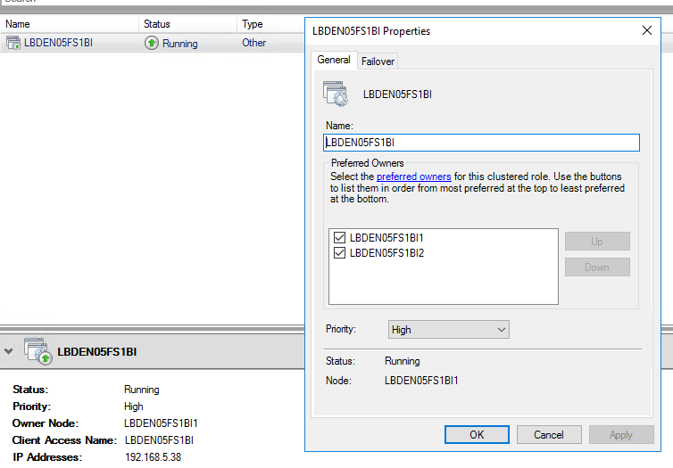

# Configuring High Availability for SSRS nodes

This article explains how to configure multiple SSRS nodes for Finance + Operations (on-premises) deployments.

## High Availability with Windows Failover Clusters

In this scenario, we'll make use of Windows Failover Clusters. As such, we would have one active node that would receive all requests and one passive node that would be idle. If the active node were to become unavailable, then the cluster would detect this event and the passive node would then receive all network traffic.

Setting up Windows Failover Cluster isn't covered in this guide. For more information, see [Create Failover Cluster](https://docs.microsoft.com/windows-server/failover-clustering/create-failover-cluster).

Once the cluster is set up we'll continue with configuring our installation. The explanations from this point on will be based on the information from the screenshot below.



1. Update your configuration file (ConfigTemplate.xml)

    1. Update the ADServiceAccount for the reporting service bootstrappper service.

        ```xml
        <ADServiceAccount type="gMSA" name="svc-ReportSvc$"  refName="gmsaSSRS">
            <DNSHostName>svc-ReportSvc.contosoen05.com</DNSHostName>
        </ADServiceAccount>
        ```

    1. Ensure that under the ServiceFabricCluster section you list all of your servers under the ReportServerType.

        ```xml
        <NodeType name="ReportServerType" primary="false" namePrefix="Rep" purpose="BI">
            <VMList>
                <VM name="LBDEN05FS1BI1" ipAddress="10.179.108.10" faultDomain="fd:/fd1" updateDomain="ud1"/>
                <VM name="LBDEN05FS1BI2" ipAddress="10.179.108.11" faultDomain="fd:/fd2" updateDomain="ud2"/>
            </VMList>
        </NodeType>
        ```

    1. Update the SSRSHTTPS certificate settings

        ```xml
        <Certificate type="SSRSHTTPS" exportable="true" generateSelfSignedCert="false" generateADCSCert="true">
            <!-- Specify the friendly name of the certificate during import operations. -->
            <Name>LBDEN05FS1BI</Name>
            <!-- Specify the file name of the pfx that will be used in export and import operations. If not specified, the name property will be used -->
            <FileName>LBDEN05FS1BI</FileName>
            <!-- Specify the dns names for the listener, and of each of the report nodes in the cluster. -->
            <!-- The FQDNS will only be accessed from within the environment so its not necessary to create external DNS entries for them. -->
            <DNSName>LBDEN05FS1BI;LBDEN05FS1BI1;LBDEN05FS1BI2</DNSName>
            <Subject>LBDEN05FS1BI</Subject>
            <Thumbprint></Thumbprint>
            <ProtectTo></ProtectTo>
        </Certificate>
        ```
    
    > [!IMPORTANT]
    > Even if you aren't going to generate the certificate using the infrastructure scripts provided, fill out the certificate information as other scripts will rely on the this information.

1. Follow the setup guide as you normally would.

    > [!IMPORTANT]
    > Ensure that the nodes are added to the Service Fabric Cluster if you have already created the cluster.
    > Ensure that the certificate for the SSRS web server gets distributed to all of the ReportServer nodes by rerunning the Export-PfxFiles.ps1 script and rerunning the Complete-Prereqs.ps1 on the appropriate machines.

## High Availability with load balancers

In this scenario, a load balancer is configured to distribute requests among the different nodes available. All report generation requests will be distributed among the different nodes available. When setting up this configuration, it's important to note that it's required to set up session affinity. The solution chosen **must** support such a requirement.

The type of session affinity that is required is client-based. When the AOS node makes a request, the load balancer should direct all requests for that AOS node to the same SSRS node. 

Instructions on setting up a specific software load balancer or hardware load balancer are not covered in this documentation.

However, the general overview for this scenario is as follows.

1. Decide on a load-balancing strategy/product.
1. Configure it according to your network topology.
1. Ensure you have set client (source ip) affinity.
1. Update the ConfigTemplate.xml using the example above as a guide.
1. Continue with cluster set up as you normally would. 

> [!IMPORTANT]
> Ensure that the additional nodes are added to the Service Fabric Cluster if you have already created the cluster.
> Ensure that the certificate for the SSRS web server gets distributed to all of the ReportServer nodes by rerunning the Export-PfxFiles.ps1 script and rerunning the Complete-Prereqs.ps1 on the appropriate machines.

## Deployed environments with Pre-PU41 base deployments

> [!NOTE]
> This configuration is only supported with PU41 and later deployments.

For existing environments that want to enable HA for their SSRS nodes, they can use a predeployment script. For more information on predeployment scripts, see [Local agent pre-deployment and post-deployment scripts](../lifecycle-services/pre-post-scripts.md)

### Predeployment script

Invoke command example:

```powershell
Configure-SSRSHA.ps1 -AgentShare "\\servername\D365FFOAgent" -Listener "LBDEN05FS1BI" -MachinesList "LBDEN05FS1BI1,LBDEN05FS1BI2" -TLSCertificateThumbprint "<cert thumbprint>" -ServiceAccount "contosoen05\svc-ReportSvc$"
```

Configure-SSRSHA.ps1 script:

```powershell
param (
    [Parameter(Mandatory=$true)]
    [string]
    $AgentShare,

    [Parameter(Mandatory=$true)]
    [string]
    $Listener,

    [Parameter(Mandatory=$true)]
    [string]
    $MachinesList,

    [Parameter(Mandatory=$true)]
    [string]
    $TLSCertificateThumbprint,

    [Parameter(Mandatory=$true)]
    [string]
    $ServiceAccount,

    [string]
    $ssrsServicePort = ""
)

$ErrorActionPreference = "Stop"

$basePath = Get-ChildItem $AgentShare\wp\*\StandaloneSetup-*\ |
    Select-Object -First 1 -Expand FullName

if(!(Test-Path $basePath))
{
    Write-Error "Basepath: $basePath , not found" -Exception InvalidOperation
}

$configJsonPath = "$basePath\config.json"

$configJson = Get-Content $configJsonPath | ConvertFrom-Json

$updatedComponents = @()
foreach ($component in $configJson.components)
{
    if($component.name -eq "AOS")
    {
        $component.parameters.biReporting.persistentVirtualMachineIPAddressSSRS.value = $Listener
        $component.parameters.biReporting.reportingServers.value = $MachinesList
        $component.parameters.biReporting.ssrsUseHttps.value = "True"
        $component.parameters.biReporting.ssrsHttpsPort.value = $ssrsServicePort
    }
    elseif($component.name -eq "ReportingServices")
    {
        $component.parameters.enableSecurity.value = "True"
        $component.parameters.ssrsSslCertificateThumbprint.value = $TLSCertificateThumbprint
        $component.parameters.ssrsServerFqdn.value = $Listener
        $component.parameters.principalUserAccountType.value = "ManagedServiceAccount"
        $component.parameters.principalUserAccountName.value = $ServiceAccount
        $component.parameters.reportingServers.value = $MachinesList
        $component.parameters.ssrsHttpsPort.value = $ssrsServicePort
    }

    $updatedComponents += $component
}

$configJson.components = $updatedComponents

$configJson | ConvertTo-Json -Depth 100 | Out-File $configJsonPath

Write-Host "Successfully updated the configuration for SSRS HA."

```