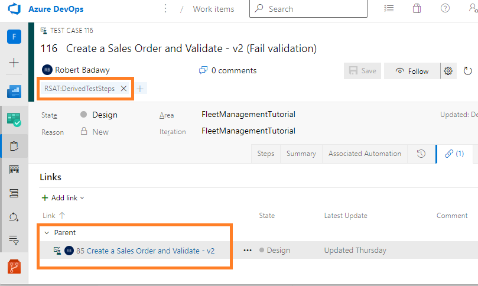

---
# required metadata

title: Derived test cases
description: This topic shows how you can use the Regression suite automation tool to execute the same test case with multiple configurations.
author: robadawy
manager: AnnBe
ms.date: 08/01/2019
ms.topic: article
ms.prod: 
ms.service: dynamics-ax-platform
ms.technology: 

# optional metadata

# ms.search.form: 
# ROBOTS: 
audience: Developer
# ms.devlang: 
ms.reviewer: rhaertle
# ms.tgt_pltfrm: 
ms.custom: 21631
ms.search.region: Global
# ms.search.industry: 
ms.author: robadawy
ms.search.validFrom: 2019-08-01
ms.dyn365.ops.version: AX 7.0.0

---

# Derived test cases

[!include [banner](../../includes/banner.md)]

The Regression suite automation tool (RSAT) lets you to use the same task recording with multiple test cases, so that you can run a task with different data configurations. To do this, select a test case in the Regression suite automation tool and then select **New > Create Derived Test Case**. This creates a child test case in Azure DevOps. The resulting derived test case is linked to its parent test case in Azure DevOps. It has an Excel parameters file attached but no recording file. The derived test case will appear in the Regression suite automation tool grid under the same test suite with the **Derived** column selected. By default, derived test cases are named after their parent test case with a numeric suffix.

In the following image, a derived test case has been created from a test case called "**Create a Sales Order and Validate - v2**". The derived test case has been renamed (in Azure DevOps) to "**Create a Sales Order and Validate - v2 (Fail validation)**"

 
In Azure DevOps, a derived test case is a child item of the **Create a Sales Order and Validate - v2** test case and is tagged with the special keyword **RSAT:DerivedTestSteps**.

 
When you run a derived test case, it will use the recording of its parent test case and its own copy of the Excel parameters file. This will allow you to run the same test with different parameters without the need to maintain more than one recording.

A derived test case does not need to be part of the same test suite as its parent test case, you can use it in another suite. You can also rename a derived test case. You can edit the Excel parameters file of a derived test case to run it with a different user, different company and/or different input and validation parameters that its parent test case.
