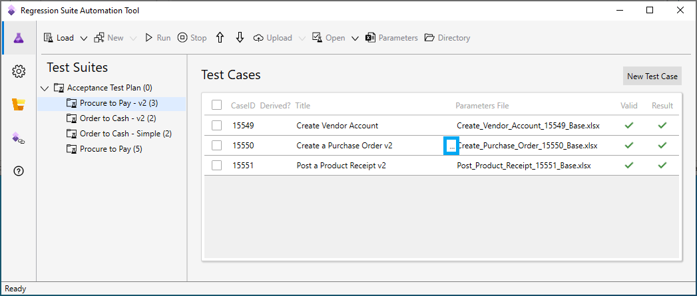
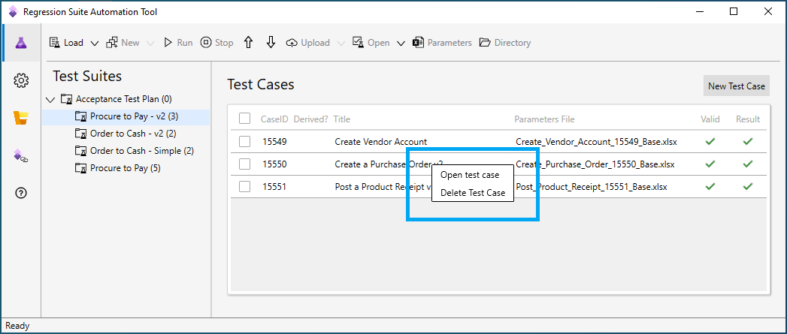
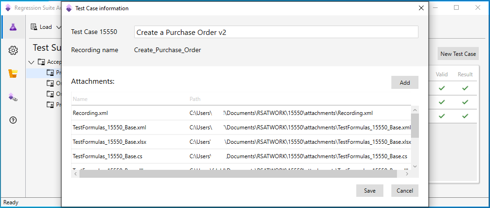
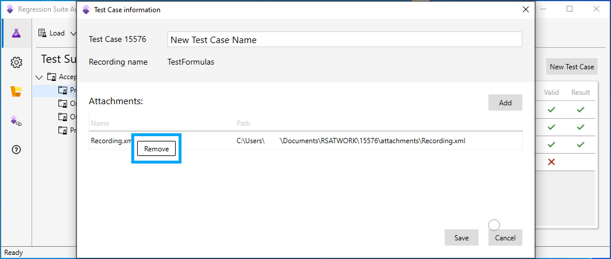

# Maintain test cases within Regression suite automation tool

[!include [banner](../../includes/banner.md)]

Regression suite automation tool (RSAT) version 2.2 and later enable users to maintain test cases and attachments directly within RSAT. This improves usability and productivity significantly compared to earlier versions where users had to shift between using DevOps for maintaining test cases and RSAT for running tests. With the new experience many operations can now be done fully within RSAT and provide a much simpler way of working with test suites.

Test plans and test suites continue to be maintained from DevOps. There are no changes done with that.

Test cases and attachments on the other hand can be maintained directly from RSAT. The option: “Enable upload to Azure DevOps” must be enabled for this to be available and changes done in RSAT automatically upload to DevOps to be available here too. This way, tests suites will include the updated test cases available to other users or for running in DevOps by pipeline.

## View test case information

You navigate to view test case information using a context menu that is accessible in the test cases grid. Locate the relevant test case and move the mouse over the line where you notice the 3 dots appearing between the title and parameters file columns as seen here below.

Left-clicking the 3 dots opens a context menu with the two items “Open Test Case” and “Delete Test Case”, as seen here below.

Left click the “Open Test Case” to open the following form with Test Case Information.

This Test Case Information form show detail for the test case. The name assigned in the Test Suite is shown at the top and can be changed within this form. The Recording name is shown from the recording xml which is what was used when the recording was made in the Task Recorder within Finance & Operations or by the POS client. Below this is a list of the attachment files available with the test case, which may also be seen using the Directory action under the attachments subfolder.

## Create test case with attachments

You add a new test case within RSAT by clicking the “New Test Case” action. This will add a new test case to the currently highlighted test suite in this example **“Procure to Pay – v2”**.

Checking the “New Test Case” button open the “Test Case Information” form, where you supply the Test Case name, then add attachment files that include the recording xml file with steps for the case. Adding attachment files is done by clicking the “Add” button on this form seen below. This will open a file dialogue for picking the files to add.

When all is ready, click Save to save the test case, or Cancel if you instead regret adding the case.

Once you Save a new test case, then RSAT will copy attachment files you selected into your local RSAT working directory and maintain that copy to be used with the test case.

The is not a specific action available in RSAT for cloning test cases from one suite to another. This is however still doable but require a few manual steps. What you do is create a new case as explained including adding the recording xml. Then save the test case and notice the caseID is it assigned. Now it will be possible to add a parameter excel file to the case, but it must match the caseID. You will need to copy the parameter excel file from the case you are cloning and change the file name of that to match the new caseID and open the file and change all places you find from the old caseID to the new caseID. Once all change has been made, then use the “Add” button to attach this prepared parameter file onto the new case. An alternative approach is to generate a parameter file with the new case first, and manually edit this file to match the parameter file you are cloning.

## Remove attachment from a test case

You can remove attachments from a test case when they are no longer needed. This can be done by right-clicking on the line with the attachment file in the Test Case Information form, and in the context menu that will open left-click “Remove” as seen below.

This can be relevant if you have edited the recording xml and want to upload a new version of this to the case. In this case remove the existing one first, and then add the new file.

## Delete test case

You can delete a test cases from test suites using the same context menu used for viewing Test Case Information. Here select the item “Delete Test Case”.

This will open a dialogue where you confirm that the test case should indeed be deleted, which provide the option to regret the action.

DevOps is creating work items that represent test cases, and test suites in DevOps includes test case by linking to these work items. DevOps supports that a test case work item can be reused by allowing it to be linked with more than one test suite. When a test case is deleted within RSAT a check is done to determine if the test case is linked with one or more test suites. If the test case is used only by the current test suite, then RSAT will delete the DevOps work item representing the test case. If on the other hand the test case is also used by other test suites, then RSAT will only delete the link to the work item but not delete the work item as it is still used with the other test suites.

Deleting a test case in RSAT removes the test case from the current test suite both as Local files and on DevOps.

[!INCLUDE[footer-include](../../../../includes/footer-banner.md)]
