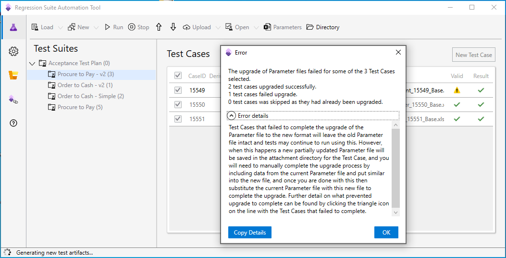

# Upgrade the parameter files

[!include [banner](../../includes/banner.md)]

The format of parameter Excel files used with RSAT changed with the 2.0 release, into a more intuitive format showing test steps. New cases created with version 2.0 and later automatically create parameter files in this new format. You might have tests that were authored before that version which still use the old format. The old format parameter files are supported by RSAT to run cases at least up to the next major release of RSAT.

RSAT can upgrade old parameter files into the new format.

Parameter files can be edited freely in Excel. There are situations a parameter file can't be fully upgraded. In these cases that some manual work will be needed to complete the upgrade. The next section explains the mechanics of the upgrade process.

## Upgrade process

The upgrade process attempts to complete a full upgrade, but there are situations where this cannot safely be completed.

When upgrade can complete fully, then the parameter file is simply replaced with the new one. A copy of the original file is created, with **_BAK** appended to the file name.

When only a part of the parameter file can be safely upgraded, then the original file is not changed. A new file is created, with **_PARTIAL** appended to the file name. The partial file contains the information that was possible to upgrade. You can use the partial file to manually bring over missing parts from the original to complete the new file. When you are done, rename your old parameter file to a backup name, for example, appending **_BAK** to the file name. Rename the new parameter file by removing the **_PARTIAL** from the file name. The new file becomes the new parameter file.

> [!NOTE]
> You can use the old parameter files until the new file is ready. RSAT will continue to support the old parameter file format at least up to the next major release.

The upgrade process can usually upgrade unedited parameter files. It can also upgrade files where only cell values have been changed in the file. When additional cells have been added and referenced, then upgrade cannot automatically complete. In this case, the partial file include cells with value **#MISSING** to indicate cell references are missing. This is where you manually add the information from the original parameter file into the new partial file.

> [!IMPORTANT]
> Going forward, add new cells to the new **CustomParameters** sheet, in the same way they are added in the partial file.

The parameter file with RSAT release 2.2 and later has a sheet named **CustomParameters**. This is included to help future-proof the upgrade of parameter files. If you add cells, put them in this sheet. We plan to bring forward this sheet directly in later releases of the upgrade feature.

Cells you added into the old Parameter files with a Name assigned to the cell, those will move into the CustomParameters sheet automatically during the upgrade, that is providing the cell value does not also reference other cells.

If you added a cell to the old parameter file, and you assigned a name to the cell, and the cell value does not reference other cells, then that named will be moved to the **CustomerParameters** sheet in the upgrade.

After you have moved your added cells into the partial file, make sure that you change the references from **TestCaseSteps** sheet that had **#MISSING** as the value. Change the reference to match the relevant cells in **CustomParameters**. Ideally, you should always reference cells by an assigned name (like **MyQuantity**) and not by the cell identifier (like **E4**).

> [!NOTE]
> It is a best practice to assign names to any cells added into the **CustomerParameters** sheet and reference the cells by name from case steps.

After the upgrade, you should run your test cases to make sure the new parameter file produces the expected results. Do this both when the upgrade completed fully and when the upgrade required manual work.

After you are done creating and testing the new files, you can delete the backup and partial files.

## Running the paramenter file upgrade

To upgrade the parameter files, open RSAT. Select that test cases that have the parameter files that you want to upgrade. On the **New** menu, select **Upgrade Parameter files (will auto generate Test Execution files**, as shown in the following screenshot.

The parameter files for all the selected cases are upgraded.

The upgrade process skips test cases where the parameter file is already in the new format. A parameter file is considered upgraded if it contains the **CustomParameters** sheet.

When the upgrade is done, a summary is shown. The summary includes:

+ The total number of selected test cases that were marked for upgrade.
+ The number of successful upgrades. For these upgrades, there are new parameter files and **_BAK** files.
+ The number of failed upgrades. For these upgrades, there are new **_PARTIAL** files.
+ The number of skipped upgrades.
+ An explanation of the results.

This is an example of the summary dialog:

For a failed upgrade, you can find more information by clicking the yellow triange next to the title case title. This is an example of the dialog:

> [!IMPORTANT]
> You can run the upgraded repeatedly, and newly upgraded parameter files will be skipped. However, new partial files will overwrite existing partial files. We recommend that you complete all partial files and rename them before running the upgrade again.

[!INCLUDE[footer-include](../../../../includes/footer-banner.md)]
