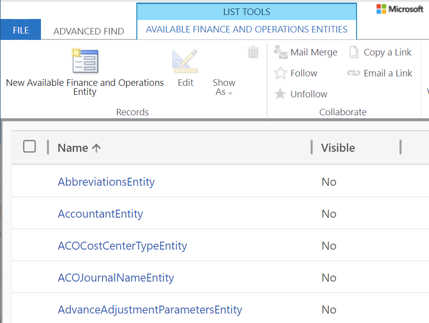
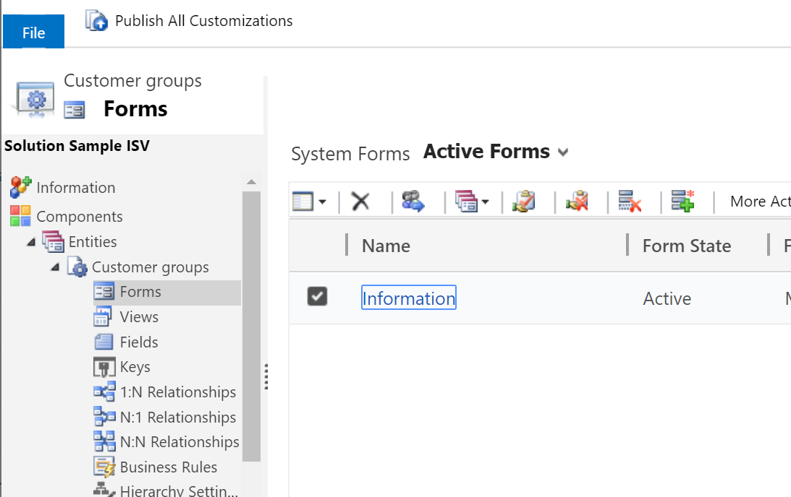

---
# required metadata

title: Finance and Operations and Common Data Service admin reference
description: This topic covers set up and configuration of virtual entities for Finance and Operations.
author: Sunil-Garg
manager: AnnBe
ms.date: 07/13/2020
ms.topic: article
ms.prod:
ms.service: dynamics-ax-applications
ms.technology: 

# optional metadata

# ms.search.form:
audience: Developer, IT Pro
# ms.devlang: 
ms.reviewer: sericks
ms.search.scope: Operations
# ms.tgt_pltfrm: 
# ms.custom: NotInToc
ms.search.region: Global
# ms.search.industry:
ms.author: sunilg
ms.search.validFrom: 2020-05-31
ms.dyn365.ops.version: 10.0.12
---

# Finance and Operations and Common Data Service admin reference
[!include[banner](../includes/banner.md)]

> [!IMPORTANT]
> This functionality requires [Platform updates for version 10.0.12 of Finance and Operations apps](../get-started/whats-new-platform-update-10-0-12.md) and service update 189 for Common Data Service. The release information for Common Data Service is published on the [latest version availability page](https://docs.microsoft.com/business-applications-release-notes/dynamics/released-versions/dynamics-365ce#all-version-availability).

This topic provides step-by-step instructions about how to set up and configure virtual entities for Finance and Operations apps in Common Data Service.

## Getting the solution
The Common Data Service solution for Finance and Operations virtual entities must be installed from Microsoft AppSource virtual entity solution. For more information, see [Finance and Operations virtual entity](https://appsource.microsoft.com/product/dynamics-crm/mscrm.finance_and_operations_virtual_entity).

Ensure the following solutions are installed in Common Data Service.

- **Dynamics365Company** - This adds the **Company** entity, which is referenced by all Finance and Operations entities with a PrimaryCompanyContext metadata value.

- **MicrosoftOperationsVESupport** - This provides the core support for the Finance and Operations virtual entity feature.

- **MicrosoftOperationsERPCatalog** - This provides a list of available Finance and Operations entities through the mserp_financeandoperationsentity virtual entity.

- **MicrosoftOperationsERPVE** - This is the API-managed solution, which will contain the generated virtual entities as they are made visible.

## Authentication and authorization

After the solutions are imported in the Common Data Service environment, both environments must be set up to connect to each other. Common Data Service will call Finance and Operations using Service-to-Service (S2S) authentication, based on an Azure Active Directory (AAD) application. This new AAD application represents the single instance of the Common Data Service environment. If you have multiple pairs of Common Data Service and Finance and Operations environments, separate AAD applications for each pair must be created to ensure connections are established between the correct pair of Finance and Operations and Common Data Service environments. The following procedure shows the creation of the AAD application.

> [!IMPORTANT]
> The AAD application must be created on the same tenant as Finance and Operations.

1.  Go to <https://portal.azure.com> **\> Azure Active Directory \> App registrations**.

2.  Select **New Registration**. Enter the following information:

    - **Name** - Enter a unique name.

    - **Account type** - Enter **Any Azure AD directory** (single or multi-tenant).

    - **Redirect URI** - Leave blank.

    - Select **Register**.

    - Make note of the **Application (client) ID** value, you will need it later.

3.  Create a symmetric key for the application.

    - Select **Certificates & secrets** in the newly created application.

    - Select **New client secret**.

    - Provide a description and an expiration date.

    - Select **Save**. A key will be created and displayed. Copy this value for later use.

The AAD application created above will be used by Common Data Service to call Finance and Operations apps. As such, it must be trusted by Finance and Operations and associated with a user account with the appropriate rights in Finance and Operations. A special service user must be created in Finance and Operations with rights *only* to the virtual entity functionality, and no other rights. After completing this step, any application with the secret of the AAD application create above will be able to call this Finance and Operations environment and access the virtual entity functionality.

The next steps walk through this process in Finance and Operations apps.

1.  In Finance and Operations, go to **System Administration \> Users \> Users**.

2.  Select **New** to add a new user. Enter the following information:

    - **User ID** - Enter **cdsintegration** (or a different value).

    - **User name** - Enter **cds integration** (or a different value).

    - **Provider** - Leave at the default value.

    - **Email** - Enter **cdsintegration** (or a different value, does *not* need to be a valid email account).

    - Assign the security role **CDS virtual entity application** to this user.

    - Remove all other roles including **System user**.

3.  Go to **System Administration \> Setup \> Azure Active Directory applications** to register Common Data Service. 

    - Add a new row.

    - **Client ID** - The **Application (client) ID** created above

    - **Name** - Enter **CDS Integration** (or a different name).

    - **User ID** - The user ID created above.

The next step in the process is to provide Common Data Service with the Finance and Operations instance to connect to. The following steps walk through this part of the process.

1.  In Common Data Service, go to **Advanced Settings \> Administration \> Virtual Entity Data Sources**.

2.  Select the data source named “Finance and Operations”.

3.  Fill in the information from the steps above.

    - **Target URL** - The URL at which you can access Finance and Operations.

    - **OAuth URL** - https://login.windows.net/

    - **Tenant ID** - Your tenant, such as “contoso.com”.

    - **AAD Application ID** - The **Application (client) ID** created above.

    - **AAD Application Secret** - The secret generated above.

    - **AAD Resource** - Enter 00000015-0000-0000-c000-000000000000 (this is the AAD application representing Finance and Operations, and should always be this same value).

4.  Save the changes.

## Enabling virtual entities

Due to the large number of OData enabled entities available in Finance and Operations, by default, the entities are not available as virtual entities in Common Data Service. The following steps allow for enabling entities to be virtual, as needed.

1. In Common Data Service, go to **Advanced find** (funnel icon).

2. Look for “Available Finance and Operations Entities” and select **Results**.

3. Locate and open the entity that you want to enable.

4. Set **Visible** to **Yes** and save. This will generate the virtual entity, so that it will appear in all of the appropriate menus, such as the advanced find dialog box.

## Refreshing virtual entity metadata

The virtual entity metadata can be force-refreshed when it is expected for the entity metadata in Finance and Operations to have changed. This can be done by setting **Refresh** to **Yes** and saving. This will sync the latest entity definition from Finance and Operations to Common Data Service and update the virtual entity.

Referencing virtual entities
----------------------------

The virtual entities are all generated in the MicrosoftOperationsERPVE solution, which is API Managed. That means the items in the solution change as you make entities visible/hidden, but it is still a managed solution that you can take dependency on. The standard ALM flow would be to just take a standard reference to a virtual entity from this solution with the **Add existing** option
in the ISV solution. It will then show as a missing dependency of the solution and be checked at solution import time. During import if a specified virtual entity does not yet exist, it would automatically be made visible without needing additional work.

To consume virtual entities:

1.  Create a separate solution as usual in Common Data Service, which will contain the consuming logic.

2.  Select **Entities \> Add Existing**. Select the virtual entity that you want to reference from the list.

3.  When prompted to select assets to add, select any forms, views, or other elements that you want to customize, then select **Finish**.

From the development tooling, existing elements such as forms can be modified for the virtual entity. Additionally, new forms, views, and other elements can also be added.

When the solution is exported, it will contain hard dependencies on the virtual entity generated in the MicrosoftOperationsERPVE solution.
